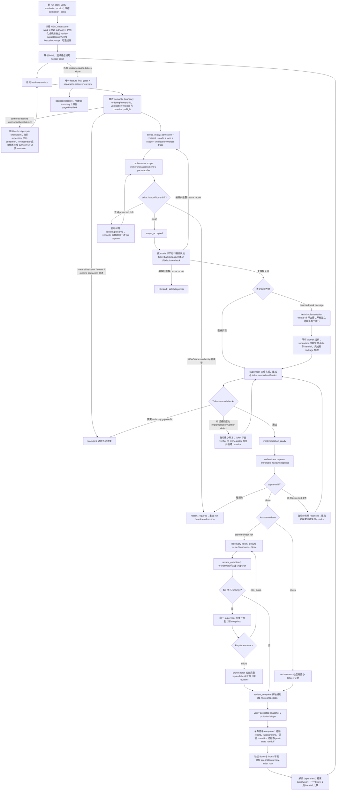

# `execute-tickets` 设计说明

> 本文描述当前仓库中 `execute-tickets` 的设计思路、状态模型和安全边界。
> 运行时行为仍以 [SKILL.md](../../skills/execute-tickets/SKILL.md)、`references/` 下的合同以及
> `scripts/` 中的确定性工具为准；本文是解释性文档，不替代这些权威输入。

## 1. 一句话定位

`execute-tickets` 是一个面向多 ticket feature 的串行执行协议：
它使用每个显式登记仓库的既有共享 working tree，按 `Blocked by` 图选择一张可执行 ticket，
为该 ticket 启动一个全新 supervisor；supervisor 可以直接实现，也可以把首轮实现拆成受控 work package
交给 fresh implementation worker，但始终亲自完成集成验证、review 收敛和验收交付，
再由薄 orchestrator 把经过冻结和复核的精确 delta 安全加入 Git index。

整个 feature 的已接受结果逐张累积在各仓 index 中，但流程不创建 branch/worktree、
不 commit、不 push。获批的 exact ticket scope 决定 working-tree ownership：scope 内已有的
tracked unstaged/untracked 内容直接进入当前 ticket candidate；scope 外内容保持冻结，若执行中发生
普通 working-tree 变化，先看它是否影响当前 ticket 的正常实现、验证、review 或 staging。
不影响就保留原状、排除在 ticket delta/index 外并直接继续，不调查是谁改的；只有确实影响当前 ticket 时才暂停处理。

## 2. 为什么需要专门的执行 skill

“依次让代理实现几张票”看起来简单，实际同时存在多类风险：

1. **上下文累积风险**：十几张 ticket、测试日志和多轮 review 会把主代理上下文撑满，并让后续 ticket 受前序推理偏见影响。
2. **共享工作区风险**：用户已有 staged、tracked unstaged 或 untracked 修改时，普通 `git add` 很容易混入无关内容。
3. **review 输入漂移**：reviewer 看过的 patch 与最终 stage 的 patch 可能不是同一组字节。
4. **状态提前解锁**：实现或测试结束就把 blocker 标为完成，会让 dependant 消费尚未 review/stage 的结果。
5. **无限修复循环**：review finding 可以不断扩 scope、引入新机制或重复审查，缺少确定的收敛预算。
6. **恢复误判**：临时 checkpoint 丢失后，仅凭 ticket 中的文字无法重建之前的 index/working-tree 边界。
7. **验证成本失控**：final repair 后一律重跑所有昂贵 gate 很浪费，但根据 changed files 猜测可复用又不安全。
8. **验证器误阻塞**：test、fixture、regex、scan 或 command 可能机械地违背已经明确的 expected result；把所有 gate failure 都当成 authority 决策会产生无意义的用户请示。
9. **错误因果路线固化**：一个可复现 bug 的早期假设被新证据推翻后，supervisor 仍可能为了保留原计划而叠加第二个症状 workaround。
10. **伪运行态验收**：build、测试、日志或 forced-state 截图可能全绿，但真实 browser、desktop、device 或 live-app primary path 从未执行。
11. **语义 Epic 被误准入**：ticket 字段和路径完整，却同时承载 public contract、迁移、lifecycle ownership、consumer switch 和 legacy contraction。
12. **并发决策边实现边发现**：跨 facade、跨 wire 的 owner 和 linearization point 未写入 authority，缺陷只能在多轮 repair 中逐层暴露。
13. **baseline 冲突发现过晚**：验证命令误伤保留接口、依赖设备或与现有工作树重叠，直到 implementation 完成才暂停。
14. **重复 review 与重复 full gate**：closure 重扫 byte-identical 区域，小修复使所有 gate 失效，等待时间远大于构建本身。
15. **执行成本不可度量**：没有一致记录 ticket scope、review round、repair reason、gate rerun/reuse 和 duration，流程优化只能凭感觉。
16. **authoring 准入语义丢失**：reviewer `FAIL` 后由用户批准的精确文本澄清，如果进入 execution 时只看 `ready-for-agent`，就无法区分真实 `PASS`、人工准入和事后漂移。
17. **验证证据假绿**：合法 production fixture 不可达、oracle 漏掉合法竞态/no-op、整类测试未包含命名 method，或 pipeline/scan 在关键证据缺失时仍返回成功。
18. **单 ticket supervisor 上下文耗尽**：同一个 fresh supervisor 同时承担仓库探索、编码、测试日志诊断、双轴 review 调度和 finding 修复时，可能在 review 开始前已消耗大量上下文，降低后续判断质量。
19. **合法分支直到 review 才补齐**：`scope_ready` 声明了 witness，但 `implementation_ready` 没有把每个合法 fixture/oracle 分支重新映射到最终测试和已执行的反事实探针，导致 discovery review 才发现缺失分支。
20. **小修复仍触发完整双轴 closure**：repair 已被分类为 `micro`，orchestrator 却仍可派发 reviewer；closure 还可能把 discovery 时已经存在的弱点包装成新的 repair regression，重复成本超过实现本身。
21. **文档删除没有职责级审计**：Markdown path 已获准修改后，执行者可能把局部 stale-content cleanup 扩张为整篇重写；
    删除审计、门禁和 reviewer 只看剩余文本是否正确，没有逐项解释消失的章节与 fenced code block。
22. **scope 外修改被误判成终止条件**：scope 外文件可能在执行期间变化；如果它不影响当前 ticket 的正常实现、验证、review 或 staging，追查修改来源和暂停流程都没有价值。
23. **预算通过换 run 重置**：ticket 或 final review 已耗尽三轮后，流程可能新建 `epoch-N`、`chain-N`
    或另一个 `review-budget.jsonl`，把同一 feature 的 Review-4 伪装成新 run 的 Review-1。

这个 skill 的设计目标是：把可以机械判断的 Git、hash、scope 和状态转换交给脚本；
把首轮实现放进边界清楚的 fresh work-package context，把 ticket 级集成和语义 review 留给 supervisor；
把真正需要用户决定的问题与普通修复分开。
因此 gate failure 只阻止 acceptance，不阻止合同范围内的实现修复或 verifier 修复。

## 3. 系统边界

| 维度 | 当前设计 |
| --- | --- |
| 输入 | 一个 feature 的 `spec.md`、完整 implementation ticket 集合、固定 `implementation-ticket-admission.json`、目标仓库规则，以及用户启动本执行模型时授予的 protected staging 权限；不再对单个 scope 内既有文件重复请示 |
| 输出 | feature 的全部已接受实现累积在 Git index 中；inline completion-record bytes 不由 execution 新 stage，而由内容哈希 transition 证明；run-start 已有 staged authority 保持原样 |
| 不改变 | Git history、branch/worktree 结构与 run `HEAD`；index 只接受 orchestrator 证明过的 ticket transition；不影响当前 ticket 的 scope 外内容保持在 working tree 中，不进入 ticket delta/index |
| 不执行 | commit、push、branch 创建、并行 ticket implementation；同一 ticket 内只允许满足独立性条件的 bounded work-package 并行 |
| 调度方式 | blocker-first frontier，始终一次只运行一个 ticket supervisor |
| review | micro 为 orchestrator inspection；standard/high-risk 为 fresh Standards + Spec 双轴 review |
| 兼容性 | bundled scripts 要求 Python 3.10+ |
| 运行证据 | snapshot、patch、log、review report、checkpoint 放在被 Git 忽略的 `.execute-tickets/<feature>/...` |
| 完成含义 | feature 已完整 stage 且通过 verification/review/final gate；不等于 committed、pushed、deployed 或 target-runtime verified，除非后者本身是 authority gate 且已被直接观察 |

### 3.1 暂停、单 ticket 阻塞与整个 run 终止

先区分三个结果：**暂停**会自动处理并继续；**单 ticket 阻塞**只影响该 ticket 及其
descendants，其他独立 ticket 继续串行执行；**整个 run 停止**才会停止所有 ticket。
`blocked` 或 `drift_detected` 只是状态，不自动等于“请求用户授权”。

| 发生了什么 | 流程怎么处理 | 影响范围 | 会问你吗 |
| --- | --- | --- | --- |
| ticket scope 外的文件发生变化 | 不判断是谁改的。先看它是否影响当前 ticket 的正常实现、验证、review 或 staging；不影响就保留现状、排除在 ticket delta/index 外并直接继续，后续再次变化也按同一规则处理；确实影响时才进入冲突处理 | 不影响时不暂停；影响时只暂停当前 ticket | 不影响时不问；只有它会改变 ticket 结果，而且现有 spec/ADR/测试不能给出唯一处理方式时才问 |
| ticket 合同不能被唯一、安全地执行。例如：同一业务问题有多个合理答案；一张票塞了多个可独立验收的结果；合法 production 输入无法触发验收；验收判断漏掉合法竞态；必须修改已完成 blocker 或其他 ticket owner 的范围 | 已有 authority 与当前代码上下文能给出唯一、行为不变的修法时，当前 supervisor 给出精确 correction，orchestrator 直接修改 spec/未完成 tickets、记录 execution authority transition 并恢复同一 supervisor；不调用 write 或 authoring review。仍有多个业务、接口、owner 或运行时答案时，等待 decision owner 写入唯一决定，再由 execute 走同一 repair | 当前 ticket 及 descendants 暂停；transition 验证后恢复 | 只有需要选择业务行为、接口、owner 或运行时语义时才问 |
| 实现检查或 review 在允许的修复轮次内仍失败 | 保存失败命令、snapshot、finding 和 canonical ledger；预算耗尽后保持 blocked，不重启 review chain | 当前 ticket 及 descendants 阻塞；独立 frontier 继续 | 否，不请求一般性继续许可，也不通过新 run-start 获得额外轮次 |
| ticket 明确要求 `adb` 真机验收 | 自动运行 `adb devices -l`。存在符合条件且状态为 `device` 的物理设备时，直接安装、覆盖安装或卸载当前 ticket 的 APK，或者在 ticket 专用 `/data/local/tmp/...` 目录推送并运行声明的测试产物；没有可用物理设备时，报告 `offline`、`unauthorized`、emulator 或空列表等实际结果，等待设备连接后从该项继续，不能用本地测试或旧 `PASS` 代替 | 有可用真机时不暂停；没有可用真机时，当前 ticket 及 descendants 阻塞 | 不询问设备操作许可；没有设备时只提示需要连接可用真机 |
| 当前执行基线或恢复证据无法可信确认。例如：代码、已暂存内容、spec/ticket/receipt 与保存版本不一致；恢复记录丢失或损坏；execution authority repair 后无法证明已经精确恢复旧 process-document bytes | 能从 checkpoint 和 hash 唯一确定正确版本时自动恢复并重试；无法确定时停止，并禁止执行半修复 ticket，避免把未证明的 authority transition 当成已接受状态 | 能自动恢复时不停；不能恢复时整个 run 停止 | 只有三种情况才问：无法判断哪个版本正确；需要把当前状态作为新的执行起点；恢复需要外部权限或会覆盖难以恢复的数据 |
| 下一步与当前 ticket 验收无关，例如操作其他应用、直接修改应用数据或系统设置、使用 root/remount/reboot、读取 credential、调用 external service，或改写 Git history | 不执行该动作，等待明确授权 | 当前动作停止 | 是 |

不会停下询问的项目：下一张唯一可执行 ticket、条件已经满足的 conditional ticket、正常
scope 内修复、已有要求明确支持的 test/fixture/regex/scan 修正、预算内 review closure，
以及不改变业务行为的 execution authority repair。发现 spec/ticket 漏列必改文件、测试、边界或验证命令时，
只要现有 authority 与当前代码上下文已经唯一确定答案，就由 execute 直接修正未完成 authority、保留原 run-start
receipt、记录 before/after transition 并让同一 supervisor 继续；这不是用户授权点，也不进入 write review。

## 4. 角色架构

### 4.1 thin orchestrator

主 agent 被刻意限制为薄 orchestrator，只负责：

- 解析所有 ticket 的 scheduling metadata：number、`Status`、`Blocked by`；
- 选择当前 frontier ticket；
- 读取当前 ticket 的 cold-start contract，但不预载 future ticket bodies；
- 冻结、验证 Git snapshot 和用户现有工作；
- 在新 run-start 通过只读 `admission_state.py verify` 校验 receipt，并把 review/user admission 事实保存为 `admission_basis`；
- 检查 `scope_ready`、`implementation_ready`、`review_complete` 状态门；
- 核对当前 authority/checkpoint、supervisor 的 admission 差异与停止条件，不另做一轮 code/semantic admission；
- 运行 scope ownership assessment；
- 检测 scope 外 working-tree 变化；不影响当前 ticket 时自动记录为 protected state、排除在 ticket delta/index 外并继续，不调查来源；确实影响实现、验证、review 或 staging 时才独占处理冲突；
- protected staging；
- verifier defect 位于当前 ticket 的字面 verification contract 时，执行 bounded ticket-only contract repair 并重新捕获 ticket baseline；
- 发现 authority 已唯一确定的 spec/ticket 顺序、边界、blocking edge、production/test-only scope 或 verification 漏项时，保留当前 supervisor，冻结 execution-authority-repair checkpoint，直接修正未完成 authority 并验证 before/after transition；原 run-start receipt 保持不变；
- 原子完成 ticket 状态转换；
- 从 completion transition 已收集的 post state 保留 ticket handoff，并在下一张 ticket 的 `pre` capture 中完成交接比较；
- 保存 compact checkpoint 和选择下一张 ticket。
- 在被忽略的 run-artifact tree 追加 deterministic run-cost events，并在结束时生成无质量评分的 summary。

orchestrator 不实现生产代码，不运行长测试，不吸收 raw logs，也不替 reviewer 做语义审查。

### 4.2 fresh ticket supervisor

每张 ticket 使用一个没有前序 conversation history 的 supervisor。它是该 ticket 的唯一责任人，负责：

- 读取 ticket、spec、completed blockers 和 live code；
- 读取已验证 receipt 与 bounded `admission_basis`，但不重写 authoring review 结果；
- 验证 cold-start contract：先确认范围、关键 Consumes/Produces、owner 和验收可行性；内部实现细节在修改相应代码前读取，不要求先完成全部实现分析；
- 选择 execution mode 与 assurance lane；
- 声明 exact candidate scope、verification trace 和适用的 `verification_witness_trace`；
- 在 routing reason 中区分直接事实、证据支持的推断和未知，并为 material inference 指定 ticket authority 内最便宜的决定性检查；
- 在 scope 获批后选择直接实现，或把首轮实现分解为带 exact path 子集、acceptance、production seam、verification witness 和 focused check 的 bounded work package；
- 检查每个 implementation worker 的完整 delta、focused checks 和 unresolved assumptions，并在所有 worker 结束后亲自完成跨 package 集成与 ticket-scoped verification；
- 在 `implementation_ready` 前对完整 delta 做三类高发自伤自查：无 ticket 要求却删除的既有行为代码（如被移除的 disable/guard 调用）、没有生产调用方的参数或分支、被测条件为假时也能通过的断言（如已释放引用被报告为探测成功）；命中先修复再派发 review。自查只收窄 finding 流，不替代或缩短任何 review lane；
- 对 bug/regression 维护可复现、可证伪的 causal model；新证据推翻模型时撤回当前路线并返回 diagnosis；
- 只运行当前 ticket 的 ticket-scoped checks；feature final gates 留给累计候选；
- 对 UI/browser/device/live-app acceptance 执行 ticket 声明的真实 target-runtime path，并记录可排除 mock/cache/forced/stale state 的 `runtime_observations`；
- 依据既有 behavior/expected result 诊断 implementation defect 或 verifier defect；在 normal owning scope 内自动修复，ticket 字面 verifier 则交给 orchestrator 的 bounded repair，再重跑受影响 gate；
- standard/high-risk 的 discovery 启动两个 fresh reviewer；closure 默认分别复用原 reviewer，只在不可用或上下文失效时替换；
- 分类并亲自修复有 authority 的 in-scope findings，不把 review repair 再委派给 implementation worker；
- 在 `implementation_ready` 前把每个 correctness-critical acceptance 的最终 legal-fixture/oracle matrix 映射到实际测试和有效 absence evidence，不能沿用 `scope_ready` 中尚未落地的计划性描述；
- 修改已有 Markdown 时，在 `implementation_ready` 前生成职责级 `document-deletion-audit.md`，
  逐项处置被删除或整体替换的标题章节与任意 fenced code block；
- 完成 deletion audit；
- 报告 `review_complete`（micro lane 除外）。

supervisor 不能 stage、commit、stash、reset、checkout 或修改 HEAD/index。
implementation worker 不改变这一 ownership：worker 的 PASS 不是 ticket 状态门，只有 supervisor 可以发送
`scope_ready`、`implementation_ready`、`review_complete`、`drift_detected` 和 `blocked` 五个状态。
与当前 ticket 无关的 scope 外变化不发送 `drift_detected`。只有变化可能影响实现、验证、review 或 staging，
且 supervisor 无法证明可以隔离时，`drift_detected` 才暂停当前写入并交给 orchestrator 处理；它不解锁 dependant，也不等同于 ticket blocker。没有单独的 acceptance
声明——orchestrator 从证据判断验收：一个所有 finding 已处置且两轴通过的 `review_complete`（或 micro 的
orchestrator inspection）在已验证 snapshot 上直接释放 protected staging。

### 4.3 fresh implementation worker

implementation worker 只在 `scope_accepted` 之后、首次 `implementation_ready` 之前存在。每个 worker 负责一个
完整垂直切片，而不是单独负责“只写测试”或“只写 production code”：

- 读取 current ticket、work package、相关 production exports、immediate callers、shared utilities 和已有 tests；
- 按 supervisor 已锁定的 execution mode，在分配的 exact path 子集内完成 production change 与对应 focused verification；
- 把 raw logs 留在被 Git 忽略的 `.execute-tickets/<feature>/...` run-artifact tree，向 supervisor 返回 bounded handoff、changed paths、checks 和 unresolved assumptions；
- 发现 accepted ticket scope 外路径变化时，先判断该路径是否属于本 package 的输入、验证依赖、接口或 state/resource owner；明确无关就继续，可能影响当前 ticket 或无法判断时才停止写入并报告 exact path；
- 发现 package 需要扩大 scope、改变 behavior/owner/interface、修改 completed blocker 或推翻 verification witness 时停止，交回 supervisor 决策。

worker 不能改变 ticket contract、execution mode、assurance lane 或 work-package boundary；不能修改 ticket/spec/receipt；
不能 stage、commit、stash、reset、checkout、修改 HEAD/index、启动 reviewer 或继续派发 implementation worker。

### 4.4 Standards reviewer 与 Spec reviewer

standard/high-risk lane 的 discovery 使用两个并行、fresh、read-only reviewer；closure 分别复用原 reviewer：

- **Standards axis**：检查仓库标准、代码质量、坏味道和工程约束；
- **Spec axis**：检查 ticket scope trace、`Consumes`/`Produces`、acceptance、verification witness、non-goals、state budget 和 stop conditions。

两轴分别出报告，不能通过“一个通过、一个失败，综合算通过”来平均结果。

### 4.5 最大并发形态

implementation phase 允许的最大 active shape 是：

1. 一个 thin orchestrator；
2. 一个 ticket supervisor；
3. 一个 fresh implementation worker；
4. 只有独立性证明通过时才允许的第二个 fresh implementation worker。

review phase 允许的最大 active shape 是：

1. 一个 thin orchestrator；
2. 一个 ticket supervisor；
3. 一个 Standards reviewer；
4. 一个 Spec reviewer。

implementation worker 与 reviewer 不得同时 active。默认只允许一个 write-capable worker；只有两个 package
同时满足 exact path 不相交、不共享 lifecycle/state owner、不共同决定 interface、不存在先后依赖，且 verification
不会读取对方 in-progress mutable output、不会写共享 generated/cache artifact 时，supervisor 才能并行启动两个 worker。

ticket 之间永不并行；不满足上述独立性证明时，work package 串行执行；reviewer 只在同一 immutable snapshot 上并行读取。

## 5. Git 三层状态模型

这是整个 skill 最关键的设计基础。

下表及后文的单个 HEAD/index/snapshot 说明对每个登记仓库分别成立；多仓库
run 用 aggregate snapshot 绑定各仓根目录、Git directory、index 位置及 member
snapshot hash，路径写成 `NAME:path`，accepted index identity 写成仓库到 hash 的映射。
一个 ticket 仍只有一个 supervisor 和既有双轴 review，不按仓库拆成独立完成结果。
命令与证据格式见 [多仓库执行合同](../../skills/execute-tickets/references/multi-repository.md)。
该扩展只管理状态、评审输入、暂存和完成证据；spec/ticket 定义验收要求，
execute-tickets 不解析构建依赖图，也不从仓库关系推导新的联合验收。

| 层 | 含义 | owner |
| --- | --- | --- |
| `HEAD` | execute-tickets 启动前的固定仓库历史 | 只读，整个 run 不得变化 |
| Git index | run 开始时用户已有 staged baseline（包括其中已有的 process documents），加上本 run 已接受 ticket 的实现；execution 不会新 stage process documents | 只有 orchestrator 可修改 |
| working tree relative to index | exact scope 内当前 ticket 的完整 candidate（可包含 scope 接受前已有内容），加上 scope 外冻结或用户批准保留的 edits | supervisor 可改获批 scope；implementation worker 只可改 assigned exact path 子集；orchestrator 独占 drift reconciliation |

可以把单张 ticket 的状态变化理解为：

```text
固定 HEAD
  + 运行开始时的 staged baseline
  + 已完成 Ticket 01 的 accepted implementation delta
  + 已完成 Ticket 02 的 accepted implementation delta
  = 当前 index

working tree - index
  = scope 外冻结或用户批准保留的 unstaged/untracked 内容
  + 当前 Ticket 03 scope 内相对 index 的完整最终 candidate
```

核心不变量：

1. `HEAD` 在 run 内保持不变；
2. 每个 index 只能由 orchestrator 从冻结 artifacts 重建并在该仓 index lock 下原子替换；多个仓库之间没有整体原子替换；
3. ticket scope 决定 ownership；scope 内既有 tracked unstaged/untracked 内容归当前 ticket，scope 外内容保持 frozen 或 classified protected state；
   worker assignment 只能进一步收窄 ticket scope，不能扩大它；
4. stage 后，scope 内完整最终 candidate 必须进入 index，scope 外 working-tree diff 必须逐字节保持 frozen 或 classified protected state；
5. dependant 只有在 blocker 的实现 delta 已 stage，且未进 index 的 completion record 与 transition evidence 都验证后才解锁。

## 6. 为什么每仓选择单 working tree + 累积 index

设计没有为每张 ticket 创建 worktree 或 branch，原因是目标场景需要让后一张 ticket 直接看到前面已接受但尚未 commit 的结果。
Git index 因此承担“累计已验收基线”的角色，而不是仅仅作为 commit 前的临时区域。

这种模型的收益是：

- ticket 按依赖自然累积；
- 用户最终可以检查各仓累计结果，并自行决定各仓 commit；
- 不需要 merge 多个临时 branch；
- 每张票仍能通过 pre snapshot 与 accepted snapshot 隔离 delta。

代价是 index 变成关键状态，任何 agent 随意 `git add` 都会破坏证明链，
所以 skill 把 index write authority 完全集中到 orchestrator，并用临时 index 构建 stage 结果。

多仓 stage 先验证全部 member 并构建临时 indexes，保存冻结的预期 post-stage
aggregate，再逐仓替换。若后一个仓失败，orchestrator 保留已发生的结果，不 reset，
不完成 ticket。原命令可凭同一份 staging evidence 继续：每个仓只能匹配原 reviewed
或 accepted 状态；工具从实际状态判断，无需重复的持久化进度标志。
submodule 只增加 Git ownership 处理：父仓不重复收集子仓文件，但保留完整 index
中的 gitlink；子仓独立保护 HEAD/index/文件，不需要提前 commit 或更新指针。
旧单仓 checkpoint 不证明未纳入的子仓状态，不能自动升级成多仓已验收基线。

## 7. 上下文隔离与消息协议

### 7.1 orchestrator 不预载全部内容

orchestrator 在选择前只解析 ticket number、status 和 blockers；选中后才读取当前 ticket body。
未来 ticket 的实现细节不会提前进入主上下文。

supervisor 只收到以下 cold-start path：

- repository instructions/standards；
- feature spec、已验证 admission receipt 与 bounded `admission_basis`；
- current ticket；
- 当前 ticket 的 direct completed blockers compact evidence；
- repository root；
- 已解析的绝对 `<execute-tickets-skill-root>` 与 `references/supervisor-protocol.md` 绝对路径，supervisor 据此直接读取 §7.5 列出的四个适用标题，不自行猜路径。

每个 direct blocker 的 compact evidence 只包含 exact ticket path/hash、当前
ticket 的 `Consumes` 实际引用的 verbatim `Produces` rows、accepted-content
index hash、completion outcome，以及这些接口引用的 ordering/ownership rows。
transitive blocker、无关 ticket section 和完整 blocker body 不进入默认 cold-start
输入。完整 blocker ticket 只作为 mismatch fallback：compact evidence 缺失、内部
不一致或与当前 ticket/current repository 冲突时才读取，并以 mismatch 阻塞，而
不是从额外文本中推导新 authority。

implementation worker 使用 `fork_turns: none` 类的 fresh context，只收到：

- repository root、applicable repository instructions；
- feature spec 与 current ticket path；
- supervisor 冻结的 work-package id、acceptance slice、execution mode、exact scope 子集；
- production seam、verification witness、focused verification command，以及只读的 completed-blocker interface evidence。

worker 从磁盘读取这些输入，不接收 supervisor 的长推理、完整对话或其他 package 的 raw logs。

原始 patch、完整测试输出和 reviewer report 均保存在被 Git 忽略的 `.execute-tickets/<feature>/...` run-artifact tree，消息只传 path、SHA-256 和 bounded summary。

orchestrator 在每张 ticket 完成时，利用仍在当前 context 中的 ticket 与 bounded
envelopes，向 `.execute-tickets/<feature>/integration-review-index.md` 增量追加
一个 compact row。它不会在 final 阶段重新读取历史 ticket 或 report body。该 row
记录 ticket/path/hash、accepted path/index hashes、cross-ticket interfaces、shared
owners/ordering、review evidence、deviations 和 owned final gates，既作为后续 direct
blocker evidence 的来源，也作为 final review 的分层入口。

### 7.2 600-word status envelope

supervisor 到 orchestrator 的状态包限制为 600 words，并使用固定状态：

| 状态 | 含义 | 下一步 owner |
| --- | --- | --- |
| `scope_ready` | contract、mode、lane、scope closure、scope 和 verification trace 已声明，尚未编辑 | orchestrator 检查并运行 scope ownership assessment |
| `implementation_ready` | 实现及 ticket-scoped verification 已结束 | orchestrator capture immutable assurance snapshot |
| `review_complete` | required reviewer 已完成同一 snapshot | orchestrator verify snapshot，两轴通过即直接接受，否则修复 |
| `drift_detected` | accepted ticket scope 外变化可能影响当前 ticket，或无法证明可以与 ticket 隔离 | supervisor 停止写入；orchestrator 记录 exact path 并处理冲突；无关变化不进入这个状态 |
| `blocked` | ticket 不能在当前合同/scope 内继续 | orchestrator 阻塞该票及 dependant |

`scope_ready`、`implementation_ready`、`review_complete` 和 `drift_detected` 都是硬等待点。
supervisor 在 orchestrator 返回确认前不得继续改 working tree，避免 snapshot 与 review 输入竞争。

### 7.3 envelope 中的可审计字段

从 `scope_ready` 到 acceptance，状态包按各状态实际时点保留以下可审计信息；已存在于当前票据或冻结 evidence 的内容使用 path、SHA-256、section/id 引用，不重复抄写：

- `admission_basis`：`admitted-by-review`，或 `admitted-by-user` 加原始 failed review 和用户 dispositions；
- `execution_mode` 与具体理由；
- `assurance_lane` 与具体理由；
- `test_seam`（仅 `test-after`/`tdd`）；
- exact `scope_paths` 与每条 `scope_trace`；
- blocker 完成后重放 permitted discovery 得到的 `scope_closure_trace`，包含 exact command、当前 execution baseline、逐路径 disposition 和 `0 undisposed paths`；
- acceptance/source/command-or-interaction 的 `verification_trace`；
- correctness-critical acceptance 的 `verification_witness_trace`：production producer、legal fixture、reachability、完整 oracle、direct observation 和 observed or validly reused absence evidence；
- 修改已有 Markdown 时的 `document_edit_contract`，以及从 `implementation_ready` 开始携带的
  `document_deletion_audit` 状态、artifact path 和 SHA-256；
- 需要真实 UI/browser/desktop/device/live-app 证据时，从 `implementation_ready` 开始携带 `runtime_observations`：
  target runtime、exact interaction、freshness action、direct observed result、authenticity evidence 和 supporting artifact；
- snapshot identity、changed paths、checks、review summaries 和 blocker。

`scope_ready` 只声明 interaction protocol，不声称已经观察到运行结果，因此不带 `runtime_observations`。
真实运行证据不存在时，supervisor 必须按 ticket 的 stop condition 返回 `blocked`，不能填充一个预期值冒充 observation。

orchestrator 校验引用哈希和字段对应关系，不依赖早先对话记忆。mode/lane 标量每次保留；理由、scope 和计划性 trace 可引用，仅差异与本轮结果展开。最终运行证据不能用计划引用替代。
`scope_ready` 中的 witness 是执行计划；`implementation_ready` 中的同一字段必须按每个互不等价的合法 fixture/oracle
分支展开，并引用最终测试位置、实际执行日志和能使该分支变红的反事实探针。把 text/vision、success/no-op 或不同合法竞态
合并成一个测试名，不构成最终 witness。
`snapshot` 字段按真实捕获时序引用：`scope_ready` 时当前票 `pre` 尚未捕获，省略该字段且不虚构未来快照；`implementation_ready` 可引用 orchestrator 已返回的实际 `pre` 身份，不得声称拥有尚未捕获的 assurance/review 快照；`review_complete` 必须绑定本轮 reviewers 实际审查的快照；`drift_detected` 与 `blocked` 只引用已取得且适用于该报告的身份，未取得则省略。

### 7.4 implementation worker handoff

worker handoff 只返回 supervisor，不形成新的 orchestrator 状态。每份 handoff 至少包含：

```yaml
work_package: <stable package id>
acceptance: <ticket acceptance identifier>
scope_paths: [<assigned exact path>]
changed_paths: [<actual changed path>]
checks:
  - command: <focused command>
    exit_code: <integer>
    result: <bounded result>
    log: <absolute run-artifact path and SHA-256>
unresolved_assumptions: [<exact assumption, or empty>]
stop_reason: <scope/authority/interface/witness conflict, or None>
```

supervisor 必须确认 actual changed paths 是 assigned scope 的子集，读取完整 worker delta，并判断 package 的
production seam、witness 和 focused check 是否仍成立。只有所有 worker 已结束、跨 package interface 已集成、
ticket-scoped checks 已由 supervisor 完成后，supervisor 才能发送 `implementation_ready`。

### 7.5 skill 本体的渐进式加载

`SKILL.md` 只保留整个 run 都必须知道的 Git 三层模型、角色边界和单 ticket 串行主干；
阶段性合同由进入该阶段的 actor 读取适用章节，避免 skill 一触发就把 run-start、supervisor mode/status
和 feature final review 同时装入上下文：

| 加载时点 | reference | 内容 owner |
| --- | --- | --- |
| 新 run snapshot 或 resume validation 前 | `references/run-preflight.md` | required inputs、admission、run-start identity、独立 review-budget ledger 初始化或续用、可选统计，以及 ticket-state command contract |
| 每个 fresh ticket supervisor 启动前 | `references/supervisor-protocol.md` | cold-start context、status envelope、execution mode 与 assurance lane routing |
| scope 外变化可能影响当前 ticket，或下一张 ticket 比较 handoff 时 | `references/working-tree-drift.md` | 影响判断、自动隔离、必要时的 reconciliation、ticket 间交接与性能边界 |
| 所有 implementation tickets stage 后 | `references/final-gate.md` | feature gate、integration review、final repair 与 completion report |

每个 actor 按当前阶段读取适用章节，在同一 context 内复用未变化的已读内容；截断只补读缺失范围。
supervisor 先读 `Context boundary`、`Supervisor status protocol`、`Execution mode routing` 与 `Assurance lane routing` 四个既有标题，首次 discovery 才读 review mechanics，closure 只加载 closure 与差异合同。
已有的 `review-policy.md`、`review-mechanics.md`、`implementation-delegation.md`、
`reusable-gates.md`、`review-budget.md` 和 `run-metrics.md` 继续按各自决策点加载。resume 时先加载 run-preflight 合同并验证
checkpoint，再加载当前恢复阶段的 reference；不能因为预计后面会用到就提前加载 final-gate 或 reviewer 细节。
`run-metrics.md` 是可选诊断说明，其缺失或不可读不属于执行合同缺失，不阻塞启动、恢复或收尾。
事件和计时的运行时细则统一维护在 `references/run-metrics.md` 的 `Event contract` 章节；入口仅保留各阶段统计时点提示和统计失败不阻塞执行的约束，不重复定义事件字段、计时区间或累计方式。
`checks.duration_ms` 是可选诊断字段：起止边界对 orchestrator 可观察时必须取机器时钟实测；null 仅限边界确实不可观察或区间丢失，且每个缺口必须进入 closeout 的 `phase_timings` `unmeasured_count` 显式上报，不得静默通过。容量导致的调度等待（如 reviewer 派发因线程/agent 上限被串行化）记入 dispatch schedule 证据、不计入执行 `duration_ms`；无法分离时如实记录合并区间并声明。不得因计时问题退回状态报告、延迟推进或重跑检查。

这个拆分是上下文边界，不改变运行状态机：reference 只移动合同 owner，不能删除 stop condition、
缩短 assurance budget 或改变 protected staging。`SKILL.md` 保持低于 500 行，portability test 固定验证
入口中的加载时点和每个阶段合同中的关键不变量。

## 8. 端到端执行流程



## 9. Preflight 设计

### 9.1 固定 run identity

orchestrator 首先记录 `git rev-parse HEAD`，该值整个 run 不得改变。
run-start snapshot 同时冻结：

- full index entries hash；
- cumulative staged patch；
- tracked unstaged patch 及每文件 patch hash；
- combined patch；
- status output；
- 每个 pre-existing untracked path 的 content hash、size、kind 和 mode；
- scope 外 dirty tracked/untracked path 的可恢复内容，保存在 `backups.json` 与 content-addressed `blobs/` 中。

snapshot 创建后，orchestrator 按 `references/review-budget.md` 初始化或恢复独立的
`.execute-tickets/<feature>/review-budget.jsonl`，绑定 feature 与首个 run-start identity。
旧 run 没有该文件时，仅从已验证 review reports、repair dispositions 和 integration index 恢复历史；
不读取 metrics 推断已用预算。resume、新 run-start 或 artifact 路径调整不能隐藏之前的 review phase。
统计独立写入 `run-metrics.jsonl`；任何统计缺失、损坏、校验或读写失败都不能影响执行和恢复。

### 9.2 receipt/spec/ticket 的新 run 准入

orchestrator 在新 run 或 resume 前先读取目标仓库的 `docs/agents/issue-tracker.md`，分别确定本 feature
的 spec 目录 `<spec-dir>` 和 ticket 目录 `<tickets-dir>`；ticket 不必位于 spec 目录下。
只有该文档不存在时，orchestrator 才分别使用 `.spec/<feature>` 和 `.spec/<feature>/issues`。
tracker 不可读、任一目录未定义或有歧义、路径逃出仓库或与 handoff/保留的 authority 路径不一致时，
orchestrator 在修改前停止，不猜目录或因声明路径缺失而静默回退。
orchestrator 把两个仓库相对目录通过 `--spec-dir`、`--tickets-dir` 传给 admission verify，
把 `--tickets-dir` 传给 ticket show/complete，并向每个 fresh supervisor 传递目录及 tracker 来源。
脚本负责路径校验，不解析自然语言 Markdown；ticket 状态、blocker 与验收语义不变。

新 run-start 首先调用 bundled `admission_state.py verify`。receipt 必须位于
`<spec-dir>/implementation-ticket-admission.json`，并精确覆盖当前 `spec.md` authority body
与完整 ticket path set/bytes。成功结果只能是 `admitted-by-review` 或 `admitted-by-user`；后者保留 failed review
和逐 finding user disposition，不能被 execution 改写成 reviewer `PASS`。receipt 若带有不可读或
超预算的 delta review lineage，同样在实现前 block。

`spec.md` 的 authority 边界与 authoring skill 完全一致：两个 skill 携带字节相同的
`manifest_lib.py`，合法 presentation block（唯一允许键 `display_title`）位于 admitted bytes 之外，
改名不会使 receipt 失效；block 一旦畸形则整文件退回 authority，ticket 字节永远全部是 authority。
边界定义只能在两份副本中同时修改，否则一个 skill 会准入另一个拒绝的字节。

receipt 通过 `--receipt` 传入 capture；`review_state.py` 从 receipt 派生 exact authority
集合——`spec.md`、receipt 本身和每张 ticket——并记录每个路径当前字节的 SHA-256，因此冻结集合永远不会与
admission 校验的路径集不一致。字节与 receipt 记录哈希的一致性由 run-start 的
`admission_state.py verify` 保证；capture 之后的任何 authority 漂移由 snapshot `verify`
与 baseline 连续性检测。snapshot 的承诺比 admission 更强——本次 run 期间不允许任何 authority 字节移动——
因此它冻结整文件字节，包含 presentation label。

因此 authority 输入（receipt、`spec.md` 和每张 ticket）在 Git 中的状态可以是：

- 已 commit 且未变化；
- 在 run-start 前由用户新增或修改后已完整 stage；
- 完全未被 Git 跟踪，或被 `.gitignore` 排除。

换言之，authority 完整性是内容寻址的，不依赖 Git 跟踪状态；执行既不要求对它们执行
`git add`，也不会在 run-start 后新增 staged authority。`review_state.py stage` 会拒绝把
current ticket delta 中的 declared authority path 写入 index。
如果用户在 run-start 前已经 stage authority，完整 index 会把它作为 frozen staged baseline 原样保留。
执行者不能基于与 receipt 哈希不一致的 receipt/ticket/spec 行为开始实现，也不能生成或刷新 receipt。

receipt 只在新 run-start 对初始 authoring authority 做一次内容校验。执行开始后，
`ready-for-agent -> done`、bounded verification-only repair 与 execution authority repair
会合法改变 spec 或 unfinished-ticket bytes；resume 使用 retained run-start、authority-repair 与 completion
checkpoints 证明这些变化。execute orchestrator 不生成、改写或替换 receipt，也不调用
`write-implementation-tickets`：原 receipt 始终是 initial admission basis，后续 approved transitions 组成执行期 authority lineage。

### 9.3 现有 staged baseline

按当前 [SKILL.md](../../skills/execute-tickets/SKILL.md) 的新 run 规则，run 开始时所有已 staged paths 都被视为用户提供的 accepted baseline，
包括用户此前已经 staged 的 process documents；execution 不会新增这类 staged path，也不移除用户 baseline。
路径不再限制必须位于 feature spec tree，也不再次要求用户分类。run-start snapshot 会冻结它们的完整 patch。

resume 则不同：已有 cumulative staged output 必须能由保留的 `.execute-tickets/<feature>/...`
checkpoint 证明属于同一 run。checkpoint 丢失时停止，不能从 ticket prose 猜测重建。

### 9.4 按 ticket scope 划分 working-tree ownership

- exact scope 内已有的 tracked unstaged files 直接成为当前 ticket candidate；review 和 stage 使用它们相对 index 的完整最终 diff；
- exact scope 内已有的 untracked files 同样归当前 ticket，最终仍存在的完整内容进入 review 和 protected staging；
- scope 外 tracked unstaged/untracked files 以 frozen protected state 开始；如果后续变化且不影响当前 ticket，就自动记录新状态并继续，不能吸收进 ticket delta/index；
- `review_state.py assess` 只报告 scope 接管了哪些既有路径，不因重叠停止，也不向用户请求额外授权；
- receipt、`spec.md` 和 implementation tickets 仍是独立的 authority inputs：run-start/resume 时必须与 receipt 或受保护 transition 记录的内容哈希一致，Git tracking/staging 状态不参与 authority 判定；
- skill 不 reset、stash 或 stage scope 外独立内容；只有 classification 结果为 `restore` 时，orchestrator 才把当前 bytes 移入 quarantine 并恢复最后的 protected state。

### 9.4.1 protected working-tree drift

`review_state.py drift` 把变化分成三类，orchestrator 按确定性 `status` 路由：

| 类别 | report status | 处理 |
| --- | --- | --- |
| ticket scope 外普通 tracked/untracked path 新增、修改或删除 | `confirmation_required` | 该 status 只表示脚本需要一份 disposition 记录。路径不影响当前 ticket 时自动 `preserve` 并继续，不调查来源、不发送 `drift_detected`；影响当前 ticket 或无法隔离时才暂停处理 |
| `HEAD`、Git index、cumulative staged patch 或 authority bytes 变化 | `restart_required` | 仍向用户报告，但当前 run 不能直接忽略；需要新的 run baseline 或 admission |
| proposed write path 没有 declared scope/permitted-discovery authority，或 worker 越过 assigned package 但仍在 ticket scope 内 | 不属于 drift reconciliation | 保持现有 scope/authority 或 delegation blocker，不借用户 `preserve` 扩 scope |

`restore` 表示 retained assignment/patch/tool evidence 将其唯一归因为执行侧误改。`reconcile` 先把当前 path 移到 resolution 的 `quarantine/`，
再从未变化的 index、baseline backup 或上一份 approved resolution 恢复 bytes、kind 和 mode。
`preserve` 表示该 scope 外变化不影响当前 ticket：path 保留在 working tree，记录为新的 protected state，但不进入 ticket scope、
`ticket-tracked.patch`、`ticket-untracked.patch` 或 Git index。classified path 再次变化时必须重新报告和分类。

report 在分类期间如果变旧，`reconcile` 会在任何恢复动作前拒绝；备份 hash 或 blob path 被篡改时也在 quarantine 前失败。
如果 reconciliation 发生在 checks 或 review 之后，supervisor 重跑所有能观察该 external path 的 checks；任何 repository edit
都会使旧 review snapshot 失效，必须按原 assurance lane 重新 capture/review。

### 9.4.2 run-start、ticket handoff 与成本

`ticket_state.py complete` 使用完成转换已经执行的 post-state collection 写出 `completion/handoff/`，不再额外调用一次
全仓状态采集。首张 ticket 使用 `run-start` 作为 handoff；后续 ticket 在 exact scope 声明后，使用上一张票的
`completion/handoff/`。两者都通过一次 `review_state.py capture --handoff ... --drift-output ...`
比较对应 handoff 并生成新的 `pre`：clean path 的同一次 state collection 直接写 `pre`，所以不增加一次仓库扫描。

如果两张票之间有普通 working-tree drift，命令只写 report、不创建 `pre`；不影响下一张 ticket 的路径自动
`preserve`，随后立即重跑同一 capture，不形成用户可见的暂停。影响 ticket 或无法隔离的路径才进入冲突处理。
保存可恢复内容仍有与 protected dirty/untracked 文件总大小成比例的读取和写入 I/O，这是精确恢复原内容的必要成本，
但不是第二次 repository discovery/status scan。

### 9.5 ticket graph admission

orchestrator 机械检查：

- 唯一 ticket number；
- 恰好一个 `Status` 和 `Blocked by`；
- 无依赖环；
- `done` ticket 在同一 ticket 文件中有且仅有一个 readable completion record；
- 当前 ticket 的 cold-start contract 包含 authority、owner、scope、interfaces、behavior、state budget、acceptance、commands/interaction protocols 和 stop conditions；
- `Slice boundary` 通过 independent-rejection test，一个 semantic epic 即使 exact paths 齐全也会阻塞；
- lifecycle/concurrency/routing/cross-process ticket 的 ordering table 已由 spec/ADR 确定 actor/thread、state/resource owner、linearization point、failure owner 和 deterministic interleaving；
- 每个 baseline preflight 都有结果或共享前置失败的证据与恢复条件；只有 completed blocker 的精确 `Produces` 和 immutable completion evidence 可以解释预期 drift；
- 每个 correctness-critical acceptance 都有 production producer、legal fixture、reachability、完整合法 oracle、direct observation 和 observed or validly reused absence evidence；
- ticket-scoped checks 与 uniquely owned feature final gates 分层，同一 gate id 的 owner、command、expected result 和 reuse assessment 一致；
- bug/regression 还包含 reproduction、evidence-backed causal model、decisive falsifier 和 re-diagnosis condition；
- authority 要求真实 UI/live-app 行为时，还包含 target runtime、exact interaction、freshness action 和 authenticity evidence。

contract 缺失时 supervisor 不得读代码后替 ticket 发明行为。跨 facade/wire 的 hard ordering 若存在多个合理答案，
必须先取得 material decision；decision owner 记录唯一答案后，由 execute 通过 authority repair 更新 spec/未完成 ticket。
TDD、“选一个现有锁”或重新调用 write review 都不能替代 authority。
supervisor 同时复用已准入的职责证据，核对新增等待、计数、cleanup guard/retry 是否保护下层 owner 保证之外的独立业务义务；
同步等待沿真实调用链检查线程、完成条件、外层预算和超时结果。下层 drain 保证不要求重复上层等待，也不替代独立业务清理。
有冲突时走已有 authority repair/material decision，不静默删约束或增加保护。
同样，padding、fake-only failure、forced state、timing sleep 或较弱 proxy 不能修补不可实现的 verification witness。
如果缺失只是不完整 ticket 对已接受行为的机械表达，且稳定 authority 在 repair delta 外唯一确定
ticket order、blocking edge、exact production/test-only scope、discovery disposition 或 verification，
orchestrator 运行 execution authority repair：保留最理解当前代码的 supervisor，直接修正 spec/未完成 tickets，
记录 approved authority transition，并在新的 `pre` snapshot 上继续；不返回 write 流程。

## 10. Frontier 与 ticket 串行调度

frontier 定义为：

- `Status: ready-for-agent`；
- 所有 `Blocked by` ticket 都为 `done`；
- 每个 blocker 的 inline completion record 有效。

默认选择最低编号 frontier ticket；`execution-plan.md` 可以声明另一个 blockers-first 顺序，
但不能静默覆盖 ticket 自身的依赖边。

若某 ticket 阻塞，只有其 descendants 被阻塞。不存在 blocker、interface 或 state-owner 关系的其他 frontier ticket
默认继续串行执行，除非 execution plan 明确禁止。这样避免一个独立决策阻塞整张图，同时仍不引入并行写入。

这里的“串行”约束作用于 ticket supervisor 和 ticket acceptance boundary。同一 ticket 的首轮实现可以按 12.5
使用 bounded implementation worker，但这些 worker 共享同一 ticket scope、不能提前形成 acceptance，且全部结束后
仍由同一个 supervisor 集成和验证。

## 11. scope admission

### 11.1 exact path

supervisor 的 `scope_ready` 必须引用或列出每个可能 create/modify 的 repository-relative exact file path。
目录、glob 和 `as needed` 不合法。
orchestrator 从已验证的 declared scope 加获批 discovery dispositions 提取一次 exact paths，复用于 assess、capture 和 metrics；不新增持久 scope 状态文件。必要检查和 pre snapshot 通过后立即发送 `scope_accepted`，随后记录指标，计时以实际发送为终点。

### 11.2 `scope_trace`

每个 path 必须映射到：

- ticket 的 declared write scope；或
- permitted discovery rule 的具体满足证据，例如 scoped `rg` 命中旧错误码。

“改这个文件更方便”不是 scope authority。无法 trace 的 path 使 ticket 进入 `blocked`，
而不是让 orchestrator 临时扩 scope。若 spec、completed blocker、production caller 与现有 test 已唯一证明
这是行为不变的漏项，则当前 supervisor 给出 exact correction，orchestrator 执行 execution authority repair、
记录 path-set transition，并从修正后的 scope 继续同一 ticket；无法唯一决定时才等待 authority decision。

### 11.2.1 `scope_closure_trace`

所有 blocker 完成后，supervisor 在编辑前重放 ticket 的每条 exact permitted-discovery command。
它把每个当前命中归类为 `declared-write`、满足 bounded discovery rule 且进入 `scope_paths` 的
`permitted-write`、`read-only` 或有理由的 `false-positive`。`scope_ready` 必须记录 authoring baseline、
当前 completed-blocker basis、完整命中集合和 `0 undisposed paths`；命令失败、重复/缺失 disposition、
未进入 scope 的 write path 或非空差集都在编辑前阻塞。没有 permitted discovery 的 ticket 明确记录
exact scope 无需 replay，不制造无意义扫描。

共享前置失败由 supervisor 在既有 `preflight_trace` 中记录一次，列出确定被遮蔽的 check IDs、原因、证据和恢复执行条件。
缺少证明时不能猜测遮蔽；独立检查和安全/前置门禁仍执行。已知 blocker 接口迁移的中间态可以继续到修复，
修复后、acceptance 前必须执行此前被遮蔽的必需检查。共同失败不是新状态枚举，也不是 PASS。

### 11.3 `verification_trace`

每个 proposed verification command 或 target-runtime interaction protocol 必须映射到一个 acceptance identifier 和 authority source。
诊断时可以缩小命令复现失败，但 acceptance 仍需要全部 ticket-scoped checks 和后续 feature final gates。

### 11.3.1 `verification_witness_trace`

每个命名 boundary test、lifecycle/resource proof、negative scan、generated-consumer check
或其他 correctness-critical acceptance 都必须检查下列可行性。scope 阶段复用已审查的 witness 定义，只核对当前 seam、blocker 变化和声明的 non-mutating probes；没有相关变化或矛盾时不重新设计 fixture/oracle。行为、接口、owner、scope 或验证可行性未知仍阻塞，内部实现细节留到对应修改前读取：

- production producer 是否是真实 encoder/API/runtime operation/generated artifact/compiled consumer；
- fixture 是否为 production 合法输入，且数值或状态构造确实可达；
- oracle 是否接受 authority 允许的合法竞态和 operation-specific success no-op；
- observation 是否直接测量 value、identity、count、ordering、artifact 或 side effect；
- absence evidence 是否证明所需测试存在并执行、真实目标被读取、失败能够传播；行为 oracle 则检查实际断言。

已有执行完整性证据和相关 red 证据在适用边界未变时直接引用；只有具体缺口才增加最小 non-mutating probe。
执行完整性证据的复用不减免 baseline 行为/构建检查或实现后检查；只有专门证明执行完整性的预检可以直接引用。
生产代码变异验证不是默认门禁，只执行有明确 authority 或具体假绿风险依据的声明 probe。
未影响 producer、fixture、oracle 或执行检查的内部修改不自动使这些证据失效。

Gradle 命名证明使用逐 method selector 或精确 JUnit method set；生产扫描排除拒绝 fixture；
generated API 检查落在实际生成并编译的 consumer；多个 operation 独立断言；必要 pipeline 保留上游非零退出。
任一 witness 不可实现时在编辑前 `blocked`，不属于 verification-only repair。稳定 authority 能唯一决定
behavior-preserving correction 时走 execution authority repair；否则等待 material decision，随后仍由 execute 更新未完成 authority。

`implementation_ready` 前，supervisor 对最终 candidate 重建一次 legal-fixture/oracle matrix：每个 authority 允许且行为不同的
合法输入、竞态或 no-op 映射到实际 fixture、完整 oracle、direct observation 和已执行日志；共享的有效 absence evidence 只引用一次，不要求逐行制造反事实失败。
orchestrator 如果发现某行只复述 ticket、没有最终测试映射，或多个不同合法分支被一个宽泛 fixture 合并，就拒绝
`implementation_ready`，不把 discovery reviewer 当作缺失 witness 的第一道检查。

### 11.4 scope ownership assessment

通过逻辑 trace 后，orchestrator 运行 `review_state.py assess`，报告哪些 pre-existing tracked unstaged/untracked
路径由 exact scope 接管。重叠不是冲突，也不是用户决策点；接管后的完整最终 diff 由当前 ticket 负责验证、review 和 stage。
逻辑授权仍来自 ticket 的 declared scope 或 permitted discovery，工作区是否干净不会扩大或缩小该授权。
未进入 exact scope 的既有内容继续由保护基线持有。

同一 assessment 与创建 ticket `pre` 的初始 `capture` 还做一次快照可覆盖性检查，并在编辑前拒绝 exact
write scope 中 Git 会忽略的路径（`path_is_ignored`：既有 untracked 文件，或尚不存在、创建后即命中
ignore 规则的路径），报出具体路径：`collect_untracked` 的 `--exclude-standard` 永远看不到它们，
review/stage 无法交付，force-add、改 `.gitignore` 或为 ignored 交付扩权都不是修复。
已跟踪路径（`git check-ignore` 不报 tracked，即使命中 ignore pattern）与 Git 不忽略的普通
untracked/未来新文件、删除路径继续按既有行为工作；ignored authority 与 run-artifact 不在 write scope；
多仓模式由每个成员在自身仓库上执行同一检查。

### 11.5 事实、推断与决定性检查

supervisor 在 `scope_ready` 的 routing reason 中把证据分成三类：

- **直接事实**：当前仓库、可复现输出或已完成 blocker 能直接证明的内容；
- **证据支持的推断**：由事实推出、但仍能被一个具体检查证伪的 owner、causal path 或 verification assumption；
- **未知**：当前 authority 和证据无法唯一决定的事项。

会改变 observable behavior、owner、interface、scope、production state 或 verification 的未知直接阻塞。
每个 material inference 必须有 cheapest decisive check；scope 接受后，supervisor 按所选 execution mode 允许的最早时点运行它。
该检查用于判断路线是否还成立，不能替代 ticket-scoped check、feature final gate、行为测试或 assurance review。

bug/regression 的 causal model 在 production edit 前被推翻时，supervisor 撤回原 `scope_ready`，建立新证据后再声明；
编辑开始后才被推翻时返回 `blocked` 并回到 diagnosis。两种情况都禁止为了让现有测试变绿而添加第二个症状 workaround。

API/wire/输出形状迁移的 supervisor 在修改调用方时同时核对声明的生成消费者和 verifier：正向 consumer
必须使用本次新形状，隔离/拒绝等负向 oracle 继续成立。旧 consumer 仍可编译不是迁移完成证据。
遗漏的 generator/script write scope 走既有 execution authority repair；不直接越界，也不留给 final reviewer 首次发现。

### 11.6 真实运行路径与 `runtime_observations`

当 authority 要求 browser、desktop UI、device 或 live-app 行为时，supervisor 在控制工具前先从 ticket 形成 exact interaction hypothesis，
然后在真实 target runtime 中执行该路径并刷新或重置陈旧状态。`runtime_observations` 记录：

- 对应 acceptance identifier；
- target runtime 与 exact interaction；
- freshness action；
- direct observed result；
- 排除 mock、cache、screenshot-only state、forced state 或 stale renderer 的真实性证据；
- supporting artifact path/hash，或明确 `None`。

build、测试、日志和截图只能支持这项观察。真实 runtime、设备或凭据不可用时，supervisor 按 ticket 的 owner/stop/report 合同阻塞，
不能用 Storybook、forced state 或较弱的本地 seam 代替。

昂贵构建或真机运行前，执行该 gate 的 supervisor 在既有 verification_trace 中一次核对：当前权威要求的
最小 target/selector、必需参数与环境来源、结果 writer 实际输出到哪个 artifact、parser 如何判定，以及可消费的
blocker 证据和用户处置。范围不清或日志路径错误先修复，不默认跑整类/整套测试；契约确需全套时仍全套运行。
需要 fresh-runtime evidence 的 gate 不能用 blocker PASS 替代。已有 gate 已声明的复用仍遵循原复用协议。

新增或修改验收入口时，要写清由谁证明它能运行，以及什么时候验证：

| 情况 | 负责人 | 完成时机 |
| --- | --- | --- |
| 当前就能判定的问题：运行器（runner）、构建接线、参数、结果位置、断言，以及命名入口独立启动所需的初始化/连接/参数 | 本票实现负责人 | 本票完成（completion）前 |
| 启动实测、合法输入可达性，需要未来设备或未完成依赖 | 已授权的验证负责人 | 依赖满足后、完整昂贵矩阵开始前，做一次最小探测 |

- 这个验证负责人可以由后续票据的负责人承担；原合同允许时，也可以由最终阶段的负责人承担。不强行前移，也不要求票据作者提前实现整套设施。
- supervisor（负责当前票据实现与验证的代理）沿真实路径确认新增入口能启动、合法输入能到达所声明的条件；已有直接证据直接复用，已知事实不重复探测。
- 声明的依赖仍未完成时，按上述既有合同记录后续验证负责人、恢复条件和尚未验证的项目，不探测硬件去重复确认这个已知阻塞；出现新事实或依赖完成后再按上面的具名负责人和阶段恢复执行。
- 本票的显式先决门禁和安全先决门禁不因此延后。
- 最小探测只证明它覆盖的范围，不替代票内检查（ticket-scoped check）、特性最终门禁（feature final gate）或行为验收。
- 源码修复后，先确认设备或运行时实际安装/运行的产物已包含该修复，才让对应门禁结果代表这次修复。现有构建输入、产物与安装记录足以把修复对应到已安装/运行身份时直接复用，只有对不上时才只重建相关产物。不能只凭源码已改或一条早于修复的成功构建日志就声称产物已含修复；也不要求每次 hash 必变、强制全量重建或让每张票都提前上设备。

关键可行性未知时，supervisor 先复用证据或执行最小有界探针，核对持续环境条件、真实 writer/parser 及总预算内的串行耗时。
这不是新审查阶段；部署或施压由已授权验证 owner 执行，不能塞进非修改性 authoring preflight。
必要环境前提中断时，原 fixture owner 收尾受影响观察并报告该项未验，不耗尽超时或靠延时掩盖前提失败。
合法结果被 oracle 拒绝先核对合同；条件成立而产品违约仍报缺陷。不可达或诊断预算耗尽时将精确未验项交决定 owner，不能自行降低验收。

verifier 修改 owner 复用已有 witness，在运行前沿脚本检查观察来源→比较→失败清理：identity、顺序、唯一性
分别比较实际值；角色/权限来自实际安装或运行边界；脚本自报标签不是观察。已启动后台进程的失败退出走现有
cleanup owner，检查的是当前生产可达脚本路径，不新增产品 instrumentation、fake failure 或状态机。
这个检查属于实现/原有 witness，完成一次后不让每个角色重做；发现缺口先修对应脚本，再运行声明验收。

对于 ticket 已声明的 `adb` 真机验收，supervisor 不先请求执行许可，而是直接：

1. 运行 `adb devices -l`，只接受状态为 `device`、非 emulator 且满足 ticket 已声明 ABI/SDK/serial 条件的物理设备；
2. 多台设备都满足而 ticket 未指定 serial 时，按 serial 字典序选择第一台；ticket 明确要求多设备/多 ABI 时按合同逐台执行；
3. 对当前 ticket 生成或明确使用的 APK/package，按验收需要直接安装、覆盖安装或卸载；APK 与 package 能从 ticket、构建产物或 manifest 唯一确定即可，不另行询问。卸载导致该 package 数据按 Android 正常语义被删除，也属于这次卸载操作；
4. 也可以在 ticket 专用 `/data/local/tmp/<feature-or-ticket>/` 目录创建临时内容，推送 ticket 声明的测试文件，为这些文件设置所需执行权限，运行精确 cases，并保存命令、exit code 和输出；
5. 不操作与当前 ticket 无关的应用，不直接执行 `pm clear` 或修改应用数据、系统设置和无关设备文件，不使用 root、remount、reboot、credential 或外部服务，除非另有明确 authority。

只有第 1 步找不到可用物理设备时才以 `evidence_unavailable` 暂停；`offline`、`unauthorized`、仅 emulator 或不满足 ticket 条件都算“没有可用真机”。这不是设备操作授权请求，连接设备后直接重试。

真机首次失败时 supervisor 先保留已有完整日志、退出结果和运行条件，再决定下一次运行。
每次后续诊断须说明要区分的原因、新增证据及 ticket 声明的次数/时长边界；若未声明，supervisor 在已有权限内
选择并记录最小有界诊断，不启动“直到通过”的循环。没有新证据的重复失败结束本轮诊断并报告未解决项。
不同模型来源、配置或环境的成功只证明那组条件，不能替代原路径；一次成功也不能覆盖相同代码/条件下的失败。
取证不扩大设备操作权限，不自动要求新增生产 instrumentation。

### 11.7 文档编辑执行审计

当 ticket 修改已有 Markdown 时，supervisor 在 `scope_ready` 重放 ticket 的文档编辑合同：默认是 `surgical`；
只有 ticket 引用的 spec、ADR 或已记录用户批准明确授权时才接受 `whole-document`。exact path 属于 accepted scope
只证明执行者可以编辑该文件，不证明整篇内容可以被重新设计。

在 `implementation_ready` 前，supervisor 对 final candidate 与 pre snapshot 的 Markdown diff 生成
`.execute-tickets/<feature>/<ticket>/document-deletion-audit.md`。审计单位只包括：被删除或整体替换的
标题章节，以及任意语言的 fenced code block。它不按删除行数、代码块数量或 Mermaid 数量判断质量。
多个代码块只有在属于同一章节、承担同一职责并共享同一 disposition/authority 时才可合并一行。

每个审计单位必须是以下一种 disposition：

- `replaced`：该文档职责仍存在；记录 replacement 的精确文件与标题/代码块位置，并证明它继续承担原职责；
- `superseded`：该职责或事实已不再存在；引用当前 spec、ADR、用户批准或当前代码合同作为精确 authority。

混合单位必须拆分。`replaced` 缺少实际 replacement、`superseded` 缺少能证明职责消失的 authority、
漏记实际删除单位，或任何 `unexplained` disposition 都阻止 `implementation_ready`。没有适用删除单位时记录
`not_applicable`；这不替代 ticket 的正向文档 acceptance。

## 12. execution mode：如何生产和测试变更

execution mode 与 diff 大小无关，按优先级选择且必须恰好一个。
supervisor 按最终产品的稳定 acceptance behavior 判断触发条件，未接线、占位实现和未完成依赖本身
不是新增回归。中间步骤只运行推进所需的检查；后续行为由 ticket 指定的 owner 验收，不能提前记为通过。
明确要求的安全不变量、迁移兼容性与前置真机证据仍按原 gate 执行，不因 feature 尚未完成而豁免。

### 12.1 `tdd`

出现任一条件就使用 `tdd`：

- ticket 明确要求 test-first 或 regression test；
- 可复现 bug；
- business/validation/parser/serializer/error/state/lifecycle/concurrency/retry/recovery/persistence/integrity/security 行为变化；
- 多个独立 acceptance behavior 各自需要新测试；
- 必须用 runnable example 消除行为不确定性。

supervisor 在首个 test 前确认 stable production seam 和 expected behavior。
如果 spec/ticket 没有确定它们，返回 `blocked`，不能为测试便利新增生产 seam。
实现采用一个 vertical red → green slice 一次，不先批量写 base-case tests。
这里的 slice 是稳定产品行为，不是每次内部编辑。一个既有或新增的失败行为测试可以覆盖连续的实现、
接线与调整，直至该行为通过；文件、helper 和 work package 不各自产生新的红灯义务。review 修复已有
失败测试覆盖的缺口时也直接修复并重跑；只有新增稳定行为、未覆盖的真实回归或必需安全不变量才补测试。

bug/regression 的 `execution_mode_reason` 还必须重复 reproduced failure、evidence-backed causal model
和 decisive falsifier。决定性证据推翻模型时，按 11.5 的 editing boundary 返回新 `scope_ready` 或 `blocked`；
不能因为已经选择 `tdd` 就继续测试一个失效的因果合同。

### 12.2 `test-after`

只有以下条件全部满足才使用：

- 通过已有 stable production seam 改变 externally observable behavior；
- ticket + spec 已完整确定 expected result；
- 没有任何 `tdd` trigger；
- failing test 不会帮助解决设计不确定性。

先实现，再加至多一个 focused behavior test。实现开始后才发现多个独立 behavior 时停止并请求拆票，
不能把已经写完的实现伪装成 TDD。

### 12.3 `direct`

只有以下条件全部满足才使用：

- 没有新 externally observable production behavior 或 public contract；
- 变更是 documentation、configuration、build metadata、naming 或已有验证覆盖的 wiring；
- 没有 `tdd` trigger；
- existing checks 或 ticket-mandated command 能覆盖路径。

`direct` 不制造一个无 durable value 的测试来证明“开始实现了”。

### 12.4 mode 变化

首个 production edit 前只能 `direct -> test-after -> tdd` 升级，不能降级；升级后重新发送 `scope_ready`。
一旦编辑开始，mode 锁定。新发现要求不同 mode 时 ticket 阻塞，不能追溯性改写开发过程。

### 12.5 implementation delegation 不改变 execution mode

delegation 是上下文与所有权分配方式，不是第四种 execution mode。supervisor 先按 12.1–12.4 锁定整个 ticket 的
`direct`、`test-after` 或 `tdd`，再决定亲自实现还是委派 work package。所有 package 必须遵守同一 mode；尤其在
`tdd` 中，一个 worker 必须拥有一个完整 red → green 垂直切片，不能把 failing test 和 production fix 分给不同 agent。
worker 继承的是目标行为的验证方式，不是逐步骤新增测试的要求；supervisor 不为分派方便切碎同一行为。

#### 12.5.1 work-package admission

只有同时能写清以下内容时，supervisor 才能委派：

- 一个命名 ticket acceptance slice；
- accepted ticket scope 内的 exact path 子集；
- stable production seam 与 package inputs/outputs；
- 对应 verification witness；
- focused verification command；
- 与其他 package 的显式依赖顺序，或可证明的独立性。

缺少任一项时，supervisor 直接实现；如果缺失说明 ticket 本身仍是 semantic epic、owner/interface 未定或 acceptance
不可独立闭合，则先尝试 execution authority repair；存在多个合理语义时等待 material decision，而不是调用 write
或用更多 worker 掩盖 ticket 边界问题。micro lane 或足够小、委派成本高于
上下文收益的实现默认由 supervisor 直接完成。

#### 12.5.2 串行默认与有限并行

一个 write-capable worker 是默认形态。两个 worker 只有在 supervisor 能证明以下条件全部成立时才并行：

- assigned exact path sets 完全不相交；
- package 不共享 lifecycle/resource/state owner；
- package 不共同定义或修改同一个 interface；
- 一个 package 不消费另一个 package 尚未完成的 output；
- 一个 package 的 source discovery、build 或 focused check 不会读取另一个 package 的 in-progress mutable output；
- focused checks 不写同一 generated file、cache、fixture、snapshot 或其他共享 artifact。

生命周期、并发、cleanup ownership、跨进程 routing 和跨层 interface 变更默认不满足独立性；它们可以把独立调查交给
read-only agent，但 write package 必须串行。并行证明在 dispatch 前完成，不能等冲突发生后补写理由。

#### 12.5.3 supervisor integration gate

worker 的 focused check 只证明 package handoff，不证明 ticket acceptance。worker 返回后，supervisor：

1. 验证 worker 没有修改 HEAD/index/ticket/spec/receipt 或 assigned scope 外路径；
2. 读取完整 package delta，而不是只相信摘要或测试退出码；
3. 验证 package inputs/outputs、verification witness 和其他 package 的 boundary interaction；
4. 亲自修复小型 integration gap，或在需要扩大 scope/改变 contract 时阻塞；
5. 在所有 worker 结束后运行完整 ticket-scoped checks、deletion audit 和适用的 target-runtime interaction；
6. 只有上述检查通过才发送 `implementation_ready`。

因此 worker 不直接与 orchestrator 协商 scope、不发送 supervisor 状态、不决定 assurance lane，也不能让 dependant 解锁。

#### 12.5.4 review repair 不再委派

immutable review snapshot 捕获前，所有 implementation worker 必须结束。`review_complete` 后，finding 的 authority、
scope relation 和 repair class 由同一个 supervisor 统一分类；有权威的 in-scope repair 由 supervisor 亲自完成。
这保留 discovery finding set、完整 ticket contract 和跨 finding interaction 的单一上下文，避免新 worker 只修局部症状。

## 13. assurance lane：需要多深的复核

assurance lane 独立于 execution mode。一个 TDD 修复可能是 micro assurance；
一个只有三行的 lifecycle edit 仍是 high-risk。

| Lane | 适用条件 | Review 形态 |
| --- | --- | --- |
| `micro` | authority 明确，且只做安全无内容 logging、内部 rename/message/comment、权威固定的机械 mapping 或删除冗余 branch；不碰公共行为、状态、ownership 等 | 0 reviewer；orchestrator 检查完整小 delta |
| `standard` | 普通 production/test/build/config/public-doc change，既非 micro 也无 high-risk trigger | discovery fresh Standards + Spec，closure 复用原 reviewer |
| `high-risk` | public API/wire/error semantics、lifecycle、concurrency、retry、cleanup/resource ownership、persistence/integrity、security/privacy/identity/routing/cross-process，或 completed blocker/state owner | discovery fresh Standards + Spec，closure 复用原 reviewer，并要求相应 deterministic boundary/interleaving test |

micro 的产品文件修改仍须 pre snapshot、按修复内容选择的 focused check、受影响 gate、适用 deletion audit、
`git diff --check` 和 immutable acceptance snapshot。纯执行记录错误由 orchestrator 核对原始证据后在既有 disposition
中更正，不改 frozen reports/logs，不重新 stage、不启动 reviewer，也不因记录变化运行模块 gate。
若缺失的是必要执行证据，只补产生该证据的最小命令；实现或测试逻辑变化才重跑受影响检查。
若 hashed assurance input 变化，仍走 snapshot integrity；揭示验收错误的修正按普通 finding 处理。
公开文档仍按其合同验证。显式要求的命令和安全门禁不能被隐含减免；不适用的旧 verifier 走现有 authority repair。
同一规则适用于 post-review repair：一旦 supervisor 和 orchestrator 接受 `repair_class: micro`，该 repair snapshot
只能进入 orchestrator inspection，不能再 dispatch Standards/Spec reviewer。若 inspection 发现 micro 条件不成立，
必须先把 repair 升级为 `non_micro`，再进入 closure；不能保留 `micro` 标签同时执行双轴 review。

lane 可以在 stage 前因新证据升级，但不能为了绕过 review 而降级。

## 14. Immutable review boundary

### 14.1 pre snapshot

scope 通过后，orchestrator capture `pre`，冻结：

- run `HEAD` 与当前 index；
- 完整 staged/unstaged/combined patch；
- tracked unstaged per-file hashes；
- pre-existing untracked manifest；
- protected dirty tracked/untracked content backups；
- approved exact scope，以及由该 scope 接管和继续保护的路径集合。

### 14.2 review snapshot

收到 `implementation_ready` 后，orchestrator 以 `pre` 为 baseline capture `review-N`。
除通用状态文件外，关键 review artifacts 包括：

- `ticket-tracked.patch`：所有 dirty tracked scope paths 相对 index 的完整最终 diff，包含 scope 接受前已有内容；
- `ticket-untracked.patch`：最终仍存在的 scope-owned untracked files 的完整 binary patch；
- `ticket-untracked.json`：这些 scope-owned files 的 path/hash/size/kind/mode；
- `unstaged.patch`：完整 working tree 的 orchestrator-only 完整性证据；
- `approved-drift.json`：已分类为保留、但仍不属于 ticket delta 的 exact protected changes；
- `snapshot.json`：所有 identity 和 artifact hashes。

capture 会拒绝 HEAD/index drift。scope 外普通 protected tracked/untracked 内容漂移时，orchestrator 把失败当作
`drift_detected` 控制信号，按 9.4.1 分类并 reconcile，再携带 `--drift-resolution` 重试；
不会把 path 静默纳入 ticket，也不会仅因普通漂移把 ticket 终止。scope 内内容可以继续变化，其相对 index 的完整最终状态进入 review snapshot。

### 14.2.1 文档删除审计进入 reviewer content

文档 ticket 的 frozen reviewer input 额外包含 `document-deletion-audit.md` 及 SHA-256。review brief 要求
Standards reviewer 对照 ticket 文档编辑合同、current authority、完整 patch 与 live replacement 逐行验证：
`replaced` 是否真正保留原职责，`superseded` 是否有 authority 证明职责已经消失，以及 patch 中是否还有漏记或
错误合并的删除单位。Spec reviewer 同时检查正向 replacement acceptance 是否满足。这里不修改 Standards reviewer
内部规则，也不增加第三个 reviewer；只是把执行侧审计作为现有双轴 reviewer 的明确输入和检查任务。

### 14.3 review 不是 live diff

reviewer 查看 immutable current-ticket artifact paths，而不是在运行中读取一个不断变化的 `git diff`。
因为 index 已含前序 accepted tickets，commit range 或 `git diff <fixed-point>...HEAD` 无法正确表示当前 ticket delta。

`ticket-tracked.patch`、`ticket-untracked.patch` 和 `ticket-untracked.json` 是
reviewer content inputs。`unstaged.patch`、`status.txt` 和完整 untracked manifest
的正文只由 orchestrator 读取和验证；reviewer 只收到 verified snapshot identity、
protected-path summary 与相关 hashes，不能再次读取 `unstaged.patch`，避免把同一
current-ticket delta 和 scope 外用户内容重复装入 review context。

reviewer 可以读取 live full files 作为 context，但 finding 只能针对 current ticket delta 或其直接 boundary。
review 结束后 orchestrator 再次 `verify` snapshot；任何 drift 都使两轴报告一起失效。
若 drift 来自可归因的授权修复，orchestrator 自动捕获新 snapshot 并重跑受影响 review；
只有无法归因或无法在新 snapshot 上复现的 drift 才安全停止并请求外部处理。

## 15. finding 分类与收敛

supervisor 与 reviewer 按最终候选和产品合同判断失败：观测代理或整个进程的计数波动必须先追溯到
要求的行为及本请求的资源归属，不能直接视为产品缺陷，也不能仅靠净计数无增长证明无泄漏。
reviewer 要求新增测试时须指出当前候选未被证明的合同与具体生产路径，不能仅以“还能增加测试”阻塞。
如果实现 owner 从结构上消除了失败路径，reviewer 用消除证据与受影响行为回归收口，不要求重建该路径
或新增注入点。独立要求的产品失败场景仍须证明；ticket 中字面的失效 verifier 通过既有 authority repair
对齐，不能静默跳过。既定检查通过后 supervisor 继续推进，只有相关变更、失败证据或具体未解决风险
才扩大验证；这不减免仍需执行的 ticket checks、review 或 feature final gates。

每个 finding 在编辑前按三个独立轴分类：

```yaml
scope_relation: current_delta | repair_regression | untouched_existing | out_of_scope
authority_status: authority_backed | authority_blocked
repair_class: micro | non_micro
```

### 15.1 机械 disposition

| 分类 | 处理 |
| --- | --- |
| `out_of_scope` | 标记 `review-drift`；保留 frozen report/hash，在既有 disposition 记录撤回/更正；必要时取得原 reviewer 判断，不新增审查轮次、不改产品、不重跑测试；hashed input 变化仍走完整性协议 |
| `authority_blocked` | 停止，请求明确产品/合同决策 |
| authority-backed verifier defect | 自动最小修复 verifier、重跑受影响 gate；错误字面量在当前 ticket 时走 verification-only contract repair |
| `repair_regression` + usable authority | 在 owning scope 自动修复 |
| `current_delta` + `authority_backed` | 自动修复，并按真实风险选择 repair assurance |
| `untouched_existing` P0/P1 | 阻塞 acceptance，分配 owner |
| `untouched_existing` P2/P3 | 记 backlog，不阻塞当前 ticket |

reviewer 的实现偏好如果没有 spec、ADR、ticket acceptance 或 repository Standard 支持，不能驱动代码修改。
当 authoritative behavior 和 expected result 已明确，而 test、fixture、regex、scan 或 command 机械地拒绝该结果时，
缺陷属于 verifier，不属于 `authority_blocked`。
但 illegal fixture、unreachable boundary、incomplete oracle、weak observation 或 absence-insensitive command
改变或无法证明验收含义，不是机械 verifier defect；它们必须进入 execution authority repair 或 material decision，
不能递归调用 write review。

finding 分类完成后，同一个 ticket supervisor 亲自执行所有有权威的 in-scope repair。review repair 不重新启动
implementation worker；否则 fresh worker 会缺失完整 discovery finding set、跨 finding 关系和既有 repair history。

### 15.2 ticket review budget

ticket 最多三轮，并且每轮目的不同：

1. **discovery review**：Standards 与 Spec 读取完整 immutable ticket delta，一次性冻结 finding set；
2. **closure review**：supervisor 批量修复所有有 authority 的 findings 后，只检查 unresolved ids、repair delta、直接边界和 immediate regression；
3. **regression closure**：只有 closure 发现 repair regression 或原 finding 未关闭时才允许。

closure 不能成为第二次 discovery。closure 中继续保持原 finding open 时，reviewer 必须指向原 finding 的未满足 oracle；
新 `repair_regression` 必须同时引用 repair 实际修改的 hunk、被直接影响的 boundary 和 frozen authority 中的明确要求，
并通过反事实说明：去掉 repair delta 后该缺陷不存在。如果同一缺陷在 discovery snapshot 中已经存在，它是遗漏的 late discovery，
不能在 closure 中新开 finding；没有明确 authority 的“更强证明”同样记为 `review-drift` 或 `authority_blocked`，不能驱动修复。

repair 分类决定下一步，而不是 diff 大小的旁注：`micro` 产品修复完成按 §13 选择的检查、适用 deletion audit、snapshot 和
orchestrator inspection 后直接形成 acceptance evidence；只有 `non_micro` repair 才进入下一轮双轴 closure。
post-review micro evidence 对每个 frozen finding 记录 `closed-by-micro-inspection`、明确 authority、repair snapshot hash
和 checks；它保留 prior reviewer 原状态，不能把先前 `FAIL` 改写成 `PASS`。仍需 Standards/Spec 判断的 finding 不属于 micro。

closure reviewer 不得把 byte-identical 区域当作新一轮普通 discovery。第三轮仍未达到 assurance 时不 stage，
阻塞该 ticket 及 descendants 并保留证据；不会启动 Review-4/5。
这三轮写入 feature 的 canonical review ledger，pause、resume 或 new run-start 后仍是同一份预算；
不得通过 `epoch-N`、`chain-N`、alternate review-budget path 或复制日志重新获得 discovery/closure phase。
discovery 独立冷启动；closure/regression closure 默认复用每个 axis 原 reviewer，并提供新 snapshot、冻结 finding、repair hunks 与 prior/current hashes。替代 reviewer 只在原 reviewer 不可用或无法可靠恢复冻结输入时冷启动，不重置预算、不扩大发现范围。

最终修复使用同一日志中的 `final_repair_review`，不借用普通 ticket 的 `review_round`。批次由最近一轮失败的 `final_review` 与原已完成 ticket 编号唯一确定，绑定该轮冻结报告中归属该票的 findings；同 owner 的兼容修复合并，不自造 batch/ticket ID。轮次预算：

| Phase | reason | 允许条件 | 上限 |
| --- | --- | --- | --- |
| discovery | `standard` \| `high_risk` | 首轮 | standard 最多 1 轮 |
| closure | — | 仅 high_risk 首轮失败且其后完成 non-micro repair | high_risk 最多 2 轮 |
| 第三轮耗尽 | — | — | 不启动新 targeted batch；失败未关闭阻止累计 final closure |

收尾路径按同一失败轮的 repair 构成分流：

| 修复构成 | 收尾方式 |
| --- | --- |
| 全 micro | 由 orchestrator inspection 以既有 `repair_micro/pass` 关闭该 owner 的 frozen IDs，保留原 FAIL 报告且不再 dispatch reviewer；必需 gates 完成后直接收尾 |
| non-micro 单 owner | 满足 §19 的完整条件时从 targeted PASS 直接收尾 |
| non-micro 混合 owners | 仍走累计 closure |

这些预算事件保存在独立 `review-budget.jsonl`，由 `review_budget.py` 校验；缺失记录仅从已验证执行证据恢复，不从统计推断。schema v2 成本日志只作可选观测，不能影响派发或收尾。

### 15.3 incremental re-review

任何 repository edit 都需要新 snapshot，但 byte-identical paths 不必完整重审：

- production fix：审 changed production paths、boundary 和 affected verification；
- 非 micro 的 test-only fix：两轴都审测试 delta 和 asserted contract，保留 production hash 不变的结论；micro test-only repair 走 orchestrator inspection；
- public-doc-only fix：审文档及其合同；
- report-only drift：保留 frozen reports，在既有 disposition 引用同一 candidate 更正；不运行测试。若 hashed assurance input 变化，仍走 snapshot integrity。

### 15.4 Gate failure 与 verification-only contract repair

ticket-scoped check 或 feature final gate 失败只阻止 acceptance，不阻止有权威依据的修复：

1. ticket supervisor 根据 acceptance source 和 expected result 判断失败来自 implementation 还是 verifier；
2. implementation defect 及 normal owning scope 内的 test、fixture、regex、scan 或 command artifact 由 supervisor 做最小修正，并重跑受影响 gate；
3. 如果错误 verifier 是当前 ticket 中的字面 verification contract，orchestrator 先以当前 ticket 为唯一 scope 捕获 repair baseline，使 production/test candidate 继续作为 scope 外内容受保护；随后只修改验证文本，以 `--authority-transition-path <current-ticket>` 将该编辑记录为已批准的 authority transition（repair bytes 不新增到 index，`stage` 也会拒绝它），再重新捕获正常的当前 ticket baseline；
4. verification-only repair 不得改变 observable behavior、acceptance sources、scope、non-goals、state budget、`Blocked by` 或 completed blocker contract；
5. 只有修复需要新的 observable semantics、权威来源互相冲突，或需要外部/破坏性权限时才询问用户。

因此，类似“禁止临时适配器”的 regex 误扫 ticket 明确要求保留的 internal method 时，
supervisor 删除误伤分支并重跑扫描即可，不能把“允许修正扫描”升级为用户授权点。

### 15.5 execution authority repair

当 admission preflight、`scope_ready`、实现或 verifier diagnosis 发现 spec/未完成 ticket 的合同漏项，
并且 spec、ADR、recorded user decision、completed-blocker evidence、production declaration/caller 或
现有 behavior test 在 repair delta 外唯一确定正确答案时，当前 supervisor 以
`blocker_class: authority_backed_ticket_defect` 给出 exact evidence、affected unfinished tickets 和最小 correction。
典型对象包括 ticket order、行为不变的 ticket boundary、机械 blocking edge、漏掉的 decoder/caller、
production/test-only scope、public mapping test、discovery disposition、stale verifier path、verification witness，
以及仅把既有决定写清楚的 spec clarification。

orchestrator 不结束或替换这个最理解 live code context 的 supervisor，也不调用 write author/reviewer。
它冻结 HEAD、index、working tree、accepted implementation、completed-ticket evidence、原 receipt、spec 和
affected unfinished-ticket bytes 到 `authority-repair-N/pre`，然后只修改命名的 spec/未完成 tickets。
行为不变的 ticket-boundary repair 可以增删或重命名未完成 ticket，但必须保留当前 ticket path 作为首个可恢复 slice，
并同步精确 `Blocked by`、`Consumes`、`Produces` 引用；不能按编号相邻或推测性后代扩大范围。

`review_state.py` 通过 authority path-set transition 记录每个 added/removed/changed path，并证明 receipt、
未列出的 process documents、HEAD、index、accepted implementation、completed tickets/checkpoints 与 protected
outside-scope state 都没有变化。orchestrator 把 verified transition 追加到 `admission_basis`，只重跑受影响的
scope/preflight，丢弃旧未接受 snapshot，重新 capture `pre`，让同一 supervisor 从当前 ticket 继续。
原 run-start receipt 始终不变；execution 既不刷新 admission，也不重新进行 write review。

如果多个 observable behavior、public interface、production owner 或 lifecycle/concurrency/retry/recovery/
cleanup/resource ownership/routing/externally visible ordering 答案仍然合理，supervisor 停止并请求 decision owner。
决定被准确记录后，execute 可以通过同一 checkpointed repair 更新 spec 和 affected unfinished tickets；它仍不进入
write review。completed ticket/blocker、unresolved review risk，以及超出 ticket 声明设备 lane 的 destructive/
credential/external/Git-history authority 不能由本流程改写。

任何 transition verification failure 都恢复 retained old process-document bytes 并验证 hash；无法证明精确恢复时，
run 停在 repair checkpoint。execution authority repair 只消除 write recursion，不降低 scope isolation、verification、
assurance 或 staging。生产编辑已经开始时，必须先结束 worker/reviewer 并冻结 current candidate；修正后的合同若不能
覆盖现有 candidate，或会追认已经发生的 scope 外写入，则恢复后重新开始当前 ticket。

## 16. Protected staging

stage 使用的必须是已经通过 assurance 的现有 immutable snapshot，不能重新 capture 一个名字更好看的“final”目录。

### 16.1 前置验证

orchestrator 立即在 stage 前执行 `review_state.py verify`，要求 live HEAD、index、working tree、untracked files
与 accepted snapshot 完全一致。

### 16.2 临时 index 重建

`review_state.py stage` 不直接对 live index 执行普通 `git add`，而是：

1. 从冻结的 run `HEAD` 创建临时 index；
2. 应用 snapshot 中的 cumulative `staged.patch`；
3. 应用 ticket-owned tracked scope paths 的完整 `ticket-tracked.patch`；
4. 应用 ticket-owned untracked scope paths 的 `ticket-untracked.patch`；
5. 证明临时 index 之外只剩 scope 外 frozen 或 classified protected tracked/untracked state；
6. 运行 `git diff --cached --check`；
7. 获取并独占 `.git/index.lock`；
8. 在持锁状态再次比较 live snapshot；
9. 原子替换 live index。

脚本使用 literal pathspec 语义和冻结 patch，避免特殊文件名被 glob/pathspec 解释，
也避免 stage 时重新读取已经漂移的 live content。

### 16.3 失败安全

任何检查失败都不会替换 live index。若已有其他 Git 进程持有 index lock，脚本保留对方 lock 并失败；
只清理自己成功创建但尚未替换的 lock。

stage 成功后返回 `staged_paths` 和 accepted-content `index_sha256`，后者进入 completion record。

## 17. Ticket completion protocol

实现 stage 成功并不立即解锁 dependant。orchestrator 还要完成独立的 metadata transition。

### 17.1 bounded inline record

completion record 使用固定形状，记录：

- execution mode；
- assurance lane；
- accepted-content index hash；
- exact verification commands、exit codes 和 bounded result；
- Standards/Spec outcome；
- bounded deviations。

raw logs、patch hashes、snapshot paths、review report paths 和正文仍留在被忽略的 run-artifact tree，不写入 ticket。
详细 `runtime_observations` 及其 supporting artifacts 同样留在当前 run 的 evidence 目录和 bounded status envelope 中；
inline record 只在既有固定形状内摘要 acceptance outcome，不复制 artifact path/hash，也不把未执行的 observation 写成通过。

### 17.2 单条原子完成命令

orchestrator 使用单条命令完成 baseline、record 追加、状态转换和证据保留：

```bash
python3 <execute-tickets-skill-root>/scripts/ticket_state.py complete \
  --tickets-dir "<tickets-dir>" \
  --ticket "<tickets-dir>/<ticket>.md" \
  --record-file .execute-tickets/<feature>/<ticket>/completion-record.md \
  --receipt "<spec-dir>/implementation-ticket-admission.json" \
  --output .execute-tickets/<feature>/<ticket>/completion
```

命令内部冻结基线、将唯一 `**Status:** ready-for-agent` 改为 `done` 并原子追加唯一 `## Completion record`，
证明 HEAD/index/工作区/其余 authority 逐字节未变而当前 ticket 确实变化，并在 `completion/completion.json`
保留 before/after SHA-256 对。命令还从这次证明已经取得的 post-state collection 写出 `completion/handoff/`，
并在 `completion.json` 记录 handoff snapshot path/hash；不会为 handoff 再扫描一次仓库。如果 ticket 已经是 `done` 且尾部 record 与输入完全相同，命令幂等返回 `done`；
不同或缺失 record 会失败，不追加第二份证据。任何下游验证失败时，命令自动回滚 ticket 为转换前字节。

### 17.3 完成后的轻量验证

completion metadata 在实现 review 之后才产生，但不再需要三明治式的多个 snapshot：

1. 执行 `ticket_state.py complete`（包含内部 baseline 和校验）；
2. 验证 status exact `done`、`completion.json` 中的 authority transition before/after 与 ticket 逐字节一致、
   `git diff --cached --check` 通过，且 index 与此前接受时相同；
3. 使用仍在当前 context 中的 ticket 与 bounded envelopes，向
   `.execute-tickets/<feature>/integration-review-index.md` 追加并验证唯一
   compact row；不能为此重读任何历史 ticket/report body；
4. 只有 completion checks 与 compact-row append 都通过，才把 ticket 加入
   completed set 并解锁 dependant；下一张 ticket 的 `pre` capture 同时比较该 handoff，clean path 不增加一次 state collection。

completion record 是 acceptance evidence，不是 behavior authority；后续 ticket 仍消费 blocker 的 `Produces` contract。

## 18. Validation-only ticket

只有 ticket 自己明确规定 production/test/build/public-documentation change set 为空时，
才能被视为 validation-only，例如 `Final Audit`。不能因为 supervisor 恰好没有改文件就临时这样分类。

validation-only ticket 使用 fresh read-only supervisor 运行 audit/gates。它拥有同一
feature final gate 时，fresh Standards + Spec reviewer 先读 verified
integration-review index，cumulative `staged.patch` 与历史报告只作为 on-demand
evidence paths，并证明 Git index 未变。
它没有 implementation delta，但仍通过同一条原子 `ticket_state.py complete` 写入 `done` 与 authority transition 证据。

如果 feature 已有明确 owning final gate 的 validation-only ticket，就不再合成第二个 final gate。

## 19. Final gate 与 feature-level review

所有 implementation tickets stage 后，final gate 对累计 feature patch 做一次跨 ticket 验证：

1. capture final state；
2. 从 tickets/execution plan 构建 stable gate id inventory；同一 id 的 owner、command、expected result 或 reuse assessment 冲突时停止，不任选或平均；
3. 每个 uniquely owned feature final gate 首次只运行一次；repair 后仅对 `always-run`、external-state 或 manifest 已失效的 gate 重跑，verified reuse 也记录为显式结果；
4. authority 要求真实 UI/browser/desktop/device/live-app path 时，重新执行该交互并记录 fresh `runtime_observations`；
5. orchestrator 在每张票完成时已增量追加 compact
   `.execute-tickets/<feature>/integration-review-index.md` row；final-gate
   supervisor 不重读历史 ticket/report body，只补 final snapshot 和 gate rows 后
   验证并冻结 SHA-256；该 index 逐项列出 final snapshot identity、按
   ticket 分组的 changed paths、cross-ticket `Consumes/Produces`、shared
   state/resource/cleanup owners、ordering rows、completion/review status 与
   finding IDs/dispositions、report hashes、deviations，以及 final-gate results；
   index 不复制 patch hunks、report prose 或 command logs，也不是 behavior
   authority；
6. Standards + Spec reviewer 必读该 index，再形成 integration-boundary checklist；
   immutable cumulative `staged.patch`、历史 reports、completion records 和 gate
   logs 只作为 on-demand paths，reviewer 只读取 checklist 所需的 exact path hunks
   和直接相关报告，不能因为 path 可用就线性通读完整 patch 或所有历史报告；完整
   patch 仍可见，因此不会隐藏 accepted bytes；
7. 冻结 integration finding set；按 owning ticket/state owner 和 compatible scope 分批串行修复；
8. 每次 final repair 后只更新 affected index rows，随新 snapshot/gate evidence
   验证并冻结新 SHA-256；旧 index/hash 保留为 discovery evidence；
9. 非 micro 修复先按 §15.2 完成 owner-batch targeted review；满足下方单 owner 直接收尾条件时由 orchestrator 关闭，否则进入累计 closure；只有原 finding 未关闭或 repair 导致 direct boundary P0/P1 时，允许一次 regression closure。全 micro 已经 inspection 关闭的 findings 直接收尾，不追加 reviewer。

单 owner 直接收尾只省略下一次累计 closure，不能省略初次 integration discovery 或 targeted 双轴审查。
orchestrator 必须从同一失败 final round 的完整 frozen finding set、之后全部修复与报告确认：所有需修 findings
和实际修复属于同一原已完成 ticket；两轴对完整 repair candidate 和全部受影响集成边界 PASS，无遗留判断；
该候选之后没有实现、测试、构建、权威或验证命令变化；其他 accepted bytes 不变；必需门禁均通过或满足明确的
复用/用户处置；没有新失败或未审 cross-owner interaction。单文件/单票标签本身不证明这些条件。

满足时，orchestrator 只核对身份、finding dispositions、门禁和当前 staged 内容，在既有 integration-review-index
记下 `closed-by-targeted-review` 及其原 final round、owner、两轴报告/repair/gate hashes，不复制审查论证、不再派 reviewer。
保留原 final FAIL 和实际 `final_repair_review` PASS，不能补造累计 PASS event；resume 核对该记录与当前证据。
任何条件缺失时先补齐所需 assurance，再按剩余预算进入普通累计 closure；新变化先修复/重验，不能拿旧 targeted PASS 收尾。后续 non-micro 修复使 targeted PASS 失效且既有预算不允许再次 targeted review 时必须 blocked；剩余累计轮次不能替代缺失的 targeted assurance。
多 owner、未覆盖跨票边界和 mixed-owner 修复仍走累计 closure；达到预算上限也不能借此省略缺失 assurance。

最终阶段（final）的修复批次内，按以下顺序推进：

1. 原修复负责人在既有修复批次、范围（scope）和预算内，先运行能回答当前实际失败的最小授权检查。
2. 中间编辑不自动触发整套最终门禁（final gate），不新增评审轮次（review round），也不重置诊断预算。
3. 候选具备提交验收条件后，原修复负责人先完成原定的票内检查、快照与规定的检查或评审（assurance）。
4. final-gate supervisor（负责最终门禁验证的代理）再按 `final-gate.md` 的原流程，执行该候选所需的门禁和修复结果的复核（closure）。

- 显式先决门禁不因诊断顺序而延后。
- 选中的部分检查通过，不等于整道门禁 PASS。
- `always-run`（每次重跑）、`reusable`（符合条件复用）与 fresh-runtime（本次真实运行证据）的要求保持原义（门禁分类与复用条件见 §20.2），不新增“保留旧 PASS”的资格。
- 同一 final 失败轮里，只要还有任何已完成归属、仍会阻塞本次完整验收的已知问题未被修复或按原权限处置，orchestrator 不因修好一个子问题就重新派发整套验收：
  - 归属沿用该轮已有失败证据；
  - repair owner 只运行回答自己修复或归属所需的针对性检查；
  - orchestrator 沿既有 execution authority repair（§15.5）或用户处置处理冲突；
  - 全部此类阻塞项修复或按原权限处置、候选准备好后，final-gate supervisor 才执行完整验收。
  这些针对性运行与其余独立且获准的工作照常推进，不因此全局停工；显式先决门禁顺序、`always-run`/`reusable`/fresh-runtime、预算与原 FAIL 记录均保持不变。定义收于 supervisor-protocol，final-gate 只引用。
- 诊断超出范围、授权或预算时，走既有的停止/报告流程。

最终累计 review 最多三轮：integration discovery、closure、optional regression closure。
它可以发现 ticket-local review 不可能看见的跨 ticket P0/P1，但不会重做 byte-identical ticket-local 普通审查。
每次 dispatch 前，orchestrator 先让 `review_budget.py validate` 校验拟用 `final_review` event；第一轮 reason 是
`integration_risk`，只有前序失败且其后存在 completed non-micro repair 时，才依次允许一次
`accepted_findings` 和一次 `repair_regression`。accepted micro repair 由 orchestrator inspection 直接收尾，
不消耗下一轮 reviewer。报告完成后 `record` 对同一 transition 再校验并落盘。

不会开启 Final-4、Final-5、`final_closure` 或无限重复全量审查。untouched-region 普通 P2/P3 进入 backlog，
不重开 finding set。canonical feature ledger 保留 ticket/final phase；pause、resume、新 run-start 或 artifact
目录变化都不能清空它，`epoch-N`、`chain-N` 和 alternate log 不是新预算。
prior screenshot、cached result、forced state 或 stale renderer 不能复用为 fresh target-runtime gate。

orchestrator 的 completion 与最终汇总分别说明实现/暂存、验收、交付事实，引用既有 check/gate ID 和 evidence，
不新增状态字段或第二套事实副本。`done` 不证明整个 feature 完成；必需项未证明/失败时不能用 `PASS (qualified)`
覆盖。用户已豁免项标明决定及范围，不自动恢复为 blocker，也不改记为 PASS。摘要更正引用既有权威结果行；
不能静默篡改 frozen 历史证据。

## 20. Final-gate evidence reuse

### 20.1 设计目的

final review repair 可能只改一个与昂贵 build 无关的文档。
如果 ticket 事先给出可证明完整的 `Reusable gate inputs`，可以在同一 run 内保留已有 PASS；
executor 不能根据 changed files 自己猜输入边界。

### 20.2 gate 分类

- `always-run`：没有完整 deterministic manifest，或存在外部/不确定输入；
- `reusable`：声明一份完整的 repository-only 输入 manifest——exact tracked files，或 exact module directories 加上所有 root build/dependency/lock/packaging/documentation input。

无声明的安全默认值始终是 `always-run`。

这两个值只决定 deterministic reuse。runtime gate 可在权威声明中另行明确允许同一 run 内后续修复沿用历史实测，
列出验收 claim、raw 证据与生产/测试/构建/部署/model 输入、失效条件及 freshness 要求；没有该条件仍正常运行。
final-gate supervisor 按 [reusable-gates.md](../../skills/execute-tickets/references/reusable-gates.md) 核对原 PASS/raw hashes、
真实构建与运行身份、所有相关及共享输入仍适用、同 gate 无后续未解释失败。相关变化或不确定则执行。
要求当前部署或新鲜交互时必须实跑；历史沿用只描述原条件，不证明当前设备未变，不伪造新的 runtime_observations。
结论写进既有 gate result/integration index 和 `gate/reused` event，不把设备 `External state` 写成 `None`，
也不扩展 gate_state.py、缓存服务或状态 schema。

新 authority 明确允许按新 oracle 重评旧 raw 时，由 verification owner 运行 validator 并独立输出新结果，绑定
新合同/validator 和原 raw hashes，保留旧 exit/FAIL；关键证据缺失仍未验。重评计为实际 gate 执行，不冒充复用旧 FAIL。

### 20.3 `gate_state.py capture`

capture 绑定：

- repository 与固定 `HEAD`；
- retained run-start snapshot identity；
- stable gate id；
- exact normalized command hash；
- exact input declarations；
- 从 stage-0 Git index 展开的 path、mode 和 object id；
- canonical manifest fingerprint。

它拒绝 absolute/escaping/glob/overlapping/missing/empty declarations、submodule、unmerged entry、
unstaged input 和声明边界内的 non-ignored untracked path。output 必须在 repository 外或位于被 Git 忽略的路径，且不能覆盖已有 manifest。

### 20.4 `gate_state.py compare`

复用前必须先验证旧 PASS 的 exit code、raw log hash 和 manifest hash，再 capture 当前 manifest。
`compare` 只有在 repository、HEAD、run-start identity、gate id、command、declarations、index entries
和 fingerprint 全部相同时打印 `reusable`。

声明外的 completion record 或无关文档变化不会使 gate 失效；声明内任一 source/test/build object 变化会失败并要求重跑。
如果当前 feature final gate 重跑后失败，当前失败生效，绝不能回退引用旧 PASS。

构建工具的 `UP-TO-DATE`/cache 命中不自动等于检查未执行：supervisor 检查任务选择、输入与产物及保留结果
是否覆盖合同；契约明确 fresh、缓存不可信或必要证据缺失时才强制重跑所需任务。
这不绕过 final-gate manifest 复用协议，也不把日志修正误认为新的产品修复。

### 20.5 脚本无法替代 authoring completeness

脚本能证明“声明的 inputs 没变”，不能证明“声明已经包含 command 的所有真实 inputs”。
device、network、credential、clock、mutable cache、ignored/generated files 是否影响结果，
仍必须在 authoring 阶段由 authority 和仓库证据排除。

## 21. 确定性脚本的职责

| 脚本 | 命令 | 自动保证 |
| --- | --- | --- |
| [scripts/admission_state.py](../../skills/execute-tickets/scripts/admission_state.py) | `verify` | 在新 run-start 校验固定 receipt、完整 spec/ticket path set、spec authority body 与全部 ticket bytes、delta review lineage 预算、review/user decision 与 dispositions；不生成或刷新 receipt |
| [scripts/manifest_lib.py](../../skills/execute-tickets/scripts/manifest_lib.py) | 由 `admission_state.py` 调用 | 只负责 authority 字节边界：presentation block 解析与 authority digest；与 authoring skill 的副本字节相同，两侧必须同步修改 |
| [scripts/review_state.py](../../skills/execute-tickets/scripts/review_state.py) | `capture` | 冻结 HEAD/index/patch/untracked/scope、protected backups 与 `--receipt` 派生的 authority bytes；相对 baseline 隔离当前 ticket delta，按 `--authority-transition-path` 记录批准的 authority transition，携带 `--drift-resolution` 保护用户批准的 external state；`--handoff` 模式在同一次 collection 中比较上一 ticket 并生成下一 `pre` |
|  | `assess` | 报告 exact scope 接管的 pre-existing tracked unstaged/untracked paths，不因重叠拒绝 |
|  | `drift` | 相对 baseline 或上一份 approved resolution 输出 `clean`、`confirmation_required` 或 `restart_required`，只报告 exact path/category/change/hash，不修改工作树 |
|  | `reconcile` | 校验 report 未过期和用户逐路径决定后，对 `restore` 先 quarantine 再精确恢复，对 `preserve` 记录新的 protected state；不改变 scope/index |
|  | `verify` | live Git 与 working-tree state 未偏离 snapshot |
|  | `stage` | 从 frozen artifacts 构建临时 index，原子 stage ticket-owned 完整 candidate，保留 scope 外用户 work |
| [scripts/repository_state.py](../../skills/execute-tickets/scripts/repository_state.py) | 由 `review_state.py` / `ticket_state.py` 调用 | 绑定显式仓库集合及 per-member snapshot，隔离嵌套仓库 ownership，复用单仓保护/恢复/暂存机制；保存 aggregate accepted 和 completion/handoff 证据；部分 stage 失败不回滚、不完成 ticket |
| [scripts/ticket_state.py](../../skills/execute-tickets/scripts/ticket_state.py) | `show` | 读取唯一 status line |
|  | `complete` | 单条命令内原子且幂等地执行 `ready-for-agent -> done`、追加 supplied record、按 receipt 派生 authority 证明只有该 ticket 字节变化，并从已有 post-state collection 写出 authority transition 与 handoff 证据；任一证明失败则恢复原字节 |
| [scripts/gate_state.py](../../skills/execute-tickets/scripts/gate_state.py) | `capture` | 冻结 exact command + declared indexed input object manifest |
|  | `compare` | 只有 manifest identity 完全相同时允许复用 prior PASS |
| [scripts/review_budget.py](../../skills/execute-tickets/scripts/review_budget.py) | `init` | 从已验证执行证据的五字段历史初始化独立 `review-budget.jsonl`；拒绝覆盖和非 canonical feature path，不读取 metrics |
|  | `validate` / `record` | 派发前校验审查预算；报告验证后追加执行结果；保留 ticket/final/targeted 原有轮次约束 |
| [scripts/metrics_state.py](../../skills/execute-tickets/scripts/metrics_state.py) | `init` | 初始化独立 `run-metrics.jsonl` 统计日志，保护已有统计数据 |
|  | `validate` / `record` | 仅校验统计数据格式，或追加观测；不判断审查轮次、执行准入和收尾资格 |
|  | `summary` | 汇总 operation duration 与不重叠 workflow wall-time spans，不生成质量分；所有统计命令均为 best-effort |

`repository_state.py` 是架在 `review_state.py` 命令层之上的外层装饰器，不是它的对等模块：它按成员仓库构造 `argparse.Namespace`，再进入 `review_state` 的 `command_capture`／`command_verify`／`command_assess`／`command_reconcile`／`prepare_stage`／`replace_index`，所以依赖方向是 `repository_state` → `review_state`。`review_state` 只在两处反向依赖它，且都使用函数内导入以避免模块初始化期成环：`load_snapshot` 对 `kind == "repository-set"` 的数据派发，以及 `main()` 对 repository-set 命令的拦截。

`review_state.py` 末尾的 `sys.modules["review_state"] = sys.modules[__name__]` 是这一拓扑的必要条件。以 `__main__` 运行时，若缺少该别名，`repository_state` 的顶层 `import review_state` 会加载第二份模块副本并产生两个不同的 `StateError` 类，使 `main()` 的 `except` 漏捕 repository 路径抛出的错误，向调用方暴露 traceback 而不是 `error: <消息>` 加退出码 1。未处理异常与 `StateError` 都以 1 退出，因此只有 stderr 内容能区分两者；`tests/test_review_state.py` 为此保留一条断言 stderr 不含 traceback 的回归测试，删除该别名行会使它失败。

metrics log 由 orchestrator 独占，supervisor/reviewer 只返回 evidence。仅补核心计时，不拆每条命令或每个 reviewer：新增 `run_phase/preparation`（新 run 输入解析到首个 supervisor dispatch 前）、`run_phase/resume`（恢复开始到 checkpoint 核验及下一步派发前）、`run_phase/closeout`（最终 assurance/gates 完成后到收尾检查、index disposition 与最终报告准备完成）。这些区间不包住 ticket、gate、review 或 repair。启动时先取机器时钟，canonical ledger 初始化后记录；若预检在初始化前阻塞，保留既有 run-artifact tree 中的准备 event 并报告耗时，不创建伪 run-start。

每张 ticket 的不重叠 workflow spans 是：

- `ticket_scope`：从 fresh supervisor dispatch 到 `scope_accepted` 或 scope block，包含 cold-start 阅读、scope reasoning 和 pre snapshot；
- `ticket_phase/implementation`：从 `scope_accepted` 到 verified implementation snapshot，包含实现、ticket checks 和 deletion audit；
- `review_round`：从 review snapshot 准备开始到双轴报告完成并验证；
- `repair_micro` / `repair_non_micro`：从 failing review 验证完成到下一份 verified repair snapshot，包含 finding classification、编辑、复验和 snapshot；
- `ticket_phase/acceptance`：从 accepted assurance evidence 到 protected staging、completion record、integration-index row 和 `ticket_result`。

ticket-check gate 仍单独记录用于定位昂贵命令，但它嵌套在 implementation/repair span 中，不再次计入 workflow wall time；
feature-final gate 没有外层 ticket span 时直接计入。summary 同时输出 all-operation duration 和不重叠 workflow duration，
避免把嵌套 gate 重复相加，也避免只记录 reviewer 时间而漏掉 supervisor 推理与收尾。

`review_budget.py validate` 在 reviewer dispatch 前校验、`record` 在报告完成后再次校验 review 状态：每张 ticket 最多一个 `discovery`、一个 `closure` 和一个
`regression_closure`，其 reason 分别固定为 `initial_ticket_review`、`accepted_findings` 和 `repair_regression`；
`repair_micro` 后禁止追加 `review_round`。feature final review 同样只有 `integration_risk`、`accepted_findings`、
`repair_regression` 三个 reason，后两者都要求前序失败和随后的 completed non-micro repair；重复 reason、越序、
`final_closure` 与第四轮全部拒绝。独立预算 event 只含 `kind/ticket/phase/reason/result` 五字段，kind 对应的 phase/reason/result 使用固定集合。最终修复的批次与 targeted/micro 收尾规则见 §15.2；targeted review 时间独立计入 workflow，不再重复计入 repair span。

cumulative closure 分别检查前置失败 final review 之后是否完成过 non-micro repair，以及各 owner 当前的 targeted assurance。
后续 verified micro repair 不抹去已完成大修；新的未审查 non-micro repair 仍阻止 closure。
早于前置失败 review 的修复不能提供下一轮资格，不增加持久状态或改写历史事件。

审查预算由 `review_budget.py` 与独立 `review-budget.jsonl` 负责，完全不依赖统计文件或脚本。
预算状态异常需要按已验证执行证据核对后再派发相关 reviewer；统计异常没有任何门禁效力。
统计退出码不得串入执行条件、`&&` 或未保护的 `set -e` 链，不能为了补统计重复审查或延迟收尾。

metrics 还记录 scope path/state owner、repair class/reason、ticket check、feature gate execution/reuse/invalidated reason 和 duration。
这些值用于诊断 ticket 粒度与重复成本，永远不能替代 acceptance、assurance 或 gate evidence。
任何 metrics 缺失、损坏、格式校验、读写或 summary 失败会显式标记 summary 不完整并停止继续追加，但不会阻塞 implementation、review、stage 或
completion 或 resume；停止可选统计，最终报告缺口，不重试或重建统计，不估算丢失事件。

schema v2 保留已有字段与历史记录，只新增上述 `run_phase` 映射并允许 `duration_ms: null` 表示未测量。orchestrator 在核心阶段边界读取机器时钟并计算 elapsed duration；暂停时把已测区间保存在既有 provisional event，恢复时记录 resume，再继续当前阶段计时。最终只追加一次实际结果 event，耗时为活动区间之和，不能用暂停制造重复统计观测。任一区间无法确定时 duration 记 null；可观察的边界必须按 §7.5 实测，并把缺口计入 `phase_timings` 的 `unmeasured_count`，容量调度等待记入 dispatch schedule 证据、不混入执行时长；不能把会话空闲时间或 mtime 差值补进成本。0 仅用于瞬时结果或复用决定；历史非瞬时 0 在 summary 中视为未测量，不改写日志。

summary 新增按 ticket、kind、phase 汇总的已测耗时和未测量记录数；保留既有总和字段，但有缺口时它们只代表已测部分。未知耗时不影响 review-budget transitions。不增加强制的命令明细、双轴 reviewer 独立计时、计时 sidecar 或新的审查轮次。

### 21.1 自动保证之外的协议责任

以下事项没有完全交给脚本：

- orchestrator 是否正确解析 DAG、cold-start contract、`scope_trace` 和 `scope_closure_trace`；
- receipt 背后的 reviewer 是否真实 fresh、用户是否真实批准精确 candidate；执行 verifier 只校验 receipt 结构和当前 authority bytes；
- `scope_path` 是否真的是 file 而不是目录语义；脚本防止绝对路径、`..` 和重复项，exact-file contract 仍由 envelope admission 保证；
- execution mode/assurance lane 选择是否符合语义；
- discovery reviewer 是否 fresh、closure 是否遵循原 reviewer 复用/替代条件、所有 reviewer 是否 read-only，finding 是否有 authority；
- completion record 是否逐字段符合 bundled shape；`ticket_state.py` 只验证 heading、非空内容、status 和幂等字节，字段语义由 orchestrator 再检查；
- reusable gate 的 input boundary 是否真的完整；
- 被忽略的 run-artifact checkpoint 是否完整、可读并属于当前 run。

这种边界遵循“模型做判断，代码做确定性转换”：路由与语义由代理负责，
hash、状态转换、patch 隔离和 index 更新由普通代码负责。

## 22. Stop conditions 与恢复语义

### 22.1 单 ticket stop

以下情况阻塞当前 ticket 及 descendants：

- 新 run-start 的 receipt 缺失、路径错误、结构不合法，或与当前 spec/完整 ticket path set/bytes 不一致；
- 排除可机械修复的 verifier defect 后，cold-start behavior contract 仍缺失、语义冲突或依赖隐藏上下文；
- verification witness 没有合法 producer/fixture、可达构造、完整 oracle、direct observation 或 absence detector；
- scope path 无法 trace，且稳定 authority 不能唯一证明其属于 execution authority repair；
- `Consumes` 与 completed blocker/current code 不匹配；
- ticket-scoped check 在 supervisor 穷尽合同支持的 implementation/verifier repairs 后仍失败；
- supervisor 改了 HEAD 或 index；
- scope 外普通 tracked/untracked drift 不影响当前 ticket 时自动保留并继续；只有它会影响实现、验证、review 或 staging，或无法证明可以隔离时才暂停当前 ticket；report 为 `restart_required`、report 无法稳定复现或 exact state 无法安全 reconcile 时才成为 stop；
- 必须改变 completed blocker contract 或另一个 ticket 的 state owner；
- review snapshot drift 无法归因于授权修复并在 fresh snapshot 上重新验证；
- authority gap/conflict 或 review finding 越界；
- optional regression closure 结束后仍未收敛。

独立 frontier 默认继续，执行仍然串行。`blocked` 或暂停是状态，不自动等于 permission request：
不影响当前 ticket 的 scope 外变化、唯一确定的 verifier 修复、execution authority repair 和下一张唯一 frontier ticket 都由
对应 owner 自动完成；只有 material decision 边界才向用户提问。

### 22.2 run resume

resume 只从 retained run-start、bounded verification-only repair、execution authority repair、
completion transition 证据、hash-valid integration-review-index rows 和同一 canonical review ledger 恢复。
inline completion record 只能证明一个 ticket 当时被接受，不能重建：

- run 启动时的用户 staged baseline；
- pre-existing tracked/untracked state；
- ticket acceptance snapshot；
- cumulative index 的来源边界。

checkpoint 丢失时 fail closed，不能 reset、stash、吸收或从 prose 推断。
resume 不对执行演进后的完整 ticket 集合重新运行 authoring receipt verify；这会把合法 completion
误判为 drift。只有 retained checkpoint 能授权 run-start 之后的 ticket byte change。
resume 也不重新初始化 review-budget ledger；新 run-start identity 不会让已经使用或耗尽的 ticket/final phase 消失。

### 22.3 外部不可用

真实 UI/runtime、可用真机、凭据或服务不可用时，必须按 ticket-scoped check、feature final gate 和 stop condition 报告。
需要 `adb` 真机验收时先自动检测并执行；只有没有符合条件且状态为 `device` 的物理设备才报告不可用，不能先询问执行许可。
不能用较弱的本地检查、Storybook、forced state、截图或旧 observation 代替并宣称通过，
也不能因为用户希望“尽快”就把当前失败替换成旧 PASS。

### 22.4 已知外部阻塞的恢复

orchestrator（负责票据调度的代理）先读保存的恢复记录（retained checkpoint）或既有的阻塞记录，从里面取出准确失败原因、目标、获准命令和恢复条件。

重新派发完整准入前，只做该记录授权范围内的最小外部恢复检查：

- 所需设备是否可用；
- 原定服务端点（endpoint）的必要可达性；
- 新目标身份或凭据授权是否已由用户处置。

它不重复 supervisor 的代码可行性审查。之后按结果分支处理：

| 情况 | orchestrator 的做法 |
| --- | --- |
| 条件未恢复 | 保留该票据的阻塞与证据，继续处理其他依赖已满足的独立票据（frontier）；不反复派发 supervisor 去读相同代码，不新增轮询服务。 |
| 条件确已恢复 | 交给对应负责人恢复该阶段；仍要完成保存的恢复记录、需求和票据等权威依据（authority）、工作区与必要检查的核验。 |
| 用户更换设备或地址 | 先按既有流程记录并采用新的目标选择，再对新目标做必要的最小恢复检查；决定本身不能替代新目标的实际可用性，未核对前不恢复完整准入。 |
| 凭据操作被拒 | 没有新的有效授权就不重试，也不换通道绕过。 |

- 旧目标可用不能替代新目标证据；外部探测成功不等于行为验收 PASS。
- 没有已知阻塞的新运行（run）沿用原流程，不新增全局环境预检阶段。

## 23. 与 `write-implementation-tickets` 的接口

两个 skill 通过 bundled local Markdown contract 对接：

| `write-implementation-tickets` 产出 | `execute-tickets` 消费方式 |
| --- | --- |
| `implementation-ticket-admission.json` | 仅在新 run-start 验证 `admitted-by-review`/`admitted-by-user`、初始 spec authority body 与 ticket bytes、delta review lineage 预算，保存 `admission_basis`，不生成或刷新 |
| exact `Status` / `Blocked by` | 构建 scheduling frontier |
| authoritative inputs | supervisor 判断 authority 与 superseded sources |
| production owner + exact scope/permitted discovery | 构造 `scope_trace` 并做 scope ownership assessment |
| scope closure preflight | blocker 完成后重放 exact discovery command，逐路径 disposition，并要求 `0 undisposed paths` |
| slice boundary | 用 independent-rejection test 拒绝 semantic epic |
| `Consumes` / `Produces` | 验证 blocker interface 和 dependant unlock |
| ordering/ownership contract | 重验 actor/thread、state/resource owner、linearization point、wire ordering 和 deterministic interleaving |
| behavior/acceptance/verification | 选择 execution mode、建立 command 或 interaction `verification_trace` |
| verification witness | 在 `scope_ready` 前重验 producer、legal fixture、reachability、oracle、observation 和 absence detector |
| baseline preflight + verification tiers | 在 `scope_ready` 前重放 preflight，并区分 ticket checks 与唯一 feature gates |
| bug/regression failure model | 复现失败、运行 decisive falsifier，并在模型被推翻时返回 diagnosis |
| UI/live-app runtime authenticity | 执行真实 target-runtime path 并记录 fresh `runtime_observations` |
| non-goals/state budget | 拒绝无授权状态、retry、abstraction 或 test seam |
| stop conditions | 机械决定何时不得继续 |
| optional reusable gate inputs | final repair 后确定 prior PASS 是否可保留 |

authority 字节边界本身也是跨 skill 契约。它由两个 skill 各自携带的字节相同的
`manifest_lib.py` 定义：spec 的合法 presentation block 不属于 admitted bytes，其余全部是。
只在一侧修改这个边界，会让 authoring 准入的字节在 execution preflight 被拒绝，
feature 就卡在两个 skill 之间，因此边界变更必须同时落到两份副本。

职责边界同样明确：authoring skill 只发布 `ready-for-agent`；execution orchestrator 是唯一能转为 `done` 的 actor。

## 24. 测试与 eval 策略

当前目录包含 139 个 Python 单元测试和 75 个 eval 场景。

### 24.1 `review_state.py` 测试

覆盖：

- tracked + new file 的完整 snapshot；
- supervisor 修改 index 后拒绝；
- scope 自动接管既有 tracked unstaged/untracked 内容，并 stage 相对 index 的完整最终 diff；
- scope 外 frozen 或 classified protected tracked/untracked 内容不进入 ticket delta/index；
- scope 外新增、修改、删除生成 `confirmation_required`，而 HEAD/index/authority 漂移生成 `restart_required`；
- retained workflow evidence 将路径归因为误改时，对 tracked dirty、pre-existing untracked 和新 untracked 内容执行 quarantine + exact restore；
- workflow 未写且修改独立于 ticket 时默认保留 exact state，后续变化再次分类，且 staging 仍只包含 ticket scope；
- stale report、tampered backup 和 escaping blob path 在修改工作树前拒绝；
- ticket handoff comparison 与下一张 ticket 的 `pre` capture 共用一次 state collection；
- review drift 和 artifact tamper 拒绝；
- 已有 index lock 不被破坏；
- preflight 失败不改变 live index；
- literal pathspec；
- completion metadata exact allowlist；
- 多 ticket cumulative staged diff 与当前 delta 隔离；
- required index paths 必须 tracked 且无 unstaged bytes。

### 24.2 `ticket_state.py` 测试

覆盖 ready-to-done、同 record 幂等、不同/missing/malformed/duplicate record 拒绝、
非法 status、多个 status、untracked ticket、布局外路径、authority transition 证据与 index 不变证明，
以及 receipt 派生 authority 中缺少该 ticket 时的拒绝；completion evidence 还验证 post-state handoff snapshot/hash。

### 24.3 `gate_state.py` 测试

覆盖 unrelated doc change 后复用、declared object/command/declaration 变化后拒绝、
非法/glob/overlap/untracked/unstaged/unmerged input、目录内 non-ignored untracked、
ignored untracked 不进入 manifest、tampered prior hash，以及 output 必须是仓库外或被忽略路径上的新文件。

### 24.4 统计与审查预算测试

`test_metrics_state.py` 覆盖统计路径、strict schema、追加和汇总；重复审查观测能够记录，
不能据此批准或拒绝执行；统计始终输出 `quality_proxy: false`。
`test_review_budget.py` 独立覆盖 ticket/final/targeted 次序与轮次上限、micro 后不再派 reviewer、
后续 micro 不抹去历史已审大修，以及从已验证历史恢复预算。
隔离回归制造缺失、损坏、无法写入的统计文件，及完全没有 metrics 脚本的运行包：
合法审查仍获准、已用轮次仍被拒绝，预算不受统计影响。

### 24.5 eval 场景

eval 重点验证代理路由：thin orchestrator、fresh supervisor、review drift、test-only incremental review、
scope trace、cold-start block、tracker conflict、required index paths、completion idempotency、checkpoint loss、
gate reuse、micro repair、scope-owned pre-existing work、contract-backed verifier repair、真实 UI/runtime authenticity、
causal model 被 decisive evidence 推翻后的 re-diagnosis、semantic-epic admission、cross-facade/wire ordering、
baseline preflight drift、unique gate inventory、三轮 ticket/final closure、integration P1 和无质量评分的 run metrics。
新增成本收敛场景验证：`implementation_ready` 的最终 legal-fixture matrix 不能漏掉合法分支；closure 不能把 discovery
snapshot 已存在的问题伪装成 repair regression；micro post-review repair 必须零 reviewer；第三轮必须使用
`regression_closure/repair_regression`；metrics 可用时覆盖 scope、implementation、review、repair 和 acceptance 的墙钟区间，缺口不得阻塞执行。
ticket/final 第三轮失败后，新 run-start、`epoch-N`、`chain-N` 或 alternate log 都不得产生第四轮。
新增场景还覆盖：合法 fixture 不可达时即使 receipt 有效也必须阻塞、人工 admission 保留 reviewer `FAIL`、
cancel/restart/history oracle 与 observation 缺口，以及 receipt 只绑定新 run-start 而 completion 由 checkpoint 授权。

delegation 场景还覆盖：可独立垂直切片由 worker 完成后 supervisor 集成；共享 state owner 的两个
package 拒绝并行；worker 越过 assigned exact path 时阻塞；worker focused check 通过但 ticket-scoped check 失败时不得
发送 `implementation_ready`；review finding 由 supervisor 修复且不再派 implementation worker；semantic epic 不得借
多个 worker 绕过 authoring split。

文档场景还覆盖：`surgical` ticket 删除未授权章节/代码块时，supervisor 必须用 `replaced` 或 `superseded`
逐项解释并在 unexplained 时阻塞；Standards reviewer 的现有 brief 必须收到该审计、patch 和 authority 后再检查。

working-tree drift 场景覆盖：与 ticket 无关的 scope 外变化不调查来源、不暂停、默认保留且禁止 staging；已有证据明确支持时仍可自动恢复误改；以及两张 ticket 之间
通过 completion handoff 合并比较和下一次 `pre` capture；强漂移仍要求重建 run baseline/admission。

自动继续场景还覆盖：admitted ticket order 与下一张唯一 frontier 不请求许可；当前未完成 ticket
漏掉 decoder/caller 或 public-mapping test-only scope 时，由当前 supervisor 给出 correction，execute 直接运行
execution authority repair、保留 run-start receipt、记录 path/hash transition 并 same-ticket resume；若 mapping
failure semantics 本身不明确，则先取得 material decision，再由 execute 更新 spec/affected unfinished tickets，
仍不进入 write review。

### 24.6 `admission_state.py` 测试

覆盖 exact user admission、authority byte drift、迟加 ticket、漏 disposition 和 receipt 固定路径；
另覆盖 presentation-only `display_title` 改名不失效、同一 block 下 spec body 改动仍被拒、
无 `authority_sha256` 的旧 receipt 仍按整文件字节校验，以及 delta review lineage 的
超预算与畸形拒绝；executor 脚本只暴露 `verify`，没有 candidate/admit 写入能力。

## 25. 关键取舍

### 25.1 串行降低冲突，牺牲吞吐

一次只有一张 ticket 写 working tree，显著简化 scope ownership、review snapshot 和 index staging。
代价是独立 ticket 也不会并行实现；blocked ticket 只能通过继续其他 frontier 来利用时间，而不是并发写入。

### 25.2 fresh context 提高独立性，增加调度开销

每张 ticket supervisor 与 discovery reviewer 独立冷启动，减少历史偏见；closure 复用原 per-axis reviewer，
只读取新快照、冻结 findings 和修复差异。原 reviewer 不可用或上下文失效才替换，不因此重置预算。
completed-blocker evidence 和 final review 采用分层输入：先读 compact contract/index，
完整 blocker、累计 patch 和历史报告只在 mismatch 或具体 boundary hypothesis 下按需读取。
这减少重复上下文，但保留 full artifact path，避免以摘要替代最终证据。

### 25.3 index 作为 accepted baseline，强但脆弱

它允许未 commit 的多票结果可靠累积；同时意味着外部 Git 命令、丢失 checkpoint 或随意 stage 都会中断证明链。

### 25.4 immutable artifacts 增加 I/O，换取 review/stage 同一性

每轮都保留 binary patches、manifests 和 hashes；pre/handoff 还保留 scope 外 dirty tracked/untracked 的可恢复内容，
其内容 I/O 与这些 protected files 的总大小成比例，比直接看 live diff 更重；
但最终 stage 的正是 reviewer 看过的 frozen bytes，而不是“看起来差不多”的当前文件。
ticket completion 复用已有 post-state collection，下一张 `pre` 也把 handoff comparison 与 capture 合并，因此 clean path 不增加第二次仓库扫描。

### 25.5 bounded convergence 防止无限循环

ticket 3 轮和 final 3 轮是成本上限。它可能在仍可继续修复时选择 block，
但避免 reviewer 不断扩大 finding set 或 repair 引入无止境新机制。
三轮是 hard ceiling，不是默认预算。最终 witness 完整时 discovery 可以直接通过；closure 只处理冻结 finding；
micro repair 由 orchestrator 接受，不消耗下一轮 reviewer。这样保留高风险变更的一次独立 discovery，同时避免小修复的复读成本。

### 25.6 被忽略的 run-artifact tree 保持产品 diff 干净并支持 resume

raw evidence 位于 `.execute-tickets/<feature>/...` 或同一个仓库外绝对路径，不污染产品 diff，
同时为 resume 保留 snapshot、log、report 与 checkpoint。该 tree 不是 authority；丢失或校验失败时
仍然 fail closed，不从 ticket prose 重建 active run。

### 25.7 早期证伪和真实运行验收增加成本，但减少错误完成声明

cheapest decisive check 会在写入大量实现前淘汰错误 causal path；真实 target-runtime observation
会比截图或 mock seam 更慢、更依赖环境。设计接受这部分成本，因为前者避免围绕错误 owner 叠加 workaround，
后者避免把“测试全绿”误报成用户路径已工作。两者都不改变 ticket checks、feature final gates 和 assurance budget。

### 25.8 receipt 绑定初始 authority，checkpoint 绑定执行演进

内容寻址 receipt 使 execution 能区分 reviewer admission、人工 admission 和 authority drift，
但它不能在每张 ticket 完成后持续匹配，因为 completion record 本来就会修改 ticket。
因此设计把校验点放在新 run-start，之后由受保护的 repair/completion checkpoint 接管 byte continuity。
这增加了一类状态证据，却避免 executor 刷新 authoring 决定或把合法执行变化误判为未授权漂移。

### 25.9 implementation delegation 降低编码上下文压力，增加集成纪律

把首轮垂直切片交给 fresh worker，可以让 supervisor 把上下文预算留给完整 ticket contract、跨 package integration、
review finding 分类和 repair。代价是需要 work-package admission、exact sub-scope、bounded handoff 和 supervisor integration gate。
设计选择默认单 writer、严格条件下最多两个并行 worker，并禁止 review repair 再委派；这样获取上下文隔离收益，
同时不把 shared working tree 变成无 owner 的多人写入区。

### 25.10 文档删除审计增加少量记录，换取职责保全

审计不做全文语义 diff，也不以行数或图表数量阻止合理重写；它只要求对标题章节和 fenced code block 的消失给出
可验证 disposition。这样能在执行状态门和既有双轴 review 两处阻止“局部 stale cleanup”被扩大成无授权整篇精简，
同时避免为 Markdown 引入专用第三 reviewer 或重量级结构比较器。

## 26. 当前限制与明确非目标

- 不支持 parallel ticket implementation；只支持同一 ticket 内经过独立性证明的 bounded implementation-worker 并行。
- 不允许 implementation worker 扩大 ticket scope、修改 authority inputs、形成 ticket 状态门或参与 review repair。
- 不允许用多个 implementation worker 掩盖 semantic epic、未定 owner/interface 或不可独立闭合的 acceptance。
- 不支持自动 commit、push、branch 或 worktree。
- 不在 checkpoint 丢失后重建 active run。
- 不允许 supervisor 热修 observable ticket/spec contract 后继续同一 snapshot；verification-only repair 与 execution authority repair 都由 orchestrator 以受保护 checkpoint 重新建立 baseline。
- 不允许 execute-tickets 创建、修改或刷新 authoring admission receipt；execution authority repair 保留原 run-start receipt，并用 approved before/after transition 承载后续 spec/unfinished-ticket 演进。
- 不允许把 scope 外 ordinary drift 静默并入 ticket；不影响当前 ticket 时自动 `preserve` 并继续，不调查来源；影响结果且现有 authority 不能唯一确定处理方式时才询问用户；`HEAD`、index、staged baseline 或其他强漂移不能在原 run 中以 `preserve` 绕过。
- 不把不可达 fixture、不完整 oracle、weak proxy 或 absence-insensitive check 降级为 verification-only repair。
- 不从 changed files 推断 reusable gate dependencies。
- 不把 reviewer inference 当作 requirement authority。
- 不允许 test convenience 改变 production architecture。
- 不把 completion record 当作 blocker behavior source。
- 不在真实 runtime 不可用时制造或降级 `runtime_observations`；对应 ticket 保持 blocked。
- 不把 run-artifact tree 当作长期项目归档或 behavior authority。
- 不允许通过 new run-start、`epoch-N`、`chain-N` 或 alternate review-budget log 重置 ticket/final review budget。

## 27. 修改或扩展本 skill 时应保持的不变量

1. `HEAD` 在一个 execution run 内固定。
2. index 只有 orchestrator 可改，supervisor/implementation worker/reviewer 始终只读 index。
3. ticket 一次只运行一个；同票 worker 只写 assigned exact path 子集，默认串行且最多两个通过独立性证明后并行；reviewer 只并行读同一 snapshot，不能与 worker 同时 active。
4. receipt/spec/ticket bytes 在 run 开始或 resume 时必须与 receipt 或受保护 transition 的内容哈希一致；Git tracking/staging 状态不参与 authority 判定，execution 不新 stage authority，但保留 run-start 已有 staged baseline。
5. current ticket scope 接管其 exact paths 上的 pre-existing tracked unstaged/untracked work；scope 外内容保持 frozen 或 classified protected state；不影响当前 ticket 的普通变化自动保留并继续，不直接扩大 scope 或进入 index。
6. implementation、review 和 stage 必须绑定同一 immutable candidate bytes。
7. execution mode 与 assurance lane 始终独立路由。
8. `ready-for-agent -> done` 只发生在 accepted implementation stage 之后，且 completion metadata 由单独的 authority transition 记录，不进入 index。
9. dependant 只在 blocker status、record 和 staged evidence 全部有效后解锁。
10. review/final convergence 保持明确 hard bound。
11. gate reuse 只依据 authority-declared exact inputs 和 deterministic comparison。
12. 流程永不 commit、push、reset 或 stash；classification 为 `restore` 时把 scope 外当前内容移入 quarantine 并恢复最后 protected state，`preserve` 内容始终留在 working tree/index 外。
13. semantic epic、未定 ordering/ownership 和无法解释的 baseline preflight drift 必须在 `scope_ready` 前阻塞。
14. ticket-scoped checks 不运行 feature final gates；feature gate inventory 中每个 id 只有一个 owner 和一致声明。
15. ticket review 固定为 discovery、closure、optional regression closure；final review 是 integration discovery，不是重复 ticket-local 全量审查。
16. run metrics 只诊断成本，始终 `quality_proxy: false`，不能成为 acceptance 或质量证据。
17. cheapest decisive check 只能验证当前路线，不能替代 ticket check、feature final gate、行为测试或 assurance review。
18. causal model 被证伪后必须返回 diagnosis，不能叠加第二个症状 workaround。
19. authority 要求真实 UI/live-app 行为时，只有带 freshness/authenticity evidence 的 direct target-runtime observation 才能满足该 acceptance。
20. completion 默认只表示 staged and verified；不得推导 committed、deployed 或 target-runtime verified，除非对应 gate 已直接观察。
21. `admitted-by-user` 必须保留 failed review 与逐 finding disposition；execution 不得伪造 reviewer `PASS`。
22. correctness-critical acceptance 必须在编辑前有可实现的 verification witness，并按 §11.3.1 证明执行完整性；不要求为未实现行为预先制造失败。
23. run-start 后只有受保护的 verification-only repair、execution authority repair 和 completion checkpoint 可以解释 spec/ticket byte 演进；其他 authority edit 一律停止。
24. implementation worker 的 PASS 只形成 package handoff；所有 worker 结束、supervisor 完成整合和 ticket-scoped verification 后才能发送 `implementation_ready`。
25. `review_complete` 后所有有权威的 in-scope finding 由同一 supervisor 修复，不重新委派 implementation worker。
26. `implementation_ready` 必须把 acceptance 要求的不同合法 fixture/oracle 分支映射到最终测试、执行日志和已观察或有效复用的 absence evidence；已被最终结构消除的失败机制按 §15 提供消除证据和受影响回归，不能把计划性 witness 原样带过状态门。
27. closure 只能关闭 frozen finding 或证明由 repair 新引入的直接 regression；discovery snapshot 已存在的问题不能在 closure 中重新发现。
28. accepted `repair_micro` 使用零 reviewer；任何后续 reviewer dispatch 都必须先显式升级 repair class。
29. 统计永远不能影响执行。独立 `review-budget.jsonl` 保存执行轮次，pause/resume/new run-start 不重置预算；`run-metrics.jsonl` 只记录成本，任何统计故障都不能改变派发、修复、暂存、完成或恢复。
30. 修改已有 Markdown 时，accepted path scope 不等于 whole-document authority；被删除或整体替换的标题章节与 fenced code block
    必须在 `implementation_ready` 前以 `replaced` 或 `superseded` 逐项闭包，并作为现有 reviewer 的显式输入。
31. 首张 ticket 必须以 `run-start` 为 handoff；completion handoff 必须复用转换证明已有的 post-state collection；后续 ticket 的 clean handoff comparison 与 `pre` capture 共用一次 collection，不引入额外 repository scan。
32. admitted ticket 顺序、下一张唯一 frontier、authority-backed verifier repair、不影响当前 ticket 的 scope 外变化和行为不变的 execution authority repair 都不得升级为用户授权点；只有 material decision 才提问。
33. 每条 permitted discovery 必须在 blocker 完成后重放并得到 `0 undisposed paths`；任何新 write path 要么由 bounded rule 纳入 exact scope，要么在编辑前阻塞并进入 execution authority repair 或 material decision。
34. `SKILL.md` 与每个 reference 只写仓库中立的协议规则。宿主仓库特有的约定属于宿主仓库自己的 instructions；协议层要么写成由 ticket 或 authority 自己声明的通用条件式，要么不写。portability test 固定验证协议层不出现以宿主仓库为限定语的条款。

## 28. 主要源码索引

- 主工作流：[SKILL.md](../../skills/execute-tickets/SKILL.md)
- run preflight protocol：[references/run-preflight.md](../../skills/execute-tickets/references/run-preflight.md)
- supervisor status/mode protocol：[references/supervisor-protocol.md](../../skills/execute-tickets/references/supervisor-protocol.md)
- final gate protocol：[references/final-gate.md](../../skills/execute-tickets/references/final-gate.md)
- portable execution contract：[references/local-markdown-contract.md](../../skills/execute-tickets/references/local-markdown-contract.md)
- admission preflight：[references/admission-preflight.md](../../skills/execute-tickets/references/admission-preflight.md)
- assurance routing：[references/review-policy.md](../../skills/execute-tickets/references/review-policy.md)
- immutable review adaptation：[references/review-mechanics.md](../../skills/execute-tickets/references/review-mechanics.md)
- deterministic gate reuse：[references/reusable-gates.md](../../skills/execute-tickets/references/reusable-gates.md)
- review-budget contract：[references/review-budget.md](../../skills/execute-tickets/references/review-budget.md)
- run-cost metrics contract：[references/run-metrics.md](../../skills/execute-tickets/references/run-metrics.md)
- implementation delegation contract：[references/implementation-delegation.md](../../skills/execute-tickets/references/implementation-delegation.md)
- protected working-tree drift protocol：[references/working-tree-drift.md](../../skills/execute-tickets/references/working-tree-drift.md)
- admission verifier：[scripts/admission_state.py](../../skills/execute-tickets/scripts/admission_state.py)
- authority byte boundary（与 authoring skill 字节相同）：[scripts/manifest_lib.py](../../skills/execute-tickets/scripts/manifest_lib.py)
- Git snapshot/staging tool：[scripts/review_state.py](../../skills/execute-tickets/scripts/review_state.py)
- repository-set 编排（`review_state.py` 命令层之上的外层装饰器）：[scripts/repository_state.py](../../skills/execute-tickets/scripts/repository_state.py)
- ticket lifecycle tool：[scripts/ticket_state.py](../../skills/execute-tickets/scripts/ticket_state.py)
- gate manifest tool：[scripts/gate_state.py](../../skills/execute-tickets/scripts/gate_state.py)
- review-budget tool：[scripts/review_budget.py](../../skills/execute-tickets/scripts/review_budget.py)
- run metrics tool：[scripts/metrics_state.py](../../skills/execute-tickets/scripts/metrics_state.py)
- tracker 路径解析与 `.spec/<feature>` 回退默认值：[scripts/tracker_paths.py](../../skills/execute-tickets/scripts/tracker_paths.py)
- snapshot/staging tests：[tests/test_review_state.py](../../skills/execute-tickets/tests/test_review_state.py)
- lifecycle tests：[tests/test_ticket_state.py](../../skills/execute-tickets/tests/test_ticket_state.py)
- reusable gate tests：[tests/test_gate_state.py](../../skills/execute-tickets/tests/test_gate_state.py)
- review-budget tests：[tests/test_review_budget.py](../../skills/execute-tickets/tests/test_review_budget.py)
- run metrics tests：[tests/test_metrics_state.py](../../skills/execute-tickets/tests/test_metrics_state.py)
- admission tests：[tests/test_admission_state.py](../../skills/execute-tickets/tests/test_admission_state.py)
- authority 边界测试（与 authoring skill 字节相同）：[tests/test_manifest_lib.py](../../skills/execute-tickets/tests/test_manifest_lib.py)
- portability tests：[tests/test_skill_portability.py](../../skills/execute-tickets/tests/test_skill_portability.py)
- behavioral evals：[evals/evals.json](../../skills/execute-tickets/evals/evals.json)
