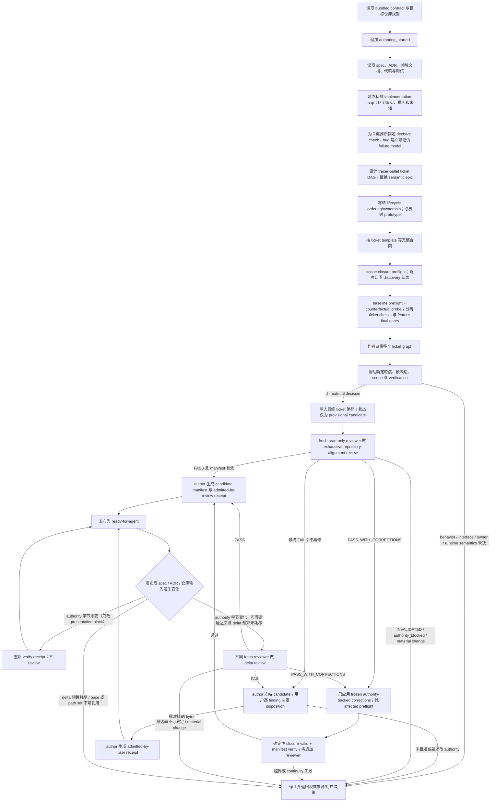

# `write-implementation-tickets` 设计说明

> 本文描述当前仓库中 `write-implementation-tickets` 的设计思路、职责边界和实现机制。
> 运行时行为仍以 [SKILL.md](../../skills/write-implementation-tickets/SKILL.md)、`references/` 下的合同以及
> `scripts/review_manifest.py`、`scripts/admission_state.py` 为准；本文是解释性文档，
> 不替代这些权威输入。

## 1. 一句话定位

`write-implementation-tickets` 不是把需求“切成几个 TODO”的普通拆票工具，
而是一道实现准入流程：它把一个仓库内的权威 `spec.md` 转换成一组按依赖排序、
可由全新执行代理在没有聊天历史的情况下独立实现和验证的本地 Markdown ticket，
并在发布前用独立 reviewer、verification witness 和内容寻址的 admission receipt
证明这些 ticket 与当前仓库一致且具备可实现的验收合同。

它解决的是“如何把已经确定的产品/架构合同交给另一个上下文可靠执行”，
而不是“如何替用户决定尚未确定的产品行为”。

## 2. 要解决的核心问题

普通任务拆分在代理执行场景中容易出现以下失真（编号按发现先后追加，仅作引用标识，不表示优先级）：

1. **需求来源失真**：聊天中的临时讨论被当成正式行为要求，执行者无法判断什么是权威合同。
2. **隐藏上下文依赖**：ticket 只写“按刚才讨论实现”，离开作者上下文后就无法执行。
3. **横向切层**：先建 schema、再写 API、再补测试，任何一张票都没有独立可验收结果。
4. **职责不清**：使用“处理失败”“做清理”“加重试”等无 owner 表述，执行者需要猜测真正的状态所有者。
5. **范围漂移**：使用目录、glob、`相关文件` 或 `as needed` 作为 write scope，代理可以无限扩张修改面。
6. **依赖边失真**：ticket 因编号先后而互相阻塞，却没有消费 blocker 产出的接口或证据。
7. **作者自证**：同一上下文既起草又认定 ticket 正确，容易把自己的错误假设带入复核。
8. **仓库漂移**：ticket 起草时引用的路径、符号或测试 seam 在发布前已经变化。
9. **因果假设固化**：日志只证明症状时，author 仍可能把一个未经证伪的候选原因写成 production owner 和 write scope。
10. **替代性验收**：build、单元测试、日志或截图可能全绿，却没有证明 spec 要求的真实 UI、设备或 live-app 路径。
11. **语义 Epic 伪装成 ticket**：跨 API、wire、lifecycle、consumer 和 delivery 的多个可独立验收结果被放进一个 fresh-supervisor 上下文。
12. **并发语义后置**：state/resource owner、linearization point 和跨 wire 顺序事实留给实现者边写边猜，导致 repair regression。
13. **验证冲突后置**：命令没有在 baseline 上自检，误伤保留接口或依赖缺失直到实现结束才暴露。
14. **门禁层级混淆**：focused ticket check 与 cumulative feature gate 混在一起，使每张 ticket 和每次小修都重复整仓构建。
15. **验收不可达**：测试名和命令看似合理，但合法 production fixture 根本无法触达声明的边界，只能靠 padding、fake-only failure 或 forced state 造绿。
16. **假绿不可见**：整类测试、模糊 regex、生成器文本或不保留上游退出码的 pipeline 在关键证据缺失时仍可能成功。
17. **review 与准入混淆**：用户接受一次澄清性文本修正时，流程要么伪造 reviewer `PASS`，要么被一个未更新的 `FAIL` 状态永久阻塞。
18. **scope discovery 未闭包**：ticket 写了能找到真实 caller 的 `Permitted discovery`，却没有在 authoring 和 review
    阶段执行并逐路径归类；遗漏只能等到 execution 的 stop condition 才暴露。
19. **文档路径授权被误解为整篇重写**：ticket 只声明一个 Markdown path 可修改和若干过时事实要删除，
    执行者却把它扩张为整体精简；负向关键词扫描仍可全绿，而当前 API 章节、链路图和示例等既有职责已消失。
20. **展示字段与权威字节共用一个 hash 边界**：spec 的人类可读名称与行为合同落在同一个 authority hash 内，
    改一个展示标题就使 receipt 失效并触发一次完整冷启动 review。降档的唯一凭据是"字节没变"，
    流程没有任何机制承认"字节变了、但触达不到任何 ticket 的权威引用"，于是语义判断只能加严、永远不能省。
21. **review 自我续命**：纯文字精确化修完后继续找下一批措辞问题，或者 delta 预算耗尽后换一个
    `review-N`/`epoch-N` 自动重开 exhaustive，使成本上限只约束目录名而不约束 feature lineage。
22. **交付粒度后置变更**：拆票前未确认用户对交付/发布粒度的偏好（哪些产物可独立交付、哪些必须同批），
    票据审完后用户才要求合并或拆分，构成 user-authority change，迫使受影响票据全套 exhaustive 重审。
23. **验证输入替换未声明**：ticket 只声明生产 write scope，执行时却需要临时替换或覆盖验证输入
    （native 库、asset、构建脚本、ABI/baseline 文件），只能靠 authority-gap repair 事后发现，
    触发 blocked→repair→重捕获循环。

因此，这个 skill 的目标不是追求最短 ticket，而是追求一个明确的冷启动合同：

> 新执行者只读取 ticket 声明的权威输入、当前代码和已完成 blocker 证据，
> 就能知道谁在什么条件下改什么、产出什么、如何验证、何时必须停止。

## 3. 系统边界

| 维度 | 当前设计 |
| --- | --- |
| 输入 | 一个权威 `<spec-dir>/spec.md`、适用的 `AGENTS.md`/标准/ADR/领域文档、当前代码与测试、已存在 ticket 和完成证据 |
| 输出 | `<tickets-dir>/<NN>-<slug>.md` 下按 blocker-first 顺序排列的 `ready-for-agent` ticket，以及 `<spec-dir>/implementation-ticket-admission.json` |
| 持久化行为 | 写最终 ticket 和 admission receipt；review report、candidate manifest、decision record、dispatch evidence 放在 `/tmp` |
| 不负责 | 实现 ticket、运行整套执行工作流、改变 ticket 为 `done`、stage、commit 或 push |
| 下游 | 可交给 `execute-tickets`，但作者 skill 不依赖后者必须安装 |
| 失败策略 | 权威来源、owner、接口、公共行为或 review 证据不确定时停止，不用推断补齐 |
| 完成含义 | 当前 `spec.md` authority body 与全部 ticket bytes 已被 `admitted-by-review` 或 `admitted-by-user` receipt 精确覆盖并可交给 fresh executor；不等于 feature 已实现、运行时验证、stage、commit 或部署 |

author 在读取 feature 文件前，先读取目标仓库的 `docs/agents/issue-tracker.md`。tracker 决定
spec 目录 `<spec-dir>` 与 ticket 目录 `<tickets-dir>` 的放置位置和嵌套结构；ticket 不必位于
spec 目录下。对于新需求，bundled contract 将 `<feature>` 固定为
`<YYYY-MM-DD>-<feature_name>`：日期取 author 首次创建需求目录时的本地日历日期，
`<feature_name>` 是不含日期、使用小写连字符的 feature slug。author 用同一个 `<feature>`
替换 tracker implementation-ticket 路径中的 `<feature>` 或 `<feature-slug>`，tracker 继续拥有
占位符之外的全部路径组成和层级；不含这两个占位符的 tracker 路径仍是仓库明确指定的固定目录。
已有 spec/ticket 路径或 resume 场景复用原 feature 目录名和 admission 值，不补加、刷新或迁移日期前缀。
只有该 tracker 文档不存在时，author 才分别使用 `.spec/<feature>` 和 `.spec/<feature>/issues`。
tracker 不可读、任一目录未定义或有歧义、路径逃出仓库时，author 停止，不猜目录或静默回退。
author 将两个仓库相对目录通过 `--spec-dir`、`--tickets-dir` 传给每次 admission 命令，
closure 命令只接收 `--tickets-dir`；脚本执行路径校验，不解析自然语言 Markdown。
reviewer 独立核对 tracker 与目录，author 将 tracker 纳入 review manifest 并在 handoff 交代路径来源。
这项规则只改变目录放置与命名，不改变 ticket 状态、blocker、transition owner 和 `done` 语义。

### 3.1 停下条件与自动继续边界

这里的“停下”指 author 暂时不再生成或发布 ticket。判断依据只有当前已经落盘的
spec、ADR、已记录决定、生产接口及必须保持的规则（production interface/invariant），
以及表达业务意图的测试。
这些依据能给出唯一答案时自动继续；仍有两个以上合理答案时才停下。

| 一眼看到的情况 | 为什么必须停 | 怎么恢复 | 会问你吗 |
| --- | --- | --- | --- |
| 现有依据无法给出唯一、可执行、可验收的 ticket 合同。例如：同一行为有多个合理答案；资源 owner 或并发顺序未确定；合法 production 输入无法触发验收；无法确定两个结果是否应该拆票 | author 继续起草就必须替产品或架构 owner 猜答案 | 已有 spec、ADR、代码或业务测试能给出唯一答案时，author 自动补齐或重新拆票；仍有多个合理答案时，由 spec owner 把唯一决定写入 spec、ADR 或 recorded decision | 只有需要新增或选择行为、接口、owner 或运行时语义时才问 |
| 无法取得有效的独立准入结果：无法启动没有继承 author 上下文的只读 reviewer，或者本 authority version 的唯一 reviewer 返回 `FAIL` | 当前 ticket 没有独立证据证明可以交给 fresh executor | reviewer 不可用时等待能力恢复；`PASS_WITH_CORRECTIONS` 只应用 reviewer 冻结的 authority-backed 文字/合同精确化，并以确定性 continuity 与 affected preflight 收尾，零追加 reviewer；`FAIL` 对精确 bytes 终止，只能由用户逐项接受 unresolved risk，或在后来明确改变 authority 后开启新 version | 不询问是否跳过或再跑一轮 review；只有选择接受 unresolved risk 或作出 material decision 时才问 |
| 无法把准入结果绑定到唯一、稳定的权威输入：review 后 spec、ticket 列表或已审字节发生变化，或者 tracker、spec/ticket 目录及其他必需输入无法唯一确定 | 现有 review 无法证明当前这组精确文件 | authority 字节未变（只改 presentation block）时重新 `verify`，不 review；authority 字节变了、path set 连续且 fresh reviewer 能界定触达面时做一次 delta review。触达面无法界定、涉及 material change、base 缺失、path set 改变或 delta 预算耗尽时结束当前用户请求；只有后来明确的用户 authority change 才能以 `user-authority-change` 开启下一 exhaustive epoch | 只有 owner 必须选择权威来源、作出 material decision，或后来明确提出新的 authority change 时才问；author 不能以“需要更多 review”为理由重置预算 |

最快判断方法：如果 spec、ADR、当前代码和业务测试已经把答案唯一确定，就自动处理。
漏写文件、测试或命令，以及 ticket order、granularity、真实 `Blocked by` edge、
production/test-only scope、scope closure 和 verification，都属于这类机械修正，
不进入上表，也不需要你再回复“允许”。

## 4. 总体流程



流程刻意把“作者认为 ticket 完整”“独立 reviewer 给出的结果”和“当前精确 bytes 是否获准执行”分开。
`**Status:** ready-for-agent` 虽然会先写入最终候选文件，但在独立 review 链结束前只是待审字节，
只有匹配当前 authority 的 admission receipt 才赋予发布语义。

## 5. 角色与职责

### 5.1 用户或 spec owner

用户或 spec owner 决定会改变可观察行为、公共接口、生产 owner、可变状态、重试/恢复语义、
跨线程资源所有权或外部可见顺序的事项。ticket 粒度、编号、真实 blocking edge、exact scope
和 verification 若能由这些已接受语义与当前仓库唯一推出，则属于 author 的机械判断，不是用户授权点。
用户也可以在真实 review `FAIL` 保持不变时，
明确批准一份精确 candidate，并对每个 unresolved finding 选择
`closed-by-clarification`、`rejected-as-review-drift` 或 `accepted-risk`，附非空理由。
作者不能把这些决策委托给实现代理；用户审批精确 bytes，但不手工计算 hash。

### 5.2 ticket author

author 负责：

- 解析权威来源和项目术语；
- 探索当前生产声明、直接调用者、共享工具和稳定测试 seam；
- 区分直接仓库事实、证据支持的推断和未知，为会改变行为、owner、接口、scope、状态或验证的推断指定最便宜的决定性检查；
- 对 bug/regression 建立可复现、可证伪且能返回 diagnosis 的 failure model；
- 建立 implementation map 和 ticket DAG；
- 用 independent-rejection test 拒绝 semantic epic，并为 lifecycle/concurrency 工作先确定 ordering/ownership；
- 在 candidate 发布前执行每条 permitted discovery，把当前命中逐项归类为 declared write、read-only 或命名 false positive，
  并检查 blocker `Produces` 是否预示已知 caller path 变化；
- 为每个修改已有 Markdown 的 ticket 声明 `surgical` 或经明确 authority 授权的 `whole-document` 编辑合同，
  精确列出允许变化的章节/职责和必须出现的 replacement output；
- 在 candidate 发布前运行所有 non-mutating baseline preflight，并建立唯一的 feature-gate inventory；
- 起草完整 ticket、完成作者自审，并自动落实由 authority 唯一确定的 ticket 顺序、粒度、blocking edge、scope 和 verification；
- 调度每个稳定 authority version 唯一的一次独立 review、记录 dispatch evidence、分类 findings；
- 只在 `PASS_WITH_CORRECTIONS` 下应用 reviewer 冻结且由权威来源唯一确定的 ticket correction，并用确定性 continuity 与 affected preflight 收尾，不启动 closure reviewer；
- 在 ticket bytes 停止变化后调用确定性脚本，为 `spec.md` authority body 和全部 ticket 生成 SHA-256 candidate manifest；
- 根据 reviewer `PASS` 或用户对精确 candidate 的明确批准生成 admission receipt，并在写入前重新校验所有 authority bytes；
- 在任何 feature 文件变化后先运行 receipt `verify`，据此判断这次变化是否真的触及 authority bytes；未触及时不启动任何 review；
- authority bytes 确实变化时，用确定性 `delta` 命令证明输入集连续并取得精确 changed set，把 base exhaustive 报告、当前 manifest 和逐路径 diff 交给 delta reviewer；author 不自行判定触达面，也不用"这只是改名"替代 reviewer 结论；
- 在所有 admission 条件成立后完成 handoff。

author 不实现生产代码，也不能用自己的 self-review 替代独立 reviewer。

### 5.3 fresh read-only reviewer

reviewer 负责从磁盘重新读取最终 ticket、权威文档和 live working tree，验证：

- 行为覆盖与权威来源；
- 路径、符号、owner、caller、测试和构建命令是否真实存在且描述准确；
- scope、`Consumes`/`Produces` 和 DAG 是否一致；
- 每条 permitted discovery 是否在 live working tree 上重放，实际结果是否全部落入 declared write、read-only
  或命名 false positive，且没有未处置路径；
- 每张票是否只有一个可独立验收单元，是否把 expand、migrate、contract 或多个 state owner 错塞在一起；
- ordering/ownership table 是否命名 actor/thread、state/resource owner、linearization point、failure owner 和确定性交错；
- baseline preflight 是否真实执行，以及 ticket-scoped checks 和 feature final gates 是否分层且没有重复 owner；
- 每个 acceptance 是否有稳定 seam、确定性 direct check 或完整的 target-runtime interaction protocol；
- 每个 correctness-critical acceptance 的 production producer、legal fixture、reachability、完整合法 oracle、direct observation 和 absence detector 是否都成立；
- 修改已有 Markdown 时，文档编辑合同是否把 write permission 与 whole-document rewrite authority 分开，
  并用正向 acceptance 保住仍然存在的文档职责；
- bug/regression 的 reproduction、causal model、falsifier 和 re-diagnosis condition 是否有证据且属于正确 owner；
- UI/live-app 验收是否明确真实 runtime、freshness action 和排除 mock/cache/forced/stale state 的真实性证据；
- 新增状态、锁、重试、cleanup owner、抽象和 test seam 是否有生产依据；
- ticket 是否真正满足 cold-start 执行条件；
- 在 delta 轮次中，changed bytes 能触达哪些 ticket 权威引用、acceptance、scope closure、interface 和 ordering 合同，
  并只复核这个闭包；触达面无法界定或变化本身是 material change 时返回 `INVALIDATED`，结束当前请求而不是自动重开 exhaustive。
  这个判定权属于 reviewer，author 不能代为收窄。

reviewer 必须是无 authoring 历史的新上下文，只读仓库，不得创建、修改、删除、stage 或重命名仓库文件。
它只产出 `PASS`、`PASS_WITH_CORRECTIONS`、`FAIL` 或 `INVALIDATED`，不创建、更新或解释 admission receipt。

### 5.4 确定性工具

`scripts/review_manifest.py` 不做语义判断，只负责冻结和比较 reviewer 实际读取的精确文件字节。
它的 `delta` 只做两件确定性的事：证明 before/after 输入集连续，并算出精确 changed set；
"这些变化意味着什么"不属于它。
`scripts/admission_state.py` 负责为当前 `spec.md` 与完整 ticket path set 生成 candidate manifest、
校验 decision record，并写入或验证内容寻址 receipt。两个脚本比较的都是 authority digest，
即排除 presentation block 之后的字节；presentation block 的合法键集是固定的，任何越界写法都退回整文件 authority。
两个脚本都不代替语义判断；它们把 hash、path-set 和 drift 判断从语言模型手中移到确定性代码。

### 5.5 下游 orchestrator

下游执行 owner（例如 `execute-tickets` 的 orchestrator）只消费已经发布的 ticket 和 receipt。
它负责 `ready-for-agent -> done`，但不能把执行完成反向解释成作者阶段遗漏的需求依据。
它只验证 receipt，不能生成、刷新或把 `admitted-by-user` 改写成 reviewer `PASS`。

## 6. 权威来源模型

### 6.1 权威顺序

当前设计按以下顺序解决冲突：

1. 当前 spec 或 superseding ADR；
2. 已记录的用户批准决定；
3. 当前生产接口和不变量；
4. 表达业务意图的测试。

聊天、松散计划和父 issue 可以帮助定位工作，但不是持久行为来源。
如果一个 observable requirement 只存在于聊天中，author 必须先推动它进入 spec、ADR
或其他用户批准的仓库来源，再发布 ticket。

### 6.2 不平均冲突

如果目标仓库 overlay 要求 `Status: resolved`，而 bundled contract 只允许
`ready-for-agent` 和 `done`，author 必须停止，不能发明一个兼容两者的新状态。
相同原则适用于 owner、公共接口和行为语义：来源冲突时暴露冲突，不拼接一个折中设计。

### 6.3 统一动作句式

每个关键行为使用以下结构：

`[Actor] performs [action] on [object] when [condition], producing [observable result].`

这不是文风要求，而是 ownership 检查。它迫使 ticket 同时说明 actor、动作、对象、条件和可观察结果，
避免“处理一下”“适当重试”这类 ownerless 指令。

### 6.4 展示字段与权威字节分离

需求的人类可读名称与需求的行为合同是两种东西，但它们过去落在同一个 hash 边界内，
于是改一个标题也要付一次完整冷启动 review 的代价。设计把这两类字节在文件层面切开。

`<spec-dir>/spec.md` 可以在文件开头放一个 **presentation block**：

```markdown
---
display_title: 需求看板
---

## 1. Authority and scope
...
```

规则如下：

- presentation block 的合法键集固定为 `display_title`，只允许平坦的 `key: value` 行。
- **authority body** 是收尾 `---` 之后的全部字节。candidate manifest、review manifest、
  receipt 比较的都是 authority body 的 SHA-256（`authority_sha256`），不是整文件字节。
- 出现未知键、重复键、空值、缩进、嵌套结构或未闭合的块时，**整个文件重新计入 authority**。
  失败方向永远是"多算权威"，因此格式写错只会多一次 review，不会少一次。
- ticket 文件不使用 presentation block，其全部字节都是 authority。

这条规则要真正省下 review，前提是标签只存在一处。如果正文里又保留一个同名的一级标题，
那个标题属于 authority body，改它仍然会触发 review。设计不为此新增停止条件——
它只是把代价说清楚：标签重复一次，改名就要付一次 review。

`<feature>` 目录名也不跟随 `display_title`。目录名在首次创建时固定（§3），
`display_title` 之后可以自由变化；两者脱钩是有意的，因为 ticket、blocker 边和 receipt 路径
都以目录名为稳定标识。

脚本能保证的只有字节边界。它无法阻止有人把一条真实行为要求写进 `display_title`，
这属于协议保证（§13.6）：需求的可观察行为只能写在 authority body，
`display_title` 是标签而不是要求，reviewer 会在 exhaustive 轮次核对 ticket 是否引用了它。

## 7. 合同分层

skill 将不同稳定度的规则拆成多个文件，而不是把所有内容塞入一份 prompt：

| 层 | 文件 | 职责 |
| --- | --- | --- |
| 工作流入口 | [SKILL.md](../../skills/write-implementation-tickets/SKILL.md) | 全局不变量、阶段加载表，以及从 authority 到候选 ticket 的 authoring 主链 |
| 可移植 tracker 合同 | [references/local-markdown-contract.md](../../skills/write-implementation-tickets/references/local-markdown-contract.md) | 目录放置与日期命名权责、状态、blocking semantics、cold-start 最低准入条件 |
| ticket 内容模板 | [references/ticket-template.md](../../skills/write-implementation-tickets/references/ticket-template.md) | 每张 ticket 的完整字段和书写约束 |
| 边界与预检合同 | [references/ticket-boundaries-and-verification-preflight.md](../../skills/write-implementation-tickets/references/ticket-boundaries-and-verification-preflight.md) | semantic-ticket admission、ordering/ownership、prototype/wayfinder 路由、scope closure preflight、baseline preflight 与验证分层 |
| 验证可实现性合同 | [references/verification-realizability.md](../../skills/write-implementation-tickets/references/verification-realizability.md) | production producer、legal fixture、reachability、oracle、observation、absence detector 与 counterfactual probe |
| author review 协议 | [references/author-review-protocol.md](../../skills/write-implementation-tickets/references/author-review-protocol.md) | 三档开轮选择、每个 authority version 唯一 reviewer、`PASS_WITH_CORRECTIONS` continuity 与 delta/epoch 预算 |
| review 合同 | [references/repository-alignment-review.md](../../skills/write-implementation-tickets/references/repository-alignment-review.md) | reviewer 隔离、输入、finding 分类、delta 触达闭包与 `delta_reach`、一次性结果格式 |
| admission 与 handoff 协议 | [references/admission-and-handoff.md](../../skills/write-implementation-tickets/references/admission-and-handoff.md) | candidate hash、review/user admission、receipt 验证与最终报告 |
| 确定性状态工具 | [scripts/review_manifest.py](../../skills/write-implementation-tickets/scripts/review_manifest.py) | 精确文件 manifest 的 `capture`、`verify`、`closure` 和 `delta` |
| 准入状态工具 | [scripts/admission_state.py](../../skills/write-implementation-tickets/scripts/admission_state.py) | authority candidate 的 `candidate`、review/user decision 的 `admit` 与 receipt 的 `verify` |
| 行为评估 | `evals/evals.json` | 用对话场景检查 skill 是否做出正确判断 |
| 代码测试 | `tests/` | 检查合同可移植性和 manifest 工具的 fail-closed 行为 |

这种分层有三个目的：

1. 目标仓库没有自己的 issue tracker 文档时，bundled contract 仍足以工作；
2. 仓库 overlay 只能增加兼容的严格条件，不能改变核心生命周期；
3. 确定性字节检查由脚本完成，语义判断保留给 author/reviewer。

### 7.1 skill 本体的渐进式加载

`SKILL.md` 只常驻全局约束、authoring 主链和阶段路由。phase-owned 协议在其 actor 即将执行该阶段时才完整加载：

| 阶段 | 加载内容 |
| --- | --- |
| 解析目标仓库输入前 | `local-markdown-contract.md` |
| 建 implementation map 和 ticket graph 前 | `ticket-boundaries-and-verification-preflight.md` |
| 写完整 ticket contract 前 | `ticket-template.md`、`verification-realizability.md` |
| 候选 ticket 已写入、review dispatch 前 | `author-review-protocol.md`、`repository-alignment-review.md` |
| 唯一 review 到达 admission decision point 且 authority bytes 稳定后 | `admission-and-handoff.md` |

resume 时，author 先加载 portable contract 并用 durable evidence 判断当前阶段，再只加载该阶段协议。
后续阶段不能因为 skill 刚触发就提前进入上下文；缺失或不可读的必需执行合同在进入该阶段前 fail closed。可选计时说明不属于这个停止条件。
这次拆分只改变内容进入上下文的时机和权威文件位置；review 次数、finding 分类、correction continuity、
admission 决策和 handoff 语义仍由上表对应合同唯一规定。
§5 作者自审的检查点仅在已加载合同内引用完整定义，不因自审提前加载后续阶段合同。

### 7.2 核心阶段耗时

author 只记录三个不重叠阶段：`authoring` 从解析输入前到 reviewer dispatch（包含探索、拆票、撰写与自检）；`review` 从 dispatch 到报告及 manifest 核验完成；`handoff` 从核验完成到修正、准入与最终报告准备完成。没有实际 review 时不造 review 记录，authoring 在确认既有 receipt 仍有效时转入 handoff。

author 在既有 `/tmp/write-implementation-tickets/<feature>/` 下维护一份 `timing.json`，各阶段开始时记录机器时钟 `started_at_ms`，结束时补 `ended_at_ms` 和由脚本减法计算的 `duration_ms`。每次实际阶段进入占一行记录；暂停前结束当前区间，恢复后追加同阶段区间，不把用户等待混入工作时间。丢失起止依据时保留 `null`，不填 0 或从 mtime 推测。author 在 handoff 按这三个 phase 汇总已测毫秒数与未测量记录数，不单独统计每张票、每条命令、自检项或 reviewer 子步骤。

计时只有诊断用途，`references/authoring-timing.md` 是可选引用。说明、工具或数据缺失、不可读，以及时钟、解析、读写、汇总失败均只报告一次缺口并停止可选计时，不阻塞 authoring、review、admission、resume 或 handoff；不重试、修复或补造统计，也不新增 reviewer、准入状态或跨 skill 脚本依赖。

## 8. implementation map：先理解实现，再决定 ticket 边界

author 在正式 ticket 之前维护一份私有 implementation map，每个 required behavior 至少包含：

| 字段 | 设计目的 |
| --- | --- |
| `Source` | 防止 acceptance 来自未记录的推断 |
| `Actor and owner` | 确定真正修改和持有状态的生产组件 |
| `Write scope` | 列出当前证据已知的精确写路径 |
| `Permitted discovery` | 未知路径只能按一个可判定规则进入 scope |
| `Scope closure witness` | 记录 discovery command、authoring baseline、每个命中路径的 disposition，以及空的 undisposed set |
| `Documentation edit contract` | 修改已有 Markdown 时记录 `surgical`/`whole-document`、获准变化的章节或职责、当前 authority 和必须存在的 replacement output |
| `Consumes` | 说明当前代码或 blocker 必须先提供什么接口/证据 |
| `Produces` | 说明后续 ticket 或 caller 能消费什么确定合同 |
| `Verification` | 把行为绑定到稳定 seam、已有确定性检查或真实 target-runtime interaction protocol，并记录适用的 producer、legal fixture、reachability、oracle、observation 与 absence detector |
| `Constraints` | 记录非目标、state budget、兼容性、ticket checks 和 feature final gates |
| `Evidence status` | 区分直接事实、证据支持的推断和未知；关键推断附决定性证伪检查 |
| `Failure model` | 仅对 bug/regression 记录 reproduction、causal owner、falsifier 和 re-diagnosis condition |

implementation map 保持私有，是因为它是 author 的推理工具，不是执行者应依赖的隐藏输入。
最终需要执行的信息必须落入对应 ticket；reviewer 也不会收到这份私有 map，
从而能检验 ticket 是否真的自包含。

决定性检查的作用是尽早淘汰错误 owner、scope 或因果路线。它可以是仓库读取、已有命令或受限 prototype，
但不能替代 ticket-scoped checks、feature final gates、行为测试或独立 repository-alignment review。
关键未知仍未解决时，author 必须停止；`ready-for-agent` 不能承载一个“执行时再猜”的假设。

## 9. ticket DAG 的切分策略

### 9.1 tracer-bullet vertical slice

每张 ticket 应交付一个穿过所需层次的完整结果。配置、生产代码、测试和文档只要共同支撑同一结果，
就应归入同一张票，而不是按技术层拆成四张横向票。

判断能否拆开的标准是：reviewer 能否接受其中一张并拒绝另一张，同时让已接受仓库保持一致。
如果不能独立接受，就不应拆开。

author 先确认结果对应最终产品行为、被后续 ticket 消费的必要接口、明确要求的迁移兼容性或前置证据，
再应用 independent-rejection test。临时 codec 形状、占位实现或尚未接线的状态仅仅可以编译，不能成为
独立行为验收的理由。中间步骤由实现 owner 执行推进所需的最小检查；明确的安全与前置门禁仍须通过。

### 9.2 semantic ticket admission

跨层不是拆票理由，同一用户功能也不是保留巨票的理由。author 对候选票应用
independent-rejection test：如果其中两个结果可以被 reviewer 分别接受或拒绝，且已接受仓库仍保持一致，
它们就不是同一 acceptance unit。以下任一情况通常要求拆分：

- 多个可独立验收的 observable result；
- 可分离的 lifecycle/state/cleanup owner；
- public contract choice 与实现迁移混在一起；
- expand、migrate、contract 三阶段混在一起；
- 权威、scope、ordering 和 verification 无法在一个 fresh supervisor 上下文中冷启动执行。

author 仍保留真正的 vertical slice：为一个结果必须同时改 API、adapter、storage 和 test 时，这些层属于同一票。

### 9.3 blocking edge 必须有消费关系

`Blocked by` 不是执行顺序偏好。一个 blocker 必须产出 dependant 明确消费的：

- identifier、signature、type 或 schema；
- compatibility interface；
- migration state；
- 或验证/决策证据。

每条边都要由 `Consumes` 与 `Produces` 精确对接。编号按 blocker-first 排列，并禁止环。

### 9.4 独立 subsystem 应先拆 spec

如果一个 spec 实际包含没有共享状态、ownership 或验收结果的独立子系统，skill 倾向先建议拆成多个 spec，
而不是制造一个松散的大 ticket graph。相反，一个完整 lifecycle/state model 不会因为跨多层就被拆开。

### 9.5 expand–migrate–contract

机械性大范围迁移如果无法一次保持绿色，使用三段式：

1. **Expand**：在旧接口旁引入新形式，保留兼容；
2. **Migrate**：按可独立变绿的 caller 批次迁移；
3. **Contract**：全部 caller 完成后删除旧形式。

这些 ticket 必须声明彼此之间的精确 compatibility interface，不能只写“等上一张完成”。

## 10. 单张 ticket 的冷启动合同

模板中的每个部分都在消除一种特定推断：

### 10.1 `What to build`、`Blocked by` 与 `Status`

- `What to build` 用一个 actor-action-object-condition-result 句子定义边界结果；
- `Blocked by` 精确列出所消费的已验收 ticket，或写 `None`；
- `Status` 在 authoring 输出中只能是 `ready-for-agent`，且需经过独立 review 和匹配当前 authority 的 admission receipt 才真正生效。

### 10.2 `Authoritative inputs`

分别列出 behavior、architecture、completed blocker 和 superseded inputs。
显式记录 superseded 来源可防止执行者重新采用旧合同。

### 10.3 `Production owner and scope`

这一节区分：

- 生产/构建/文档/验证 owner；
- 只读输入；
- 精确的 create/modify/delete 路径；
- 有条件的 permitted discovery；
- 执行期临时替换或覆盖的验证输入（`Verification input substitutions`）：每个被替换的 native 库、
  asset、构建脚本或 ABI/baseline 文件都要写明恢复 owner 与恢复后的身份核验；没有替换时显式写
  `None`，消除"验证输入替换未声明"（§2 第 23 项）这类事后 authority-gap 修复。

目录、glob、`相关文件`、`必要时` 都不是合法 write scope。
如果路径只能在执行时通过 scoped search 确定，ticket 必须写清搜索条件和“命中什么才允许哪个精确文件进入 scope”的规则。

`Permitted discovery` 不是把 scope 完整性推迟到 execution 的许可证。author 在批准前必须对当前 baseline
运行每条 discovery，并把每个 repository-relative path 归入且只归入以下一种 disposition：

- `declared-write`：ticket 已明确列出的 create/modify/delete path；
- `read-only`：执行者理解合同需要读取、但不得修改的精确 path；
- `false-positive`：匹配搜索表达式但与本 ticket 无关的精确 path，并附原因。

其闭包条件为：

```text
discovered paths - declared write paths - read-only paths - named false positives = ∅
```

ticket 的 `Scope closure preflight` 记录 exact discovery command、authoring baseline、逐路径 disposition 和
`0 undisposed paths`。如果 blocker 的 `Produces` 会改变 caller topology，author 还要检查 blocker 的精确 write scope
与 produced interface，把当前已知的未来 caller path 提前放入本票 scope；不能用“blocker 完成后再看”代替已知归属。
下游 execution 在 blocker 完成后重放同一 discovery，任何新出现且未归类的 path 继续触发原有 stop condition。

scope closure witness 与 verification witness 解决不同问题：前者证明每个实际 caller 都有 owner/disposition，
后者证明 acceptance 能由合法 production fixture 触达并观测。两者不能互相替代。

API/wire/输出形状迁移时，author 将已知生成消费者、发布坐标 smoke consumer、验收脚本及相关正向/负向 oracle
作为现有调用方一起归类。只在受影响 seam 和已有门禁范围内读取；用实际生成的消费者/现有生成内容确认旧形状，
不把生成器版本标签或旧命令 PASS 当作新行为证据。需要修改的生成器或脚本精确归属迁移票；另票负责时写清
Consumes/Produces 与 blocker，不留到 final gate 临时补范围。未知 scope 继续走现有 discovery，不新增一轮审查。

### 10.3.1 `Documentation edit contract`

修改已有 Markdown 时，ticket 默认使用 `surgical`：精确列出 authority 允许删除、改写或搬迁的标题章节、
代码示例职责或事实，未列出的现有内容默认保留。exact path 进入 write scope 只授权修改该文件的 bytes，
不授权重新设计整篇文档。只有 spec、ADR 或已记录的用户批准明确要求 whole-document replacement 时，
ticket 才能使用 `whole-document`，并引用该 authority；“清理过时内容”“重建某节”或负向 token scan 都不足以隐含这一权限。

当一个现有职责仍然存在但表达位置或形式变化时，ticket 必须在 acceptance 中正向声明 replacement output
及其目标位置；只有 authority 明确证明该职责或事实已不再存在时，才允许把它作为 superseded content 删除。
混合了仍需保留职责与过时事实的章节必须在 ticket 中拆开描述，不能把整个章节笼统标成过时。

### 10.4 `Slice boundary`

这一节记录唯一 acceptance unit、会变化的 lifecycle/state/cleanup owner、independent-rejection 结论、
fresh-context fit 和 split trigger。它使 `execute-tickets` 能在实现前重新拒绝 semantic epic，
而不是把“字段齐全”误当成“ticket 足够小”。

### 10.5 `Interfaces`

`Consumes` 描述进入 ticket 前已经存在或 blocker 产出的合同；
`Produces` 描述 dependant/caller 将获得的合同。没有 cross-ticket interface 时也要说明沿用哪个现有接口，
避免通过沉默制造隐式依赖。

### 10.6 `Behavior contract`

`Acceptance and verification` 的 A-id 是本票可观察行为的唯一定义，保持 actor、动作、对象、条件和结果完整。
`Behavior contract` 只索引 A-id 和对应 source；已有票据不为格式迁移重写，重复定义矛盾时先按 authority 修正。

### 10.7 `Ordering and ownership contract`

当 ticket 改变 lifecycle、concurrency、cancellation、retry/recovery、cleanup/resource ownership、
routing 或 cross-process ordering 时，必须引用已写入 spec/ADR 的操作顺序表。每个操作都命名 actor/thread、
condition、state owner、resource owner、linearization point、competing operation、failure owner、
observable result 和 deterministic interleaving。跨 facade 必须共享身份/所有权事实，跨 wire 必须说明顺序事实
如何携带或重建。权威材料不能唯一决定时，先用 `wayfinder` 定位真实 owner、用 `prototype` 运行 latch 模型，
再把结论写回 authority；ticket 不是第一权威来源。

author 在新增等待、计数、cleanup guard 或 retry 前，沿真实调用链核对下层 resource owner 已有保证，
并说明上层保护的独立业务义务；同步等待同时核对线程、完成条件、外层预算及超时结果。
下层已保证 unload 前 drain 不等于上层还须同步等待；独立业务清理仍须保留。
结论写入现有 ownership/state budget，reviewer 不用加测来强化多余保证；显式合同冲突先交 authority owner 决定。

### 10.8 `Failure model`

这一节只用于 bug/regression，包含：

- 能稳定触发当前失败的 exact command 或 interaction；
- 把直接事实与因果推断连接到 production owner 的证据；
- 能证伪当前 causal model 的最便宜决定性检查；
- 证据推翻模型时停止实现、返回 diagnosis 的条件。

write scope 不能从未经检查的候选原因推导，也不能预授权“第一个修复没用就再加一个 workaround”。

### 10.9 `Implementation sequence`

`Implementation sequence` 描述负责 actor、精确 symbol/file、
条件和中间结果。它是低推断执行说明，但不是 minute-by-minute 操作记录，也不包含 commit 步骤。
author 不把每个中间结果自动提升为 acceptance，也不为每个步骤预排一次新的 red → green。
步骤引用 A-id，不另写一份产品行为或验收 oracle。

### 10.10 `Acceptance and verification`

author 将稳定产品行为分配给能直接证明它的生产边界；其他层只保留本层独有的映射或不变量验证，
不重复整组端到端场景。依赖未实现时，author 在既有 `Interfaces` 和验证分层中具名后续 ticket 或
final-gate owner，记录尚未证明的行为；不得以半成品通过替代最终验收，也不得推迟明确的前置证据门禁。
author 与 reviewer 先检查验收对象是否有上述合同依据，再要求完整 verification witness。
预检的 absence detector 证明所需测试确实存在并执行、检查读取真实目标且失败能够传播；
它与保护产品行为的断言分开评估。已有精确测试结果、失败传播证据或相关 red 证据可引用，
仅在这些证据不足时增加最小 non-mutating probe。不得默认要求逐验收项修改生产代码做变异测试；
变异验证必须有明确 authority 或现有断言无法排除的具体假绿风险，并声明最小 probe 与重跑条件。

每个 acceptance item 都包含：

- 权威 source；
- 稳定 production seam 或确定性 direct check；
- 指向唯一 ticket-scoped check 或 feature-final gate 定义的 check/gate ID；
- specific expected result。

命名 boundary test、lifecycle/resource proof、negative scan、generated-consumer check
或其他 correctness-critical acceptance 时，还必须实例化 verification witness：

- `Production producer`：真实产生被观察值或状态的 encoder、API、runtime operation、generated artifact 或 compiled consumer；
- `Legal fixture`：该 producer 合法接受的输入，不能用未知 wire field、test-only padding、fake-only failure、comment 或 dead text 替代；
- `Reachability`：数值上下界或确定性交错，证明合法输入能触达声明边界；
- `Oracle`：authority 允许的全部结果，包括合法竞态和 operation-specific success no-op；
- `Observation`：直接证明 value、identity、count、ordering、artifact 或 side effect，而不是较弱代理；
- `Absence detector`：关键测试、操作、artifact 或 assertion 缺失时，检查必须失败。

如果按生产代码的防护条件（guard），合法输入不可能走到某个待验证分支，票据作者（author）要写明
为什么到不了这个分支，以及哪些公开行为仍要验证。排除只对已证明到不了的那一个具体分支成立。
作者应分别说明以下内容：

- 哪个分支不必运行：该不可达分支的断言不必安排执行，已证明到不了的场景不排成设备必跑；
  也不得为了制造测试路径削弱防护条件或伪造输入。
- 哪些观察必须保留：其余可达分支不受影响，权威（authority）已声明的实际接收、事件计数等观察
  原样保留在验证依据（verification witness）里，保留它们无需追加授权；保留范围也以原权威对可达分支
  已声明的内容为限。
- 不得变相新增要求：不得为被排除的下游路径另外要求“上游实际接收”或“事件计数”——
  生产者把消息发出去，不证明消费者收到了；这条路到不了，也不证明另一分支必定可达。
- 证明何时失效、何时恢复：排除证明须写明它依赖的防护条件与顺序的有效条件，相关结构一旦改变就要重新验证；
  合法路径重新可达时，恢复该分支原来的观察。
- 哪些要求不被豁免：权威另行明确要求的失败行为或独立验证程序（verifier），不因这条排除记录而豁免；
  这类要求与能力冲突时，交既有的需求负责人（需求 owner）决定。

当 spec 要求 browser、desktop UI、device 或 live-app 行为时，ticket 还必须给出：

- 真实 target runtime 和前置状态；
- exact interaction path；
- refresh/reset freshness action；
- 直接成功观察，以及排除 mock、cache、screenshot-only state、forced state 或 stale renderer 的 authenticity evidence；
- runtime 不可用时由哪个 owner 停止并报告什么证据；
- 首次失败需保留的现场证据，以及后续诊断的证据目标和尝试次数或时长边界。

已有日志、结果文件和运行参数优先复用，author 不为取证要求新增生产 instrumentation。
不同模型来源、配置或环境的运行用于诊断时必须标明变化；它不能替代原验收路径。
在相同代码和条件下出现失败后，一次成功不能消除失败；关闭失败需要原因及相应修复/复验，或明确用户处置。

build、测试、日志和截图可以支持验收，但不能代替 authority 明确要求的真实运行路径。

author 在既有 check/gate 定义中给出最小必需 target/selector、结果实际输出的位置与解析条件，
并区分本次必需运行、按明确接口消费的前序证据及用户已豁免项；这些分类不授权复用 fresh-runtime gate。
当 verifier 涉及哈希/顺序、角色或后台进程时，author 写明真实观察来源、所需比较关系及现有 cleanup owner。
实现 owner 在昂贵运行前只核对这些已声明内容与当前脚本/fixture，复用已有直接证据；不提前跑整套 gate，
不制造一轮 pre-review 或通用变异矩阵。缺口通过既有 authority/scope repair 纠正。
同一归属规则也适用于新增或修改的验收入口（测试类、selector 或 gate 内脚本），分两件事：

- 现在就要修的：测试运行器（runner）、构建配置、参数、结果位置与断言上的缺陷，凡能通过阅读代码或
  静态检查确认的，由本票的实现负责人（implementation owner）在本票完成前解决；新测试类编译成功，
  不能替代“入口实际可启动”的观察。
- 启动证据何时、由谁取得：当这项观察需要未来的设备、构建或尚未完成的依赖时，像可达性证明一样写明
  负责人与恢复条件，在依赖齐备后的最早适用阶段做最小探测；已有有效启动证据可以复用。不因此要求每张票
  额外跑真机检查；入口责任的这类划分也不改变显式票内检查与整个功能最终验收的原合同。

author 在同一 witness 区分产品结果、必要环境前提和补充指标/参数校准，只有 authority 决定哪些必须阻塞验收。
每个会阻塞验收的项，按其 A-id 或权威出处核对适用范围：仓库里已有一个大脚本，
不代表它的每一条检查都自动进入本功能的验收范围。
spec 明确要求的行为必须保留；代码或模型能力与要求冲突时，交需求负责人决定，作者不得自行豁免。
环境前提按所需能力表述（解释器与版本、JDK/SDK/NDK、依赖解析、设备、模型来源等）；操作系统、
镜像、offline/在线解析这类运行载体，只有权威来源点名或确有生产边界/工具兼容性需要时才属于验收条件，
否则只是作者的执行选择；两者都无依据时不得固化为唯一阻塞条件。存在已满足条件的既有环境（本机或
远程均可）时优先复用，实际载体随该次结果记录。显式的权威环境限制与真实兼容约束不得擅自取消，
修正走其 owning authority 流程。作者与 reviewer 都不得仅凭现成大矩阵或单个枚举/映射改动
推导成本 feature 的『模型输出效果』阻塞验收；该判据也不反向豁免 spec 点名的
真机 Customer/Agent 验收，历史 FAIL 证据仍按原处置保留。
昂贵矩阵前先用已有证据或最小有界探针核对关键未知：持续条件是否可达、真实 writer/parser 是否可见并接纳合法结果、
必要串行等待及操作能否装入总预算。一次字段读取不证明持续条件。author 只做非修改性预检；需部署、施压或尚未实现
fixture 的证明，由已授权验证 owner 在完整矩阵前完成，不新增通用预检票或提前实现整套设施。显式安全前置条件仍须满足。
操作合法解除触发条件的结果不能被 oracle 拒绝；前提未建立不等于产品缺陷，但不代表该场景已验证。

ticket author 不预先替实现 owner 选择 `direct`、`test-after` 或 `tdd`，而是提供足够事实，
让 live production path 下的 owner 按规则机械路由。

### 10.11 baseline preflight 与验证分层

author 为每个 check/gate 声明最小可行性预检，并优先共享共同前置检查，不默认把完整验收命令当作预检。
记录 `pass`、`intentional-fail` 或 `implementation-dependent`、expected result 与 observed result。
同一前置失败已被直接证明且必然遮蔽其他检查时，author 记录失败证据、被遮蔽的 check IDs 和恢复执行条件，
不反复运行同一失败链，也不记录下游 PASS。只有已声明未完成依赖可解释、当前可行性均已证明时才能发布；
其他未知或矛盾仍先修正合同。execute 以相同规则处理已完成 blocker 导致的预期迁移中间态。
baseline 就与权威行为冲突的 scan、regex、fixture 或 command 必须先修正，不能交给执行期发现。
命令引用了现有接口、目标或保留边界时，作者先读取所引内容的真实声明、相关调用或既有验证程序，再写检查。
引用了不存在的接口、或误伤明确保留接口的检查，都是编写票据阶段（authoring）可判定的错误，由作者直接纠正。

这一步只证明 verification contract；它不承担 scope closure。scope closure preflight 必须更早独立完成，
即使模块编译和全部 baseline verification command 都成功，也不能覆盖一个未归类的真实 caller。

每个 correctness-critical check 按 §10.10 区分执行完整性和行为断言，复用已有 absence evidence；
存在具体证据缺口时才运行最便宜的 counterfactual probe。独立 operation 和 required assertion 的完整性
通过生产 seam 与断言检查证明，不把它们自动扩展成逐项变异验证。
例如 Gradle 使用逐 method selector 或核对精确 JUnit method set；生产禁止项扫描排除拒绝测试 fixture；
pipeline 必须保留上游非零退出；identity/history 与 exact-once cleanup 使用直接 identity/count observation。
只能运行、但不能感知证据缺失的命令不能进入 ticket。

- `Ticket-scoped checks` 由当前 supervisor 运行，聚焦本票 acceptance 和诊断。
- `Feature final gates` 在累计候选冻结后运行；每个 stable gate id 只有一个 owner 和一份 command/expected/reuse declaration。
- Acceptance 独占行为预期；check/gate 定义独占 exact command、working directory 和执行结果判定。Baseline 只引用 check/gate ID，另写不同的 baseline probe/expected/observed；Reusable gate inputs 只引用 gate ID 和输入边界，不再复制命令。若 baseline probe 与既有命令相同则引用，不复述。引用必须在声明输入内唯一可解析，不能形成循环或依赖隐藏对话。
- 每个 feature gate 明确评估为 `reusable` 或 `always-run`。无法证明完整 deterministic boundary 时，安全默认是 `always-run`，并写出原因。

### 10.12 `Non-goals and state budget`

这一节主动限制“为了稳健顺手加机制”的倾向。它需要明确：

- 哪些相邻行为和 owner 不变；
- 禁止新增哪些 mutable state、lock、retry、abstraction、cleanup owner、test seam 或 compatibility layer；
- 如果允许新增状态，具体预算和生产理由是什么。

### 10.13 `Stop conditions`

stop condition 必须指出：哪个 actor 在什么条件下、在哪个动作之前停止、把什么证据返回给谁。
这让缺失 authority、owner、interface、scope 或 seam 时的行为成为合同的一部分，而不是执行者临场发挥。

## 11. Reusable gate inputs：只做可证明安全的优化

除下面的 deterministic reuse 外，author 可在现有 runtime gate 声明中明确允许同一 run 后续修复沿用历史实测，
说明验收 claim、raw 证据和相关生产/测试/构建/部署/model 输入、失效条件，以及是否要求当前部署或新鲜交互。
没有这项明确条件时 `always-run` 正常运行；它不把外部状态变成 `None`，也不放宽 fresh-runtime 要求。
execute 按对应 historical runtime evidence 协议核对原 PASS/身份/哈希、共享输入适用性和后续失败，再记录沿用依据；
任何相关变化或缺口都要求执行。新合同允许重评 raw 时须独立结果并保留旧 FAIL，不能用缺失证据生成 PASS。

`## Reusable gate inputs` 是可选元数据，不是 ticket 必填项，也不能替代 feature final gate。
只有 expensive deterministic command 的完整 repository-only 输入边界可被证明时才写：

- command 必须与唯一 owner 声明的 feature final gate 完全相同；
- 每个输入必须是精确 tracked file 或 directory；
- source、test、build、packaging、lockfile 和 consumed documentation 都必须包含；
- outcome 不得依赖 device、network、clock、credential、mutable cache、ignored/generated file 或其他外部状态。

只要完整性无法证明，就删除这一节，并把 feature gate 明确标为 `always-run`。缺失声明不能让 executor
从 changed files 推断依赖。

## 12. 独立 repository-alignment review

### 12.1 为什么必须 fresh context

author 已经形成一套 implementation map，很容易在 review 时自动补全 ticket 中没有写出的内容。
fresh reviewer 不接收 authoring conversation、proposal summary 或 private map，只能根据最终文件和仓库证据判断，
这相当于真实模拟下游冷启动执行者。

### 12.2 exhaustive Review 1

第一轮必须完整检查整个 ticket graph。reviewer 只收到路径，不收到作者结论，
并在 `/tmp/write-implementation-tickets/<feature>/review-1/` 写：

- `report.md`；
- `inputs.json` 精确输入 manifest。

author 在 reviewer 启动后单独写 `dispatch.json`，记录 review number、type、
platform-returned reviewer identifier、`fork_turns: "none"` 和最终 ticket paths。
reviewer 不能代写该证据；每轮 identifier 必须不同。

对每张声明 permitted discovery 的 ticket，reviewer 必须重放 exact command，将 live result set 与 ticket 的
scope closure dispositions 做集合比较，并在报告中记录 `discovered`、`declared-write`、`read-only`、
`false-positive` 和 `undisposed` 数量。`undisposed` 非零时必须返回 finding；只确认命令存在或 scope“看起来合理”
不构成 exhaustive scope review。

reviewer 沿用 §10.10 的阻塞来源与环境能力判据核对 acceptance 与 gate 环境前提：finding 若把现成
大脚本的全矩阵或单个枚举/映射改动推导为本 feature 的阻塞验收（含模型输出效果类要求），按
`review_drift` 处理；反之，spec 点名的真机运行验收项也不因该判据被降级或禁止。

### 12.3 三档再准入与 authority delta review

review 的规模由**哪些 authority 字节变了**以及**fresh reviewer 能否界定这些字节的触达面**决定，
不由 author 对改动大小的判断决定。任何 feature 文件变化后，按固定顺序取第一个成立的档：

| 档 | 前置条件 | 代价 |
| --- | --- | --- |
| 重新 verify | `admission_state.py verify` 仍输出 `admitted-by-review` 或 `admitted-by-user`，即 authority digest 未变 | 不启动 reviewer |
| delta review | authority digest 变了；存在可复用的 base exhaustive `PASS` 或已确定性收尾的 `PASS_WITH_CORRECTIONS`；`review_manifest.py delta` 输出 `delta-valid`；连续 delta 预算未耗尽 | 一个 fresh reviewer，只审触达闭包 |
| exhaustive review | 首个 candidate；或当前请求已经结束后，用户后来明确提出新的 authority change，并在 decision record 中提供 `review_epoch_reason: user-authority-change` | 一个新的 exhaustive epoch；不是 delta/base/path-set 失败后的自动 fallback |

第一档才是"改展示标题"的正常路径：presentation block 不进入 authority digest（§6.4），
所以 `verify` 直接通过，没有 review 可省也没有 review 需要跑。

delta 轮次的确定性前置由脚本证明，语义部分交给 reviewer：

1. author 对与 base exhaustive 完全相同的 input path set 重新 capture manifest；
2. author 运行 `review_manifest.py delta`，要求 `delta-valid`，并得到精确 changed set；
3. author 启动一个新的 fresh reviewer，交给它仓库根、governing instruction、spec、最终 ticket、
   base exhaustive 的 report 与 manifest 及其 hash、当前 manifest、`delta.json` 和每个 changed path 的精确 diff。
   它不接收 authoring conversation、private implementation map，也不接收 author 关于"这次改动无关"的说法；
4. reviewer 自己算出 changed bytes 的触达闭包——哪些 ticket 的 `Authoritative inputs`、acceptance、
   scope closure、`Consumes`/`Produces`、ordering 合同和 non-goals 依赖这些字节——并对该闭包执行完整的
   exhaustive 检查项；
5. reviewer 在报告中写出 `delta_reach`：它认定可触达的条目、认定不可触达的条目及理由。
   没有这一节，"我只审了受影响部分"就是不可证伪的说法，该轮结果无效。

结果路由与其他轮次一致：`PASS` 进入 admission；`PASS_WITH_CORRECTIONS` 只允许 reviewer 已经给出唯一
authority-backed 答案的 ticket correction，author 应用后由 §12.5 的确定性检查收尾；`FAIL` 冻结并终止
这组精确 bytes；`INVALIDATED` 或 reviewer 判定触达面无法界定时结束当前请求，不自动重开 exhaustive。
**降档授权属于 reviewer**：author 不能因为自己觉得改动很小而收窄审查面，也不能推翻 reviewer 的升档结论。

连续 delta 有预算上限：**同一个 base exhaustive 最多支撑两次连续的 delta 准入**，第三次 authority
变化使当前用户请求终止。只有用户在后续请求中明确提出新的 authority change，author 才能记录
`user-authority-change` 并开启下一 exhaustive epoch。原因是每次 delta 只看自己那一份 diff 的触达闭包，
看不到多次独立 diff 之间累积出来的交互；如果预算耗尽本身能够授权新 chain，上限就没有约束力。
预算与 epoch 写在 receipt 里而不是 `/tmp`，因为 `/tmp` 证据会被清理（§17.3）。

### 12.4 finding 分类

| 分类 | 含义 | 处理方式 |
| --- | --- | --- |
| `author_correction` | reviewer 已给出明确 authority、精确 ticket 和唯一最小修正，且不改变 behavior/interface/owner/runtime state semantics | 仅用于 `PASS_WITH_CORRECTIONS`；author 应用 frozen correction，重跑受影响 preflight，并执行确定性 continuity，不再派 reviewer |
| `review_drift` | reviewer 请求了 authority 和 scope 中不存在的行为 | 保留为 unresolved，冻结 terminal `FAIL`；author 不自行删除 finding 或重开 review，用户 disposition 与 reviewer PASS 分离 |
| `authority_blocked` | 必需结果或 owner 未定义，或权威来源互相冲突 | 停止；展示缺失/冲突的来源，请用户/authority owner 决策，不平均 |
| `material_change` | 修复会改变可观察行为、公共接口、生产 owner 或 lifecycle/concurrency/retry/recovery/cleanup/resource ownership/routing/外部顺序等 runtime state semantics | 停止；用户后来明确改变 authority 后才可开启新 exhaustive epoch；graph 或 scope 的 authority-backed 精确化本身不构成 material change |

author 的分类只决定路由，不是 finding 已关闭的证据。

### 12.5 `PASS_WITH_CORRECTIONS` 的确定性 continuity

本轮 reviewer 如果只发现措辞过宽、路径/命令表达不精确等已有 authority 能唯一决定的 ticket correction，
可以返回 `PASS_WITH_CORRECTIONS` 并冻结 finding IDs、精确 ticket、authority 和最小修改。author 应用这一组
correction 后：

1. 对与本轮完全相同的 input path set 重新 capture manifest；
2. 用 `review_manifest.py closure` 证明只有明确列出的 corrected ticket 发生变化；
3. 只重跑受影响的 deterministic preflight/lint；
4. verify corrected manifest，并把 finding IDs 记录为 receipt 的 `author_corrections`。

`closure` 在这里是 path/hash continuity 命令，不是一轮 model review。修正完成后禁止再派 reviewer 去优化措辞。
如果 non-ticket authority input、input path set 或 reviewer 规定之外的 boundary 发生变化，这条快速路径失效并停止；
它不能递归调用 review，也不能把 `FAIL` 转换成 correction。

delta 只用于上一条已准入 lineage 之后的 authority byte change；correction continuity 只用于当前唯一 reviewer
已经返回 `PASS_WITH_CORRECTIONS` 的 frozen ticket correction，两者不能互相替代。

### 12.6 reviewer 结果与 admission decision

reviewer 结果是不可改写的历史事实：`PASS`、`PASS_WITH_CORRECTIONS`、`FAIL` 或 `INVALIDATED`。
execution admission 是另一个状态，只允许：

- `admitted-by-review`：review 为 `PASS`，或为 `PASS_WITH_CORRECTIONS` 且 frozen correction 已通过
  deterministic continuity/affected-preflight；两者都没有 unresolved finding；
- `admitted-by-user`：review 保持 `FAIL`，用户批准一份精确 candidate manifest，
  并为每个 unresolved finding 提供一次 disposition 和理由。

两条路径都要求每轮 dispatch evidence 有效、review manifest 对当前 review input 精确有效，
并由 author 在 ticket bytes 停止变化后生成 candidate。用户批准后任何 spec/ticket addition、removal
或 authority byte change 都使该批准失效，必须重新生成 candidate 和 admission decision；
是否需要为此再跑一轮 review，按 §12.3 的三档判断。
人工准入不能被报告为 reviewer `PASS`。

### 12.7 execution 自行修正执行期漏项

`execute-tickets` 不从 active run 调用 write、fresh authoring review 或替换 receipt。
当前 supervisor 用稳定 authority 证明未完成 ticket 的行为不变修正；orchestrator 冻结 checkpoint，
更新精确受影响的 spec/未完成 tickets，验证 authority transition，再捕获当前票 pre 并继续同一 supervisor。
原 run-start receipt、completed ticket 与 accepted implementation 保持受保护。完整条件和恢复协议归
execute 的 `references/admission-preflight.md` 所有，不在 write 中另写第二份执行流程。
涉及新 observable behavior/interface/owner/runtime semantics 的决定仍由用户或 authority owner 明确记录。


## 13. 确定性 authoring state scripts

两个脚本共享 `scripts/manifest_lib.py` 中的字节冻结原语（SHA-256、仓库包含检查、
presentation-block 解析、`{path, sha256, size, authority_sha256}` 记录），
但各自保留独立的 manifest schema、校验语义和命令面。

### 13.1 `capture`

`capture` 接收 repository root、仓库相对文件路径和仓库外 output，记录：

- schema version；
- resolved repository path；
- 每个文件的 repository-relative path、size、原始 SHA-256 和 `authority_sha256`。

原始 SHA-256 与 size 是审计证据，供 handoff 交代精确字节；参与比较的只有 `authority_sha256`。

它拒绝 absolute input、逃逸 repository 的路径、非 regular file、重复路径和 repository 内的 output。

### 13.2 `verify`

`verify` 重新读取 manifest 中每个文件，比较 `authority_sha256`；缺失或 authority 变化都失败，
成功时只打印 `valid`。它不再把 presentation block 的变化当成漂移。

### 13.3 `closure`

`closure` 比较 before/after manifest，要求：

- repository 相同；
- 精确 input path set 相同；
- 允许变化的路径必须匹配 `<tickets-dir>/<ticket>.md`；
- 变化只能发生在显式 `--ticket` allowlist 中。

成功时只打印 `closure-valid`。helper 允许 before/after 完全相同，但这不构成启动另一个 model reviewer 的授权；
`PASS_WITH_CORRECTIONS` 路径必须实际应用 reviewer 冻结的 correction。

### 13.4 `delta`

`delta` 服务 §12.3 的第二档。它比较 base exhaustive manifest 与当前 manifest，要求：

- repository 相同；
- 精确 input path set 相同；
- 至少有一个路径的 `authority_sha256` 变化。

它把 changed set 连同 before/after digest 写进仓库外的 `delta.json`，成功时只打印 `delta-valid`。
changed set 为空时它报错，因为那种情况属于第一档：重新 `verify` receipt 即可，不需要 reviewer。

`delta` 与 `closure` 的区别在于允许什么、以及把判断留给谁：`closure` 只接受 allowlist 内的 ticket 变化，
`delta` 接受任意 authority 输入变化，但它只交付"变了哪些路径"这个事实，**不判断这些变化能触达什么**。
触达面是 delta reviewer 的产出，脚本不代劳。

### 13.5 `admission_state.py`

`candidate` 由 author 调用，枚举当前 `spec.md` 和 `<tickets-dir>/*.md` 完整 path set，记录 size、
原始 SHA-256 与 `authority_sha256`，并强制把 candidate manifest 写在仓库外。`admit` 校验 decision record
绑定的 candidate hash、review/user decision 形状以及当前 authority bytes，再把 receipt 写到固定的
`<spec-dir>/implementation-ticket-admission.json`。`verify` 重新枚举完整 path set 并核对
`authority_sha256`，成功时只输出 `admitted-by-review` 或 `admitted-by-user`。

receipt 的 `review` 段额外记录 review lineage：`opening_type`（`exhaustive` 或 `delta`）、
`base_exhaustive_report_sha256`、`delta_generation`、`exhaustive_epoch` 和 `epoch_reason`。
第一个 exhaustive 是 epoch 0；delta 继承 epoch 与 base，`admit` 拒绝 base 不一致或第三次 delta。
已有 receipt 上再开 exhaustive 时，decision record 必须包含 `review_epoch_reason: user-authority-change`，
脚本才会把 epoch 加一并把 delta generation 归零。预算耗尽和 author 自己的修正都不能生成这个 reason。
这让 §12.3 的预算终止与 lineage 延续成为脚本能拦住的条件，而不是只写在协议里的期望。

author 生成所有精确 SHA-256；用户只审批脚本生成的 path/hash 集合和 finding dispositions。
reviewer 不写 receipt，下游 executor 也只能 verify。

### 13.6 自动保证与协议保证的边界

脚本自动保证的是 authority 字节连续性与 lineage 计数，不保证语义 review 本身正确。
以下事项仍由 author/reviewer 协议保证：

- reviewer 是否真的 fresh、read-only；
- `dispatch.json` 是否及时且由 author 写入；
- reviewer 是否找全了所有相关 repository input；
- report 中的 authority 和 repository evidence 是否真实充分；
- finding 分类是否正确；
- delta 轮次的触达闭包是否真的完整，`delta_reach` 里"不可触达"的理由是否成立；
- `display_title` 是否被当成标签使用，而不是藏了一条真实行为要求；
- 用户是否真的明确批准了 decision record 所绑定的精确 candidate 与 dispositions。

这一区分是刻意的：确定性工具只处理可机械判断的问题，不让模型承担哈希、路径集合和 drift 判断。

## 14. 失败与停止模型

以下情况不会被“尽量继续”掩盖：

- observable behavior 或真实 owner 不明确；
- authority 缺失或冲突（`authority_blocked`）；
- repository overlay 改变固定 tracker contract；
- public interface、状态、重试、cleanup ownership 存在多种合理选择；
- bug/regression 的 causal model 没有可复现证据，或 decisive check 已推翻当前 owner/scope；
- authority 要求真实 target-runtime 验收，但 interaction、freshness/authenticity evidence 或 unavailable-runtime owner 未定义；
- ticket 需要隐藏 conversation context；
- reviewer 无法以 fresh context 启动；
- reviewer 修改了仓库；
- manifest authority 漂移或 final ticket hash 不匹配；
- verification witness 的 legal fixture 不可达、oracle 不完整、observation 只证明较弱性质，或 counterfactual probe 假绿；
- scope discovery 不能执行、命中路径没有逐项 disposition，或 closure 结果存在 undisposed path；
- delta reviewer 无法界定 changed bytes 的触达闭包，或报告缺少 `delta_reach`；当前请求停止，不缩小审查面或自动重开 exhaustive；
- 连续 delta 预算耗尽，或没有可复用的 base exhaustive `PASS`/`PASS_WITH_CORRECTIONS`；当前请求停止，只有后来明确的用户 authority change 才能开启新 epoch；
- correction continuity 超出 frozen ticket 边界、改变 non-ticket authority/input set、校验失败，或唯一 review 为 `FAIL`，且用户没有对精确 candidate 做独立 admission。

停止时，skill 应报告精确 blocker，并保持 implementation 和 Git state 不变。

## 15. 可移植性设计

skill 不依赖目标仓库必须存在 `AGENTS.md`、`docs/agents/` 或 tracker 文档。
tracker 的存在是可选的；一旦存在，它对 spec/ticket 的放置与嵌套具有权威性，
其他规则才是 optional compatible overlays。bundled local Markdown contract 提供其余最低可执行协议。
bundled scripts 要求 Python 3.10+。

所有 bundled resource 都从当前 skill 的绝对安装目录解析，不能通过目标仓库中同名 skill 路径寻找。
这样避免目标仓库的旧副本或恶意同名文件改变 authoring contract。

`SKILL.md` 与每个 reference 只写仓库中立的协议规则。宿主仓库特有的约定属于宿主仓库自己的 instructions；
协议层要么写成由 spec 或 ticket 自己声明的通用条件式，要么不写。
portability test 固定验证协议层不出现以宿主仓库为限定语的条款。

## 16. 测试与 eval 策略

当前目录包含 70 个 Python 单元测试和 38 个 eval 场景。

### 16.1 单元测试重点

- bundled contract 在没有仓库 tracker 时仍完整；
- repository tracker 只拥有 spec/ticket 目录的放置与嵌套，bundled contract 为新需求生成
  `<YYYY-MM-DD>-<feature_name>`，并在 resume 时保留既有目录名；
- template 只包含一个 `ready-for-agent` 和一个 `Blocked by`，不预放 `done` 或 completion record；
- semantic epic 和缺失 ordering/ownership contract 在 publication 前被拒绝；
- baseline preflight、ticket-scoped checks、唯一 feature final gate owner 和 reuse assessment 保持必填；
- scope closure preflight 必须重放 permitted discovery、逐路径归类，并在存在 undisposed caller 时 fail closed；
- 修改已有 Markdown 的 ticket 必须声明默认 `surgical` 的文档编辑合同；whole-document rewrite 需要显式 authority，
  且仍存在职责的 replacement output 需要正向 acceptance；
- reusable gate 声明保持可选且保守；
- failure model、decisive check 和 runtime-authenticity 字段保持 cold-start 可执行，且不能替代 ticket checks 或 feature final gates；
- fresh reviewer、no-history、no-fallback、每个 stable authority version 仅一次 model review，以及 `PASS_WITH_CORRECTIONS` 后零追加 reviewer 不能从主 prompt 中消失；
- manifest 能拒绝路径逃逸、仓库内输出、缺失/变化输入、input set 漂移和 non-ticket authority 修改；
- `PASS_WITH_CORRECTIONS` 只能包含 frozen authority-backed correction，并由 `closure-valid` continuity 收尾；`FAIL` 不得进入 model closure。
- presentation block 只排除固定键集，未知键、重复键、空值、缩进和未闭合块都退回整文件 authority；
  只改 `display_title` 时 `verify` 与 `closure` 都不视为漂移；
- `delta` 要求相同 repository 与 input path set，changed set 为空时报错，并把精确 changed set 写入仓库外 `delta.json`；
- receipt 记录 review lineage 与 exhaustive epoch；`admit` 拒绝 base 不一致、第三次 delta，以及缺少 `user-authority-change` 的新 exhaustive epoch；
- admission candidate 覆盖 `spec.md` 与完整 ticket path set，authority drift、漏 disposition、错误输出路径和迟加 ticket 都 fail closed；
- user admission 保留 review `FAIL` 与 `closed-by-clarification` 等 disposition，不伪造 `PASS`。

### 16.2 eval 重点

eval 使用更接近真实对话的判断场景，包括：

- 无 repository overlay 时正常拆票；
- 聊天中未落盘的 retry 需求必须停止；
- tracker 生命周期冲突必须停止；
- blocker completion evidence 与行为 authority 的区分；
- deterministic gate 可复用与 device/network gate 不可复用；
- semantic epic 必须按 acceptance/ownership 拆分，同时保留真正的 vertical slice；
- cross-facade/cross-wire concurrency 在 ordering authority 缺失时必须先 prototype/ADR；
- baseline scan 误伤保留接口必须在发布前发现；
- permitted discovery 找到未声明 caller 时必须停止发布；命名 read-only/false-positive 后才可闭包；
- focused ticket checks 与 cumulative feature gate 不得按 ticket 重复；
- stale path/interface 等 authority-backed 精确修正由 reviewer 返回 `PASS_WITH_CORRECTIONS`，author 修正后只跑确定性 continuity；
- reviewer 不可用时不得退化为 author self-review；
- `review_drift`、`material_change` 的不同路由；
- 真实 UI/runtime 验收不能被 Storybook、mock、cache 或截图替代；
- 未经证伪的 bug 假设不能生成 production write scope，证据推翻模型后必须返回 diagnosis。
- preparation payload 等合法 fixture 不可达边界时必须返回 authoring，不能用 padding 造绿；
- 生产代码的防护条件（guard）拦住某条输入路径时：作者记录为什么到不了这条路径的排除证明，以及仍要验证的
  公开行为；不削弱防护条件、不伪造输入；
- 新增或修改验收入口时，“入口实际可启动”的观察交给依赖齐备后最早的负责人取得：能通过阅读代码或静态检查确认的
  测试运行器、接线问题，由本票实现负责人在完成本票前解决；需要设备的可达性写明负责人与恢复条件，
  延到最早适用阶段做最小探测；编译成功不代替入口启动观察；这样的延后与探测不削弱显式门禁；
- 会阻塞验收的项按权威出处核对适用范围：仓库已有的大脚本，不自动把它的每一条检查变成本功能的验收；
  要求与能力冲突交需求负责人决定；
- method-level gate、pipeline、生产扫描和 generated consumer 检查必须能检测命名证据缺失；
- reviewer `FAIL` 可由用户对精确 bytes 独立准入，但 report 状态保持不变。
- 文档 ticket 不能把“删除过时事实”扩张为整篇精简；混合章节中的保留职责与 superseded 事实必须分开授权。
- 只改 `display_title` 不得触发任何 review：author 先 `verify` 并据此收工，而不是重跑一次冷启动 review；
- authority 确实变化时，触达面必须由 delta reviewer 界定；author 不能用"这只是改名"收窄审查面；
  reviewer 界定不了或 delta 预算耗尽时结束当前请求，不能自动升回 exhaustive 或新建 chain。

## 17. 关键取舍

### 17.1 正确性优先于 authoring 速度

完整 code exploration、用户批准和独立 review 增加了拆票成本，但把歧义暴露在实现前，
避免多张 ticket 执行后才发现 owner 或接口根本不成立。

### 17.2 ticket 更长，但执行推断更少

模板要求 source、scope、interfaces、state budget 和 stop conditions，导致 ticket 明显长于普通 issue。
换来的好处是 fresh executor 可以机械执行，reviewer 也有明确验收面。

### 17.3 `/tmp` 证据减少仓库噪音，但需要保留意识

report、manifest 和 dispatch evidence 不进入仓库，避免把运行日志当成产品文档；
同时这些证据可能被系统清理，因此 handoff 必须报告路径和 hash，不能假装它们是永久审计存档。

### 17.4 确定性 correction continuity 节省复核成本，但边界必须可证明

当 reviewer 已经给出唯一 authority-backed 修正时，exact manifest 可以证明只有命名 ticket 变化，
affected preflight 可以重验受影响事实，因此无需再让一个模型评审文字。若 repository input、input set 或
reviewer 规定的 boundary 变化，这条优化立即失效并停止；不会递归 review 或自动开 exhaustive。

### 17.5 决定性检查降低误拆票，但不降低最终证据门槛

先运行最便宜的 falsifier 可以避免围绕错误 owner 和 scope 生成整张 ticket graph；
但它回答的是“当前路线是否仍成立”，不是“最终行为是否已经完成”。因此 ticket-scoped checks、
feature final gates、行为测试、真实运行路径和独立 review 仍按各自 authority 执行。

### 17.6 review 与 admission 分离，增加一个持久 receipt

独立 review 继续提供外部视角，但不再承担所有最终决策语义。用户可以接受一次已人工核查的澄清性修正，
同时保留 reviewer 原始 `FAIL`。代价是 feature tree 多一个 receipt，author 需要在最终 bytes 冻结后运行确定性脚本；
收益是执行权限、review 历史和实际 authority bytes 三者不再靠口头状态拼接。

### 17.7 scope closure 增加 authoring 成本，但保留 execution 的最后防线

逐路径 disposition 会让 caller 较多的 ticket 多一张小表，但它把“搜索命令存在”升级为可复核的完整性结论。
设计没有新增解析脚本或放宽下游 stop condition：author 和 reviewer 对当前 baseline 证明闭包，execution 在 blocker
完成后重放 discovery 并拦截增量 drift。只有重复使用表明人工集合比较本身仍不可靠时，才值得引入确定性工具。

### 17.8 authority 粒度切分与 delta 档降低复核成本，但把一部分判断交回 reviewer

把 presentation block 移出 authority digest，等于承认需求有一个不参与语义的名字：
改它零成本，代价是 spec 多了一个格式约定，而且标签一旦在正文重复，改名仍然白付一次 review。
delta 档进一步承认"authority 变了但触达不到任何 ticket"是可能的，代价更实质：
触达闭包不可机械证明，只能由 fresh reviewer 判断。

设计因此不把这个判断交给 author，并给它两道兜底：reviewer 必须在报告里写出 `delta_reach`，
让"只审了受影响部分"变成可反驳的声明；同一 base exhaustive 最多支撑两次连续 delta，
让累积漂移有上限；上限耗尽会结束当前请求，只有后来明确的用户 authority change 才能进入下一 epoch。
这两道兜底存在的前提是承认降档本身有风险——
如果发现 `delta_reach` 经常漏项，正确的反应是收紧或取消 delta 档，而不是继续放宽预算。

## 18. 当前限制与明确的非目标

- skill 不替代 spec authoring；authority 不足时它只能停止。
- skill 不验证实现是否正确；它只发布实现合同。
- skill 可以在 authoring authority 内运行仓库读取、已有命令或 prototype 来消除关键推断，但不会替下游声称 UI/live-app 已通过最终验收。
- `review_manifest.py` 不绑定 Git HEAD/index，只绑定被选文件的当前字节；Git 状态保护属于下游 execution workflow。
- `admission_state.py` 绑定当前 spec/ticket path set 与 authority bytes，但不证明用户身份或 review 语义质量；显式用户决定和 reviewer 隔离仍由协议保证。
- 脚本只能划定 authority 字节边界，不能阻止有人把一条真实行为要求写进 `display_title`；
  "标签不是要求"由协议和 exhaustive review 保证。
- delta 档的触达闭包不由脚本证明。`delta_reach` 让 reviewer 的收窄结论可以被反驳，
  但它不是完整性证明；连续 delta 预算上限是针对这一点的兜底，不是消除它。
- reviewer 相关的身份、上下文隔离和只读性主要由 orchestration protocol 约束，不由 manifest 脚本自动证明。
- ticket 中写出的未来 `Produces` 可以尚不存在，但必须有 authority 支持；脚本不会判断一个 future interface 是否合理。
- 独立 review artifacts 默认位于 `/tmp`，不是长期仓库历史。

## 19. 修改或扩展本 skill 时应保持的不变量

1. 目标仓库 `docs/agents/issue-tracker.md` 决定 spec 与 ticket 目录的放置和嵌套；bundled contract
   将新需求的 `<feature>` 命名为 `<YYYY-MM-DD>-<feature_name>`，并在 resume 时保留既有名称。
   仅在 tracker 不存在时回退到 `.spec/<feature>/spec.md` 与 `.spec/<feature>/issues/<NN>-<slug>.md`。
2. implementation ticket 生命周期仍只有 `ready-for-agent -> done`，author 不拥有 `done` transition。
3. 每条 acceptance 都能追溯到 durable authority。
4. 每条 blocking edge 都有精确 `Consumes`/`Produces` 关系。
5. write scope 仍是 exact path 或 bounded discovery rule。
6. fresh read-only review 仍是发布前的强制独立检查，没有 same-context fallback；其结果与最终 admission decision 分离。
7. review 规模按 authority 字节分三档：authority digest 未变时只重新 `verify`；变了且 fresh reviewer
   能界定触达闭包时用一次 delta；首个 candidate 用 exhaustive。触达面不可界定、input set 漂移、
   material change 或连续 delta 预算耗尽时结束当前请求。只有后来明确的用户 authority change 才能以
   `user-authority-change` 开启下一 exhaustive epoch；author 不能凭改动看起来小或“需要更多评审”重置 lineage。
8. material behavior/owner/interface/runtime-state-semantics change 必须回到用户批准和 authority 更新；由既有 authority 唯一确定的 ticket graph、scope 和 verification 修正自动完成。
9. skill 不实现、不 stage、不 commit ticket 内容对应的生产变更。
10. bug/regression ticket 必须携带可复现、可证伪的 failure model；模型被证伪后返回 diagnosis，不叠加第二个症状 workaround。
11. authority 要求真实 UI/live-app 行为时，ticket 必须携带 interaction、freshness 和 authenticity contract；支持性测试或截图不能替代它。
12. independent-rejection test 必须拒绝 semantic epic，同时保留一个结果所需的 vertical slice。
13. lifecycle/concurrency ticket 必须在 authority 中冻结 owner、linearization point、failure owner 和 deterministic interleaving。
14. 每个 exact verification command 必须在 baseline preflight 中自检并记录结果。
15. ticket-scoped checks 与 feature final gates 分层；每个 feature gate 只有一个 owner 和明确 reuse assessment。
16. cheapest decisive check 永远不能替代 ticket check、feature final gate、行为测试或独立 repository-alignment review。
17. 每个 correctness-critical acceptance 必须有可实现的 verification witness 和已执行的 absence/failure probe。
18. 只有匹配当前 `spec.md` authority body 与完整 ticket bytes 的 `admitted-by-review` 或 `admitted-by-user` receipt 才赋予 `ready-for-agent` 发布语义。
19. author 生成 hashes 与 receipt；用户决定、reviewer 保留结果、executor 只验证，三者职责不得合并。
20. 每条 permitted discovery 都必须有当前 baseline 的 scope closure witness；任何 undisposed path 阻止发布，
    execution 对 blocker 后增量继续 fail closed。
21. 修改已有 Markdown 默认是 `surgical`；write scope 不等于 whole-document rewrite authority，
    且仍然存在的文档职责必须由正向 replacement acceptance 保护。
22. `spec.md` 的 presentation block 只排除固定键集（当前为 `display_title`）。任何未知键、重复键、
    空值、缩进或未闭合块都让整个文件重新计入 authority——退化方向永远是多算权威。
    ticket 文件没有 presentation block。
23. delta 轮次必须由 fresh reviewer 判定触达闭包并在报告中写出 `delta_reach`；
    连续 delta 预算由 receipt 的 review lineage 承载并由 `admit` 拦截，不依赖 `/tmp` 证据存活。
24. 一个 stable authority version 最多一个 model reviewer；`PASS_WITH_CORRECTIONS` 之后只允许 frozen correction、
    affected preflight 与 deterministic continuity，`FAIL` 和预算耗尽都不能启动 closure reviewer 或新 chain。

## 20. 主要源码索引

- 主工作流：[SKILL.md](../../skills/write-implementation-tickets/SKILL.md)
- portable authoring contract：[references/local-markdown-contract.md](../../skills/write-implementation-tickets/references/local-markdown-contract.md)
- ticket template：[references/ticket-template.md](../../skills/write-implementation-tickets/references/ticket-template.md)
- ticket boundary and verification preflight：[references/ticket-boundaries-and-verification-preflight.md](../../skills/write-implementation-tickets/references/ticket-boundaries-and-verification-preflight.md)
- verification realizability：[references/verification-realizability.md](../../skills/write-implementation-tickets/references/verification-realizability.md)
- author review protocol：[references/author-review-protocol.md](../../skills/write-implementation-tickets/references/author-review-protocol.md)
- repository-alignment review：[references/repository-alignment-review.md](../../skills/write-implementation-tickets/references/repository-alignment-review.md)
- admission and handoff：[references/admission-and-handoff.md](../../skills/write-implementation-tickets/references/admission-and-handoff.md)
- review input manifest：[scripts/review_manifest.py](../../skills/write-implementation-tickets/scripts/review_manifest.py)
- admission state：[scripts/admission_state.py](../../skills/write-implementation-tickets/scripts/admission_state.py)
- shared byte-freeze primitives：[scripts/manifest_lib.py](../../skills/write-implementation-tickets/scripts/manifest_lib.py)
- manifest tests：[tests/test_review_manifest.py](../../skills/write-implementation-tickets/tests/test_review_manifest.py)
- admission tests：[tests/test_admission_state.py](../../skills/write-implementation-tickets/tests/test_admission_state.py)
- authority 边界测试（与 execution skill 字节相同）：[tests/test_manifest_lib.py](../../skills/write-implementation-tickets/tests/test_manifest_lib.py)
- portability tests：[tests/test_skill_portability.py](../../skills/write-implementation-tickets/tests/test_skill_portability.py)
- behavioral evals：[evals/evals.json](../../skills/write-implementation-tickets/evals/evals.json)
